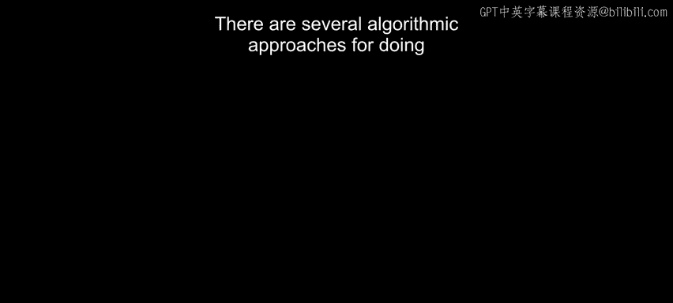
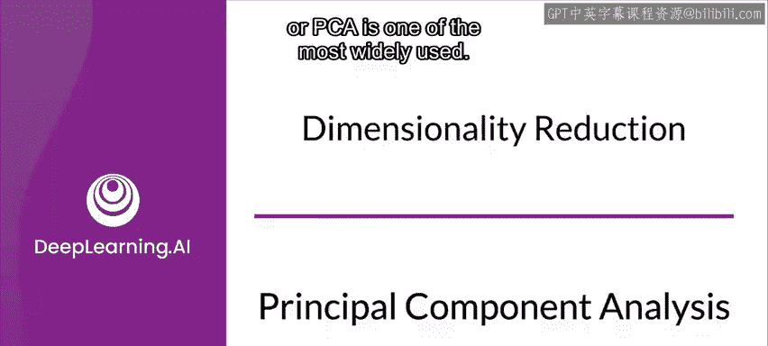
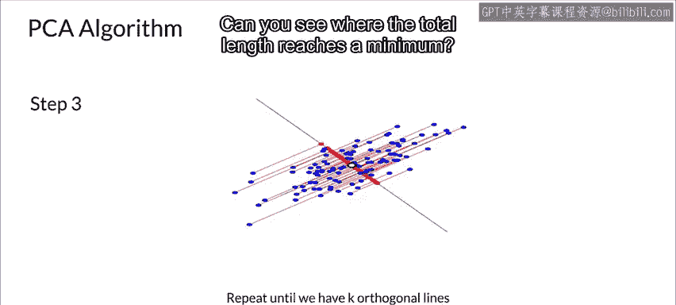
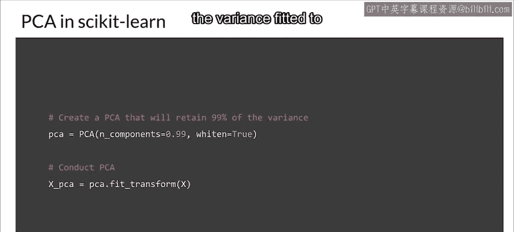
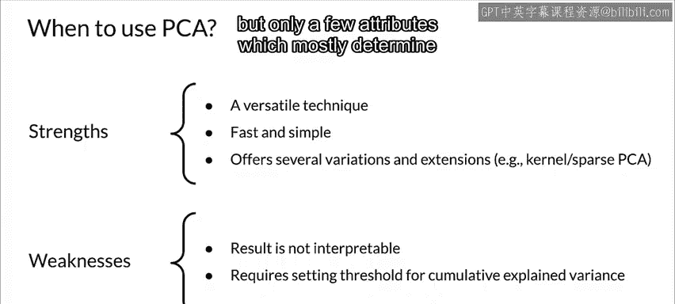

#  094：主成分分析 (PCA) 🧩



在本节课中，我们将要学习一种广泛使用的降维算法——主成分分析（PCA）。我们将了解其工作原理、核心目标、具体步骤以及如何在实践中应用它。



---

## 概述

降维有多种算法方法，主成分分析（PCA）是其中最广泛使用的之一。PCA是一种无监督算法，它通过创建原始特征的线性组合来减少数据的维度，同时尽可能保留数据中的信息。

## PCA 的工作原理

上一节我们介绍了PCA是一种降维方法，本节中我们来看看它是如何具体工作的。

PCA通过两个步骤执行降维。第一步是**去相关**，这一步并不改变数据的维度。PCA首先旋转样本，使其与坐标轴对齐。实际上，它做的更多：PCA还会平移样本，使其均值为0。下图展示了PCA应用于鸢尾花数据集三个特征后的效果。


PCA被称为主成分分析，因为它学习数据的主成分。主成分是样本变化最大的方向，在图中用红色箭头表示。PCA正是将这些主成分与坐标轴对齐。

## PCA 的核心目标

PCA的目标是找到一个**低维平面**，将数据投影到这个平面上，以最小化**平方投影误差**。换句话说，就是最小化每个数据点与其投影点之间距离的平方。

这个目标的结果是最大化投影的方差。

*   **第一主成分**：是使投影数据方差最大的投影方向。
*   **第二主成分**：是与第一主成分正交，并使剩余投影数据方差最大的投影方向。

## 一个简单的例子

让我们通过一个二维数据点的简单例子来应用PCA。


第一主成分是使投影数据（红点）方差最大的方向。在图中，你可以看到三条尝试线，很明显，红色线方向上的方差最大。

第二主成分是与第一主成分正交，并使剩余投影数据方差最大的方向，在图中用绿线表示。

完整的主成分集合构成了特征空间的一个新的正交基，其轴遵循原始数据的最大方差方向。当我们将原始数据投影到前K个主成分上时，就实现了数据的降维。

## 重构与误差

之后，你可以从这个降维后的投影中恢复原始空间。当然，这种重构会有一些误差，但考虑到降维带来的其他好处，这个误差通常是微不足道且可接受的。

观察红点随着线条旋转如何变化，那就是方差。你能看出它何时达到最大值吗？

其次，如果我们从新的红点重构原始的两个特征（蓝点），重构误差将由连接红点的红线长度给出。观察这些红线（误差线）的长度如何随着线条旋转而变化。你能看出总长度在哪里达到最小值吗？

## 在鸢尾花数据集上的应用

这里我们在鸢尾花数据集上应用具有两个主成分的PCA算法并可视化结果。



现在，假设你再次应用PCA，但使用四个成分而不是两个，让我们可视化这四个成分解释了多少方差。


如果你观察相对方差，可能会丢失一些信息。但如果特征值很小，则信息丢失不多。

## 主成分的特性与选择

正如我们之前所见，主成分本质上是正交的，这意味着它们是不相关的。同时，它们按照解释方差的多少进行排序。

*   第一主成分解释了数据集中的最大方差。
*   第二主成分解释了第二大方差，依此类推。

因此，你可以根据**累积解释方差**来限制保留的主成分数量，从而实现降维。例如，你可以决定只保留足够达到90%累积解释方差的主成分。

**因子载荷**是特征向量的非标准化值。我们可以将载荷解释为协方差或相关性。

## 使用 Scikit-learn 实现 PCA

Scikit-learn 提供了PCA的实现，它包含 `fit` 和 `transform` 方法，就像标准缩放器一样，还有一个结合了 `fit` 和 `transform` 的 `fit_transform` 方法。

*   `fit` 方法学习如何平移和旋转样本，但实际上并不改变它们。
*   `transform` 方法则应用 `fit` 学到的变换。特别是，`transform` 方法可以应用于PCA之前未见过的**新样本**。

以下是使用代码示例：
```python
# 首先对特征使用标准缩放器
from sklearn.preprocessing import StandardScaler
scaler = StandardScaler()
X_scaled = scaler.fit_transform(X)

# 创建PCA实例，保留99%的方差
from sklearn.decomposition import PCA
pca = PCA(n_components=0.99)

# 拟合数据并应用学到的变换
X_pca = pca.fit_transform(X_scaled)
```



## 总结与优缺点


综上所述，PCA是一种在实践中表现良好的有用技术。它**快速且易于实现**，这意味着你可以轻松地测试使用和不使用PCA的算法以比较性能。

此外，PCA提供了多种变体和扩展，例如核PCA或稀疏PCA等，以解决特定的障碍。

然而，PCA也有其局限性：
1.  生成的主成分**难以解释**，这在可解释性很重要的某些场景中可能是一个致命缺点。
2.  你仍然必须手动设置或调整累积解释方差的阈值。

尽管如此，PCA在**可视化研究高维数据中的观测聚类**时特别有用，例如在你仍在探索数据时。或者，当你**有理由相信数据本质上是低秩**时（即有很多属性，但只有少数几个属性主要通过线性关联决定其余属性），PCA也很有用。

---



本节课中我们一起学习了主成分分析（PCA）。我们了解了它是一种通过寻找数据最大方差方向来进行降维的无监督算法，掌握了其核心目标、计算步骤、特性以及如何使用Scikit-learn库实现它，并讨论了其优缺点和适用场景。