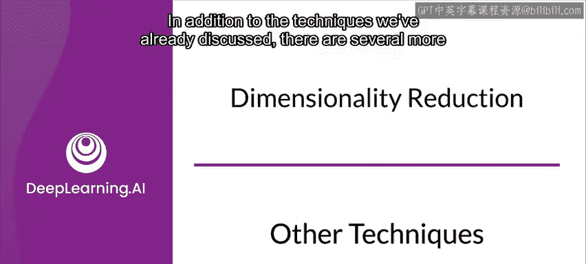
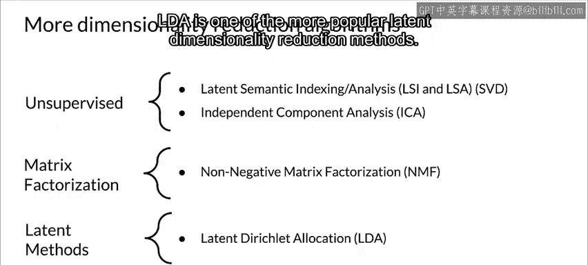
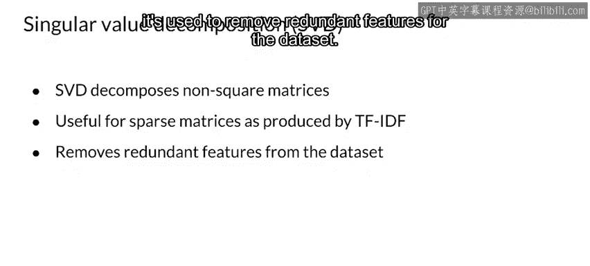
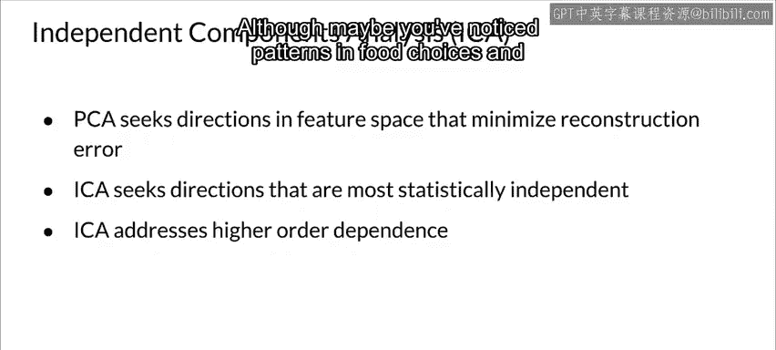
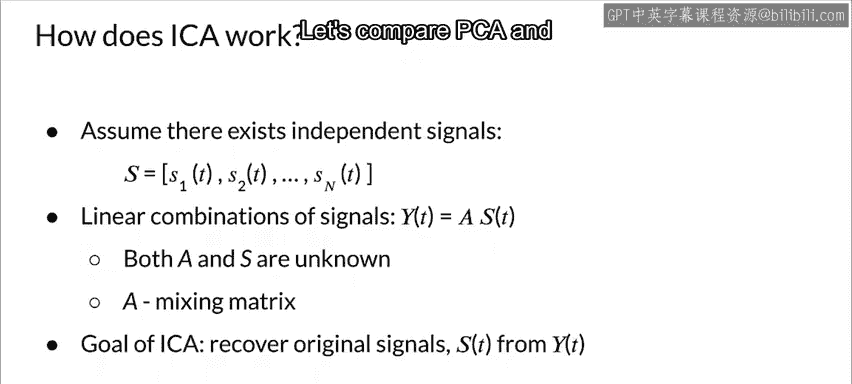
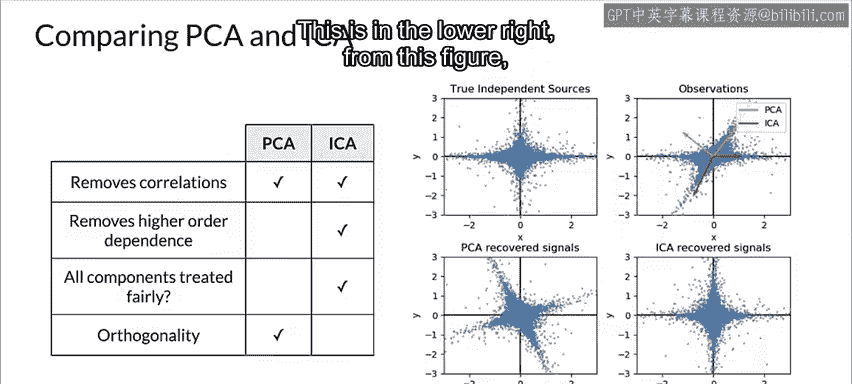

#  095：其他降维技术 🧩

在本节课中，我们将学习几种主成分分析之外的降维算法。我们将探讨奇异值分解、独立成分分析和非负矩阵分解等方法，了解它们各自的原理、适用场景以及与PCA的区别。

---

除了我们已经讨论过的技术，还有几种其他的算法方法可以进行降维。让我们来看看其中的一些。有些技术专注于特定类型的问题。

例如，在无监督方法中，有诸如**奇异值分解**或**SVD**，以及**独立成分分析**或**ICA**等技术。

在矩阵分解技术中，你可以使用**非负矩阵分解**。最后，**潜在狄利克雷分配**或**LDA**是更流行的潜在降维方法之一。

---

## 奇异值分解 🔍

上一节我们介绍了降维的多种途径，本节中我们来看看**奇异值分解**。

矩阵可以被视为空间中的线性变换。我们之前讨论过的**PCA**依赖于特征分解，而特征分解只能对方阵进行。当然，你并不总是拥有方阵。

例如，在TF-IDF中，高频词在某些情况下可能并不真正有效。一般来说，稀有词贡献更大，如果这些词在同一文档中出现的次数增加，其重要性也会增加。另一方面，在语料库中频繁出现的词的重要性会降低。

挑战在于，生成的矩阵非常稀疏且不是方阵。为了分解这些无法通过特征分解处理的矩阵，我们可以使用**奇异值分解**或**SVD**等技术。

SVD将我们的原始数据集分解为其组成部分，从而实现降维。它用于从数据集中移除冗余特征。

**公式表示**：
对于一个矩阵 **A** (m×n)，SVD将其分解为：
**A = U Σ V^T**
其中 **U** 是 m×m 正交矩阵，**Σ** 是 m×n 对角矩阵（奇异值），**V^T** 是 n×n 正交矩阵的转置。

---

## 独立成分分析 🧠

接下来，我们转向另一种基于信息论的算法——**独立成分分析**。

它也是最广泛使用的降维技术之一。PCA和ICA的一个显著区别是，PCA寻找**不相关**的因素，而ICA寻找**独立**的因素。

如果两个因素不相关，意味着它们之间没有线性关系。如果它们独立，则意味着它们不依赖于其他变量。例如，一个人的年龄与他吃什么或看多少电视是独立的（可能）。尽管你可能注意到不同年龄组在食物选择和看电视方面存在模式。

独立成分分析将多元信号分离为**最大程度上独立**的加性分量。ICA通常不用于降维，而是用于分离叠加的信号。

由于ICA模型不包含噪声项，因此必须应用**白化**处理。这可以通过多种方式完成，包括使用PCA的某个变体。

ICA进一步假设存在独立信号 **S**，以及信号的线性组合 **Y**。ICA的目标是从 **Y** 中恢复原始信号 **S**。

ICA假设给定变量是某些未知潜在变量的线性混合。它还假设这些潜在变量是相互独立的，换句话说，它们不依赖于其他变量，因此它们被称为观测数据的**独立成分**。

让我们直观地比较一下PCA和ICA，以更好地理解它们的不同之处。两者都是统计变换，即PCA使用从二阶统计量中提取的信息，而ICA则使用更高阶的统计量。

两者都用于各种领域，如盲源分离、特征提取以及神经科学。ICA是一种在特征空间中寻找方向的算法，这些方向对应于高度非高斯分布的投影。

与PCA不同，这些方向在原始特征空间中不需要正交，但在白化后的特征空间中是正交的，其中所有方向都对应于相同的方差。

另一方面，PCA在原始特征空间中找到正交方向，这些方向对应于能解释最大方差的方向。

让我们看一个模拟：左侧使用高度非高斯过程模拟两个独立源。接下来，应用混合方案来创建观测值。在这个原始观测空间中，由PCA识别的方向用橙色向量表示。然后，在PCA向量对应的方差白化后，在PCA空间中表示信号。运行ICA对应于在这个空间中进行旋转，以识别最非高斯的方向（右下角）。

从图中可以看出，PCA去除了相关性，但没有去除高阶依赖性；相反，ICA去除了相关性以及高阶依赖性。在成分重要性方面，PCA认为其中一些成分比其他成分更重要，而ICA则认为所有成分同等重要。

---

## 非负矩阵分解 📊

现在让我们讨论一种称为**非负矩阵分解**的降维技术。

NMF将样本表示为可解释部分的组合。例如，它将文档表示为主题的组合，将图像表示为常见视觉模式的组合。

与PCA一样，NMF是一种降维技术。然而，与PCA相比，NMF模型是**可解释的**。这意味着NMF模型更容易理解，也更容易向他人解释。

NMF不能应用于每个数据集。它要求样本特征是非负的，即值必须大于或等于0。已经观察到，在精心约束下，NMF可以产生数据集的基于部分的表示，从而得到可解释的模型。

以下是一个示例，右侧显示了NMF从Olivetti人脸数据集的图像中找到的16个稀疏成分，左侧是PCA特征脸。

---

## 总结 📝

本节课中我们一起学习了三种重要的降维技术：
1.  **奇异值分解**：通过分解非方阵来去除冗余特征。
2.  **独立成分分析**：专注于寻找统计上独立的成分，适用于信号分离。
3.  **非负矩阵分解**：产生可解释的、基于部分的表示，但要求数据非负。

每种技术都有其独特的假设和适用场景，是PCA之外处理特定降维问题的有力工具。理解它们的区别有助于在实际项目中做出合适的选择。