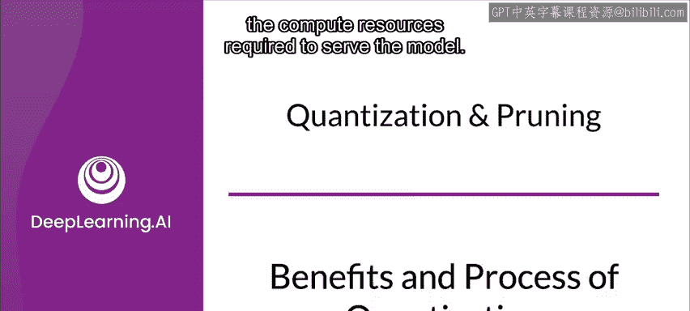
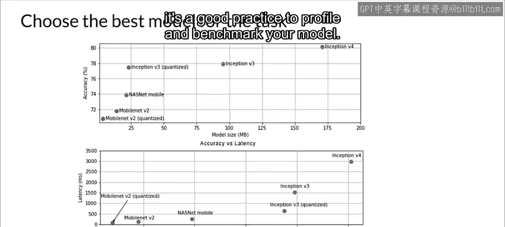

#  097：模型量化技术详解 🚀

在本节课中，我们将要学习模型量化技术。这是一种优化模型以提升其在资源受限环境（如移动设备和物联网设备）中部署效率的关键方法。我们将探讨量化的基本概念、好处、具体流程以及其对模型性能的影响。

上一节我们介绍了模型部署面临的挑战，本节中我们来看看如何通过量化技术来优化模型。

## 量化概述与动机

量化是指将模型转换为一种使用更低精度参数和计算的等效表示形式。这能提升模型的执行性能和效率，但通常会导致模型精度略有下降。

为了更好理解，可以想象一张图片。图片是由像素网格组成的，每个像素有一定数量的比特。将现实世界的连续色彩光谱减少为离散颜色的过程，就是一种量化或近似。本质上，量化减少了表示信息所需的比特数。

神经网络模型可能占用大量磁盘空间。例如，AlexNet模型需要约200MB的存储空间。其大小主要由神经网络连接的权重参数占据，这些权重通常是数百万个略有不同的浮点数。最直接的量化动机是缩小文件大小。对于移动应用，在手机上存储一个200MB的模型来运行单个应用通常是不切实际的，因此压缩高精度模型是必要的。

另一个量化原因是为了减少推理计算所需的计算资源，通过完全使用低精度输入和输出来运行。这虽然实现起来更困难，但能带来显著回报：模型运行更快、功耗更低，并且为许多无法高效运行浮点计算的嵌入式系统（如物联网设备）打开了应用之门。

## 量化的好处

以下是量化带来的主要优势：

*   **提升速度**：在硬件支持的前提下，低比特深度的算术运算更快。从32位浮点数转换到8位整数，通常能获得约4倍的内存减少和速度提升。
*   **减小模型体积**：更轻量的部署模型意味着占用更少的存储空间，更容易通过较小带宽进行分享和更新。
*   **提高能效**：低比特深度意味着可以将更多数据塞入相同的缓存和寄存器中，从而构建具有更好缓存能力的应用，降低功耗并运行得更快。
*   **增强硬件兼容性**：浮点运算复杂，并非所有微控制器和超低功耗嵌入式设备（如无人机、手表）都支持。而整数运算支持则普遍可用。

## 量化的原理与影响

神经网络由节点、节点间的连接、每条连接关联的权重参数以及偏置项组成。量化主要针对这些权重参数和激活节点的计算进行。

量化将一小段浮点数值范围挤压到固定数量的信息“桶”中。这个过程本质是有损的，但特定层的权重和激活值往往分布在一个较小的、可以预先估计的范围内。这意味着我们不需要用同一种数据类型来存储整个大范围，而是可以将宝贵的有限比特集中在更小的范围（例如-3到+3）内。如果操作得当，量化只会造成很小的精度损失，通常不会显著改变输出结果。

现在，让我们看看量化会影响模型的哪些部分：

*   **静态参数**：如各层的权重。
*   **动态参数**：如网络内部的激活值。
*   **结构变换**：如添加、修改或删除操作，合并不同操作等。

在某些情况下，变换可能需要额外数据。例如，在量化的一种技术中，会使用一些未标记的数据来确定缩放参数。

优化通常会导致模型精度的变化，这在应用开发过程中必须予以考虑。精度变化取决于被优化的具体模型和数据，很难提前预测。一般来说，为体积和延迟优化的模型会损失一定精度。根据应用场景，这可能影响也可能不影响用户体验。在极少数情况下，某些模型可能因优化过程而获得精度提升。

## 实践中的权衡与步骤

移动和嵌入式设备的计算资源有限，因此保持应用资源高效至关重要。根据任务需求，你需要在模型精度和模型复杂度之间做出权衡。

如果任务要求高精度，则可能需要一个庞大而复杂的模型。对于精度要求较低的任务，最好使用更小、更简单的模型，因为它们不仅占用更少的内存和磁盘空间，而且通常更快、更节能。

例如，MobileNets就是为移动设备优化的模型系列，专为移动视觉应用设计，在设备延迟和ImageNet分类精度之间实现了先进的权衡。

一旦为你的任务选定了候选模型，一个好的做法是对模型进行分析和基准测试。

本节课中我们一起学习了模型量化的核心概念、优势、工作原理以及在实践中的应用考量。量化是模型部署，特别是在资源受限环境下的关键优化步骤，它通过权衡精度以换取显著的效率提升，从而使得复杂的机器学习模型能够在更广泛的设备上运行。