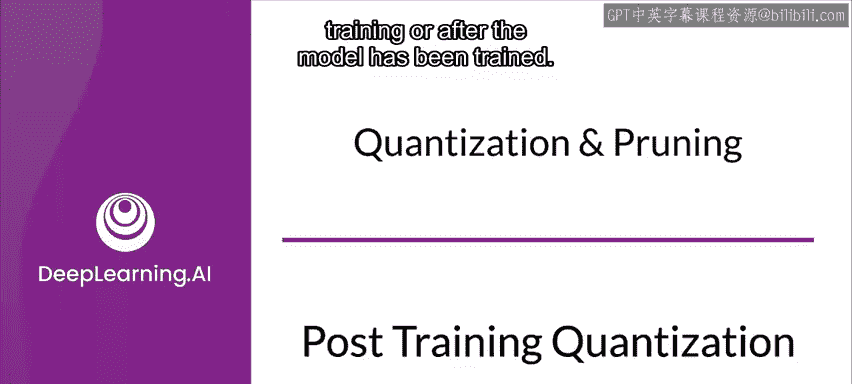
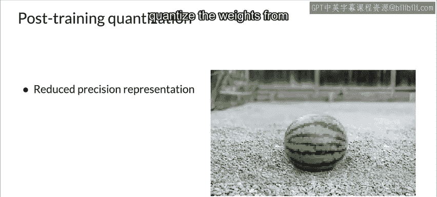
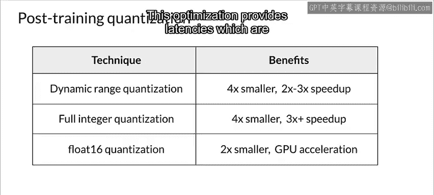
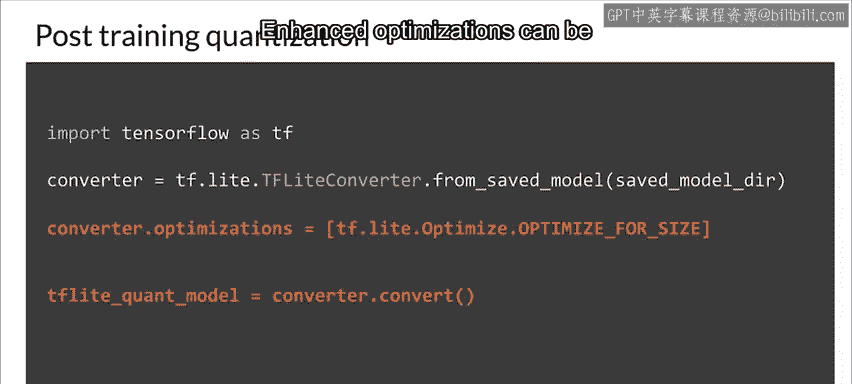
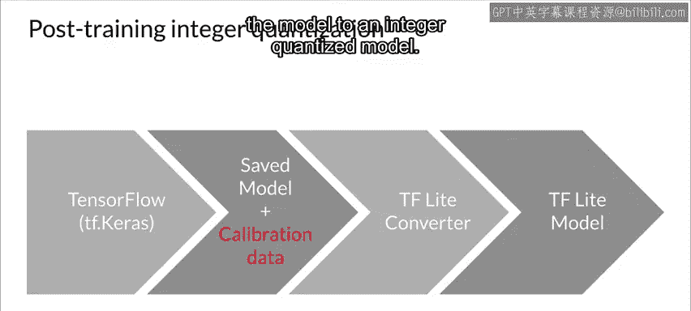
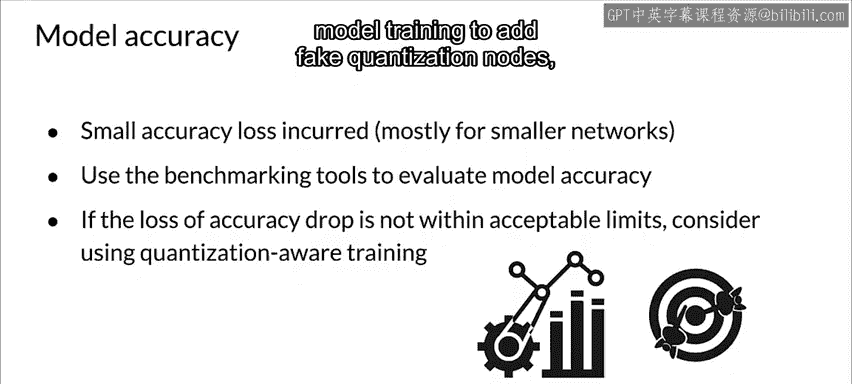

#  098：后训练量化 🧠



在本节课中，我们将学习一种名为“后训练量化”的模型优化技术。这项技术可以在几乎不影响模型准确性的前提下，显著减小模型体积并提升其在CPU和硬件加速器上的推理速度。

量化可以在模型训练期间进行，也可以在模型训练完成后进行。本节我们首先关注后训练量化。

## 什么是后训练量化？🔍

后训练量化是一种转换技术，它能在模型精度损失很小的情况下，减小模型体积，同时改善CPU和硬件加速器的推理延迟。



你可以使用TensorFlow Lite转换器，将一个已训练好的TensorFlow模型转换为TensorFlow Lite格式时，对其进行量化。这种方法易于使用，因为它已直接集成到TF Lite转换器中。

后训练量化的核心作用，是**以高效的方式将权重从浮点数转换为整数**。

通过这种方式，你可以在不显著影响准确性的前提下，获得**高达三倍的延迟降低**。

## 量化选项与策略 ⚙️

使用默认的优化策略时，转换器会尽力应用后训练量化，尝试同时优化模型的体积和延迟。这是推荐的做法，但你也可以自定义此行为。

以下是几种可供选择的后训练量化选项及其优势的总结：

*   **动态范围量化**：如果你希望获得约2-3倍的加速，同时模型体积减小约一半，可以考虑此选项。
*   **全整数量化**或**浮点16量化**：如果你希望从模型中榨取更多性能，这两种量化方式可能带来更快的推理速度。其中，浮点16量化在你计划使用GPU时尤其有用。



在动态范围量化中，推理时权重会从8位整数转换为浮点数，激活值则使用浮点内核进行计算。这种转换只进行一次并被缓存，以降低延迟。这种优化提供的延迟，接近于完全定点推理。

## 如何实施后训练量化？💻

后训练量化仅需两行代码即可实现。

首先，导入TensorFlow并定义一个TF Lite转换器。
```python
import tensorflow as tf
converter = tf.lite.TFLiteConverter.from_saved_model(saved_model_dir)
```
然后，设置转换器以优化模型体积。
```python
converter.optimizations = [tf.lite.Optimize.DEFAULT]
```
最后，应用转换器转换你的模型。其他可用的优化模式包括`OPTIMIZE_FOR_LATENCY`（降低模型延迟），而`DEFAULT`模式则默认尝试同时优化速度和存储。

## 更进一步的量化：全整数量化 🚀



上一节我们介绍了动态范围量化，本节我们来看看更进一步的优化选项。

通过提供代表性数据集，可以应用增强的优化，例如动态范围量化。这可以减少模型体积和/或延迟，但它有一个限制：推理仍需使用浮点数。

这并非总是理想的选择，因为某些硬件加速器（例如Edge TPUs）仅支持整数运算。因此，优化工具包也支持**后训练全整数量化**。

这项技术使用户能够获取已训练的浮点模型，并将其完全量化为仅使用**8位有符号整数**，从而使得定点硬件加速器能够运行这些模型。当目标是获得更大的CPU改进或使用定点加速器时，这通常是更好的选择。

后训练整数量化通过收集校准数据来工作。它在一小部分输入上运行推理，以确定将模型转换为整数量化模型所需的正确缩放参数。

## 量化后的考量与总结 📝



后训练量化可能导致精度损失，特别是对于较小的网络，但这种损失通常可以忽略不计。从积极的一面看，它通过使用较低精度处理最繁重的计算，而使用较高精度处理最敏感的计算，从而加速了执行速度，因此通常导致很少或没有最终的精度损失。

TensorFlow Lite模型库中也为特定网络提供了预训练的全量化模型。重要的是，需要检查量化后模型的准确性，以验证任何精度下降是否在可接受的范围内。TensorFlow Lite包含一个评估模型准确性的工具。

或者，如果精度损失过大，可以考虑使用**量化感知训练**。然而，这样做需要在模型训练期间进行修改以添加伪量化节点，而后训练量化技术则相对简单。

---



**本节课总结**：我们一起学习了后训练量化的概念、优势以及实施方法。我们了解到，量化是一种强大的模型优化技术，能够有效平衡模型大小、推理速度和准确性，尤其适用于移动端和边缘设备的部署场景。