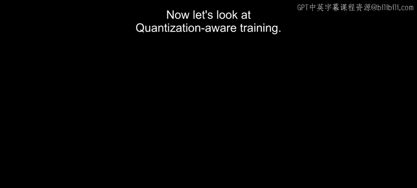
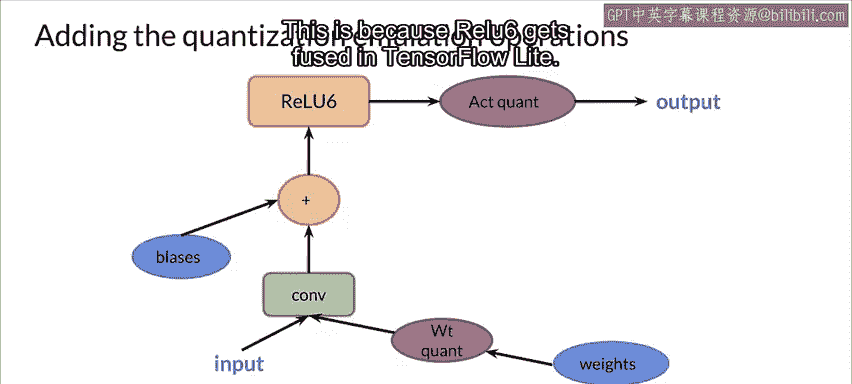
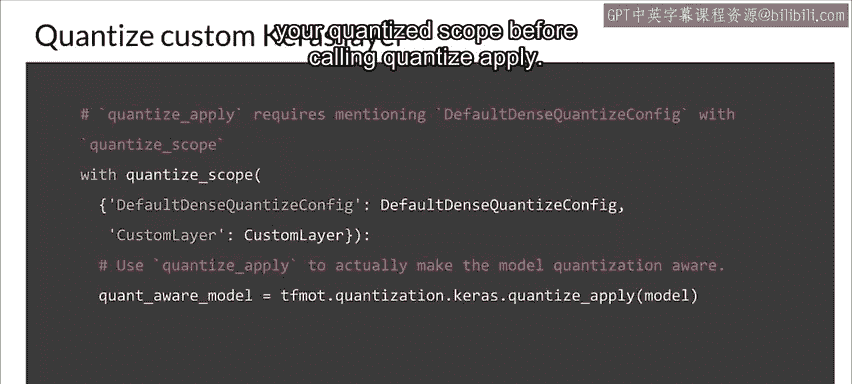
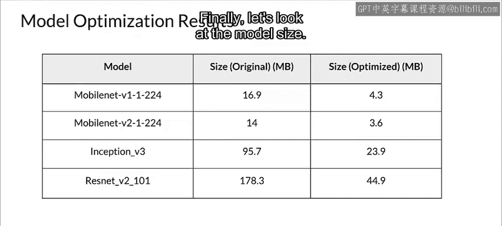

#  099：量化感知训练 🧠



在本节课中，我们将要学习量化感知训练。这是一种在模型训练过程中就模拟量化效果的技术，旨在让模型学习到的参数对后续的定点化操作更具鲁棒性，从而在部署时获得更好的精度与性能平衡。

---

## 概述

量化感知训练的核心思想是在训练阶段的前向传播路径中，模拟低精度推理时的计算过程。通过插入“伪量化”节点，模型可以在训练时就“感知”到量化带来的舍入误差，并据此调整权重，以最小化最终部署时的精度损失。

上一节我们介绍了训练后量化，本节中我们来看看如何在训练过程中就融入量化。

---

## 量化感知训练的原理

最简单的神经网络量化方法是先以全精度训练模型，然后直接将权重量化为定点数，这被称为训练后量化。

相比之下，量化感知训练在模型训练时就应用量化。

其核心思想是，量化感知训练在训练过程的前向传播中，模拟低精度推理时的计算。

通过插入伪量化节点，在训练的前向传播中模拟量化通常会发生的舍入效应。

目标是微调权重，以适应精度损失。

因此，如果在模型图中预期会发生量化的位置（例如，在卷积层）包含了伪量化节点。

那么在训练的前向传播中，浮点数值将被舍入到指定的量化级别，以模拟量化的效果。

这会在训练过程中将量化误差作为噪声引入，并成为整体损失的一部分，优化算法会尝试最小化这个损失。

这样，模型就能学习到对量化更具鲁棒性的参数。

---

## 量化感知训练的过程

接下来，让我们看看在训练期间量化模型的具体过程。

在量化感知训练中，你首先像往常一样构建模型，然后使用 TensorFlow 模型优化工具包的 API 使其具备量化感知能力。

最后，你使用量化模拟操作来训练这个模型，以获得我们最终的纯整数量化模型。

让我们看一下这个展示神经网络基本操作的简化图。

下一步是添加量化模拟操作。

量化模拟操作需要被放置在训练图中，其放置方式要与量化图的计算方式保持一致。

权重量化和激活量化操作在模型的前向传播中引入损失，以模拟推理期间的实际量化损失。

请注意，在卷积层和 ReLU6 之间没有量化操作。

这是因为在 TensorFlow Lite 中，ReLU 操作会被融合。

量化感知训练 API 使得为整个模型或仅部分模型训练量化感知能力变得容易，然后可以将其导出以使用 TensorFlow Lite 进行部署。

因此，为了使整个模型具备量化感知能力，我们应用 `tfmot.quantization.keras.quantize_model` 到模型。

```python
import tensorflow_model_optimization as tfmot

quant_aware_model = tfmot.quantization.keras.quantize_model(model)
```

---



## API 的灵活性与高级用法

该 API 也非常灵活，能够处理更复杂的用例。

例如，它允许你在层内精确控制量化、创建自定义量化算法，并处理你可能编写的任何自定义层。

以下是量化感知训练的一些高级应用场景：

你可以选择性地量化模型的某些层，以探索精度、速度和模型大小之间的权衡。例如，尝试量化后面的层而不是前面的层。

请始终记住，避免量化关键层，例如 Transformer 架构中的注意力机制。

例如，如果你的激活函数或其他操作恰好是量化感知框架尚未支持的，你可以使用量化配置来解决这个问题。

例如，在这段代码片段中，调用了一个像 `DefaultDenseQuantizeConfig` 这样的自定义配置来量化一个自定义层。

```python
quantize_config = tfmot.quantization.keras.QuantizeConfig(
    # ... 自定义配置细节
)
```

最后，在调用 `quantize_apply` 之前，记得在你的量化作用域中包含你的自定义配置。

```python
with tfmot.quantization.keras.quantize_scope({'CustomLayer': CustomLayer,
                                              'DefaultDenseQuantizeConfig': DefaultDenseQuantizeConfig}):
    # 应用量化
    model = tfmot.quantization.keras.quantize_apply(model, quantize_config)
```

---

## 效果评估：精度、延迟与模型大小



以下是一些模型在量化后的精度损失结果。这可以让你对自己的模型可能发生的情况有一个大致的预期。

接下来，让我们看看几个模型的推理延迟。请记住，在这种情况下，数值越低越好。

最后，让我们看看模型的大小。同样，数值越低越好。

---

## 总结



本节课中，我们一起学习了量化感知训练。我们了解了其核心原理是在训练时通过伪量化节点模拟推理时的量化误差，从而使模型参数对量化更具鲁棒性。我们探讨了使用 TensorFlow 工具包实施量化感知训练的基本流程，并介绍了其 API 在选择性量化、处理自定义层等方面的灵活性。最后，我们通过精度、延迟和模型大小的数据，直观地认识了量化带来的影响。掌握量化感知训练，是优化模型以便在资源受限环境中高效部署的关键一步。