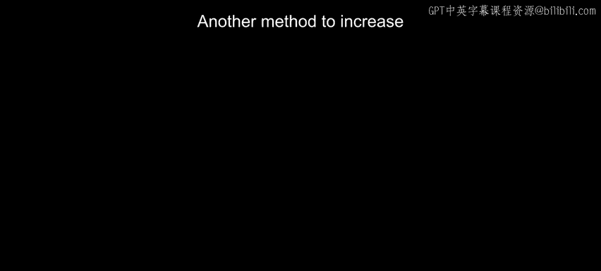
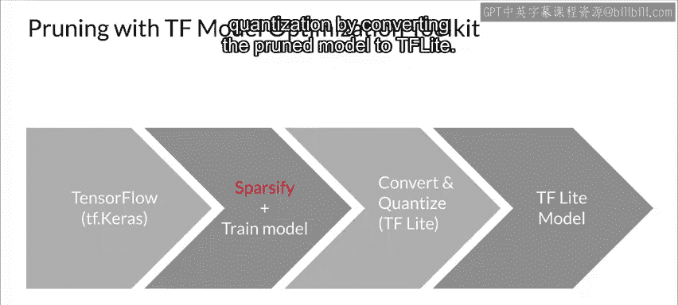
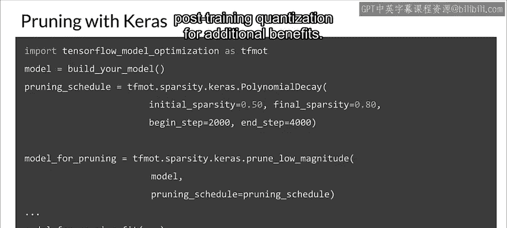
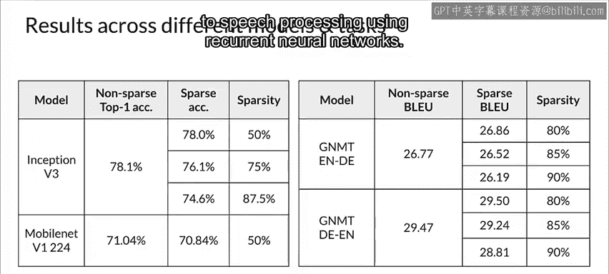

#  100：模型剪枝 🧹

在本节课中，我们将学习一种提升模型效率的重要方法——模型剪枝。我们将探讨其核心概念、历史背景、工作原理、具体实现及其带来的益处。

---

## 概述

另一种提升模型效率的方法是移除那些对产生准确结果贡献不大的模型部分。这被称为**剪枝**。现在我们来讨论它。

优化机器学习程序可以采取多种形式。幸运的是，神经网络已被证明对旨在实现该目标的各种变换具有鲁棒性。

上一节我们讨论了模型量化的方法，本节中我们来看看如何通过剪枝来精简模型。

## 剪枝的动机与概念

当你考虑具有更多层和节点的更广泛神经网络时，减少其存储和计算成本变得至关重要，尤其对于一些实时应用。随着机器学习模型被部署到移动电话等嵌入式设备中，模型压缩变得日益重要，压缩神经网络的重要性也随之增长。

剪枝是深度学习中一个受生物学启发的概念。

**剪枝**旨在通过移除网络连接来减少生成预测所涉及的参数和操作数量。因此，通过剪枝，你可以降低网络中的总体参数数量。

网络通常看起来像左边这样。在这里，一层中的每个神经元都连接到它前面的一层。但这意味着我们必须将许多浮点数相乘。理想情况下，我们只将每个神经元连接到少数其他神经元，从而节省一些乘法运算。如果我们能找到一种方法在不过多损失精度的情况下做到这一点，那就是剪枝背后的动机。

## 稀疏性的重要性

连接稀疏性长期以来一直是神经科学研究的基本原则，也是关于新皮质的关键观察之一。在大脑的任何地方，神经元的活动总是稀疏的，但常见的神经网络架构有很多参数，而这些参数通常并不稀疏。以 ResNet-50 为例，它拥有近 2500 万个连接。

这意味着在训练期间，我们需要调整 2500 万个权重，这至少可以说是相对昂贵的。因此，需要以某种方式解决这个问题。

神经网络中稀疏性的故事始于**剪枝**，这是一种通过压缩来减小神经网络大小的方法。

以下是减少参数数量带来的几个好处：

*   **模型更小更快**：稀疏网络不仅更小，而且训练和使用速度更快。
*   **适用于资源受限环境**：在硬件受限的环境中，例如嵌入式设备或智能手机，速度和大小可以决定模型的成败。
*   **缓解过拟合**：更复杂的模型更容易过拟合。因此，在某种意义上，限制搜索空间也可以起到正则化的作用。

然而，即便如此，这也不是一项简单的任务，因为降低模型的容量也可能导致精度损失。因此，与许多其他领域一样，复杂性和性能之间存在着微妙的平衡。

现在，让我们更深入地了解一些挑战和潜在的解决方案。

## 剪枝的历史与方法演变

让我们从一点历史开始。第一篇倡导神经网络稀疏性的重要论文可以追溯到 1990 年，由 Janon Lacoon、John S. Denker 和 Sarah A. Solla 撰写，标题相当具有挑衅性，名为《最优脑损伤》。当时，对训练好的模型进行后剪枝以压缩模型已经是一种流行的方法。

剪枝主要通过使用权重**幅度**作为**显著性**的近似值来确定不太有用的连接。其直觉是，幅度较小的权重对输出的影响较小，因此如果被剪枝，对模型结果的影响也较小。

这是一种迭代剪枝方法：
1.  第一步是训练一个模型。
2.  然后估计每个权重的显著性，其定义为对网络中的神经元施加扰动时损失函数的变化。
3.  变化越小，权重对训练的影响就越小。
4.  最后，他们消除显著性最低的权重。这相当于将它们设置为零。
5.  最后，对这个剪枝后的模型进行重新训练。

这种方法在重新训练剪枝后的网络时出现了一个特别的挑战。事实证明，由于其容量减少，重新训练变得更加困难。

这个问题的解决方案后来才出现，伴随着一个被称为**彩票假设**的见解。

## 彩票假设

赢得彩票头奖的概率非常低。例如，如果你玩强力球，中头奖的几率大约是 300 万分之一。如果你购买 N 张彩票，你的机会是多少？

所以，如果获胜的概率是 P = 1/3,000,000，那么不获胜的几率就是其补集 1 - P。将其扩展到购买 n 张彩票时，我们得到概率为 (1 - P)^N。由此可知，至少有一张中奖的概率再次简单地是其补集。

这与神经网络有什么关系？在训练之前，模型的权重是随机初始化的。是否可能存在一个随机初始化网络的子网络，它赢得了“初始化彩票”？

一些研究人员着手调查这个问题并寻找答案。最值得注意的是，Frankle 和 Carbin 在 2019 年发现，对于这些新剪枝的网络，训练后对权重进行微调并不是必需的。

事实上，他们表明，最好的方法是将权重重置为其原始值，然后重新训练整个网络。与 Han 及其同事提出的原始密集模型以及后剪枝加微调方法相比，这将导致模型具有更高的准确性。

这一发现使他们提出了一个最初被认为是疯狂的、但现在被普遍接受的想法：过度参数化的密集网络包含多个具有不同性能的稀疏子网络，其中一个子网络就是“中奖彩票”，其性能优于所有其他子网络。

然而，这种方法存在显著的局限性。首先，它对于更大规模的问题和架构表现不佳。在原论文中，作者指出，对于像 ImageNet 这样更复杂的数据集和像 ResNet 这样更深的架构，该方法通常无法识别初始化彩票的赢家。

## 现代剪枝实践与 TensorFlow 工具

实现良好的稀疏性与准确性权衡是一个难题，也是一个非常活跃的研究领域，最先进的技术不断改进。

TensorFlow 包含一个基于 Keras 的权重剪枝 API，它使用一种简单但广泛适用的算法，旨在训练期间根据权重幅度迭代地移除连接。

从根本上说，需要指定一个最终的**目标稀疏度**，以及一个执行剪枝的**时间表**。

在此图中，你可以看到在训练期间，将按计划执行剪枝例程，移除幅度值最低、最接近 0 的权重，直到达到当前稀疏度目标。每次计划执行剪枝例程时，都会重新计算当前稀疏度目标，从 0% 开始，直到在剪枝时间表结束时，根据平滑的斜坡上升函数逐渐增加，达到最终的目标稀疏度。

就像时间表一样，斜坡上升函数可以根据需要进行调整。例如，在某些情况下，可能需要在达到一定收敛水平后的某个步骤开始安排训练过程，或者在你的训练程序的总训练步骤数之前结束剪枝，以在最终目标稀疏度水平上进一步微调系统。

稀疏度随着训练的进行而增加。所以你需要知道何时停止。这意味着在训练过程结束时，对应于已剪枝的 Keras 层的张量将根据该层的最终稀疏度目标，在权重已被剪枝的位置包含零。

## 剪枝带来的益处

你可以从剪枝中获得的一个直接好处是**磁盘压缩**。这是因为稀疏张量是可压缩的。因此，通过对剪枝后的 TensorFlow 检查点或转换后的 TensorFlow Lite 模型应用简单的文件压缩，我们可以减小模型的大小以便存储和/或传输。在某些情况下，你甚至可以在利用整数精度效率的 CPU 和机器学习加速器上获得速度提升。

此外，在多项实验中，我们发现权重剪枝与量化是兼容的，从而产生复合效益。在接下来的练习中，我们将展示通过应用训练后量化，我们可以将剪枝后的模型从两兆字节进一步压缩到仅约半兆字节。

在不久的将来，TensorFlow Lite 将增加对稀疏表示和计算的一流支持，从而将压缩优势扩展到运行时内存，并解锁性能提升，因为稀疏张量允许你跳过涉及零值的不必要计算。或者，取决于你观看此内容的时间，它可能已经包含在内。

## 如何使用剪枝 API

要使用剪枝 API，你首先需要创建一个 TensorFlow Keras 模型。然后，我们向模型中的某些层添加稀疏性，并重新训练或训练它。最后，你还可以通过将剪枝后的模型转换为 TF Lite 来获得量化的好处。

在此示例中，让我们将剪枝应用于整个模型。你从 50% 的稀疏度（即权重中 50% 为零）开始，最终达到 80% 的稀疏度。你也可以仅剪枝模型的一部分或特定层，以改进模型精度。稍后，你将看到如何使用 TensorFlow Model Optimization Toolkit API 为 TensorFlow 和 TF Lite 创建稀疏模型。然后，你可以将剪枝与训练后量化结合以获得额外的好处。

此外，这种技术可以成功地应用于跨不同任务的各种类型的模型，从基于卷积的图像处理神经网络到使用循环神经网络的语音处理。此表显示了一些实验结果。

---

## 总结

本节课中我们一起学习了模型剪枝技术。我们了解到，剪枝是一种通过移除神经网络中不重要的连接来减少模型大小和计算成本的有效方法。它受大脑神经元活动稀疏性的启发，能够提升模型在资源受限环境下的部署效率。我们从其历史发展、核心的“彩票假设”原理，到现代 TensorFlow 中的具体实现工具都进行了探讨。最后，我们看到了剪枝与量化技术结合所能带来的复合优势，这是优化生产环境机器学习模型的重要一环。