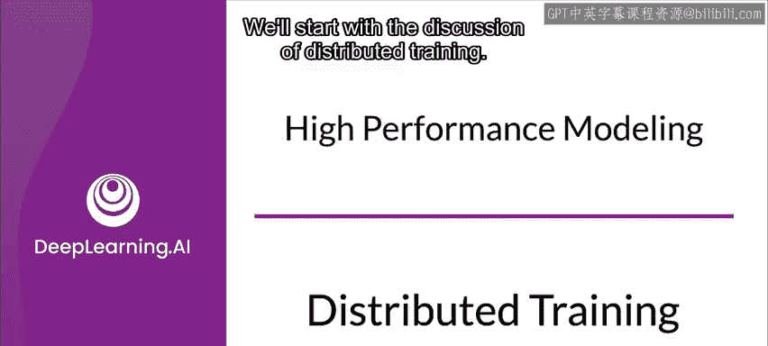
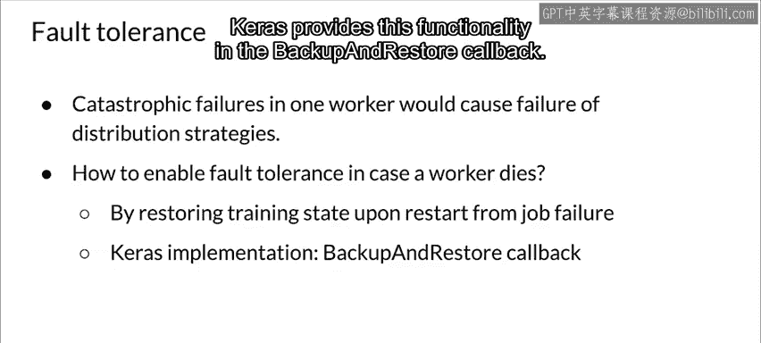

#  101：分布式训练 🚀

在本节课中，我们将要学习分布式训练的核心概念与技术。随着数据集和模型规模的不断增长，单机训练可能变得非常耗时。分布式训练允许我们利用多台机器或多个加速器（如GPU）来并行处理训练任务，从而显著缩短训练时间并支持训练超大规模模型。

上一节我们介绍了分布式训练的必要性，本节中我们来看看实现分布式训练的两种基本方式。

## 数据并行与模型并行

分布式训练主要有两种基本范式：数据并行和模型并行。

### 数据并行

数据并行可能是两者中较易实现的一种。在这种方法中，数据被划分为多个分区。完整的模型被复制到所有工作节点上，每个节点处理不同的数据分区，模型更新在工作节点间同步。这种并行方式与模型架构无关，可应用于任何神经网络。

通常，数据并行的规模与批次大小相对应。

### 模型并行

在模型并行中，模型本身被分割成不同的部分，在不同的工作节点上并发训练。每个模型部分在同一份数据上进行训练。这里，工作节点只需要同步共享的参数，通常在每个前向或反向传播步骤中进行一次。

当模型过大，无法放入单个加速器的内存时，通常会使用模型并行。与数据并行相比，模型并行的实现相对复杂。

模型并行是一个更复杂的主题。因此，我们现在先通过图示了解数据并行的工作原理，稍后再讨论模型并行。

## 数据并行的工作原理

在数据并行中，数据被分割成多个分区。分区的数量通常是计算集群中可用工作节点的总数。

为了进行训练，模型被复制到每个工作节点上，每个节点在其自己的数据子集上进行训练。这要求每个工作节点都有足够的内存来加载整个模型，对于大型模型来说，这可能是个问题。

每个工作节点独立计算其训练样本的预测值与标注数据之间的误差。然后，每个工作节点执行反向传播，根据误差更新其模型，并将其所有更改通信给其他工作节点，以便它们更新自己的模型。

这意味着工作节点需要在每个批次结束时同步它们的梯度，以确保它们训练的是同一个一致的模型。

以下是使用数据并行进行分布式训练的两种基本风格：

*   **同步训练**：每个工作节点在其当前的小批次数据上进行训练，计算其自身的更新，将其更新通信给其他工作节点，并在进行下一个小批次之前等待接收并应用来自所有其他工作节点的更新。All-Reduce算法就是这种风格的一个例子。
*   **异步训练**：所有工作节点独立地在其小批次数据上进行训练，并异步地更新变量。参数服务器算法是这种风格的一个例子。异步训练往往效率更高，但实现起来可能更困难。

异步训练的一个主要缺点是精度降低和收敛速度变慢，这意味着需要更多的步骤才能收敛。收敛速度慢可能不是问题，因为异步训练带来的加速可能足以弥补。然而，精度损失可能是个问题，具体取决于损失了多少精度以及应用的要求。

## 使模型支持分布式训练

要使用分布式训练，模型必须变得“分布式感知”。幸运的是，像Keras或Estimators这样的高级API支持分布式训练。你甚至可以创建自定义训练循环以提供更精确的控制。

你会发现，为了使这些普通模型能够以分布式方式进行训练或推理，你需要通过一些小的代码更改使它们支持分布式。通过这样做，你就可以获得在大量加速器（如GPU或TPU）上训练模型的强大能力。

具体来说，要在TensorFlow中执行分布式训练，你可以利用TensorFlow的`tf.distribute.Strategy`类库。这个类支持多种用于高级API的分布式策略，也支持使用自定义训练循环进行训练。`tf.distribute.Strategy`类不仅支持在Eager模式下执行TensorFlow代码，也支持在图模式下以及使用`tf.function`。

除了训练模型，还可以使用此API在不同平台上以分布式方式执行模型评估和预测。它只需要最少的额外代码来使你的模型适应分布式训练。你可以轻松地在不同策略之间切换，进行实验并找到最适合你需求的策略。

## TensorFlow分布式策略

TensorFlow有许多不同的策略来执行分布式训练。以下是最常用的几种：

*   `OneDeviceStrategy`
*   `MirroredStrategy`
*   `ParameterServerStrategy`
*   `MultiWorkerMirroredStrategy`
*   `CentralStorageStrategy`
*   `TPUStrategy`

让我们重点了解前三种选项。关于`tf.distribute.Strategy`的更多信息，请参阅资源部分的链接。

**`OneDeviceStrategy`** 会将在其作用域内创建的任何变量放置在指定的设备上。通过该策略输入的分布式数据将被预取到指定设备。此外，通过`strategy.run`调用的任何函数也将被放置在指定设备上。该策略的典型用法是在切换到实际分发到多个设备和机器的其他策略之前，使用`tf.distribute.Strategy` API测试你的代码。因此，这通常是你在开发中使用的东西。

**`MirroredStrategy`** 支持在一台机器的多个GPU上进行同步分布式训练。它为每个GPU设备创建一个副本。模型中的每个变量在所有其他副本之间进行镜像。这些变量共同形成一个称为“镜像变量”的单一概念变量。这些变量通过应用相同的更新来保持彼此同步。高效的All-Reduce算法用于在设备之间通信变量更新。All-Reduce通过对所有设备上的张量进行求和来聚合它们，并使每个设备上都可以使用。它是一种融合算法，非常高效，可以显著减少同步开销。

**`ParameterServerStrategy`** 是一种常见的异步数据并行方法，用于在多台机器上扩展模型训练。一个参数服务器训练集群由工作节点和参数服务器组成。变量在参数服务器上创建，并在每个步骤中由工作节点读取和更新。默认情况下，工作节点独立读取和更新这些变量，彼此之间不同步。这就是为什么有时参数服务器风格的训练也被称为异步训练。

## 容错性考量

通常在同步训练中，如果一个或多个工作节点发生故障，整个工作节点集群都会失败。在工作节点死亡或不稳定的情况下，考虑某种形式的容错性非常重要。这允许你从因抢占工作节点而导致的故障中恢复。这可以通过在分布式文件系统中保存训练状态来实现。

由于所有工作节点在训练轮次和步骤方面都保持同步，其他工作节点需要等待失败或被抢占的工作节点重新启动才能继续。

例如，在`MultiWorkerMirroredStrategy`中，如果一个工作节点被中断，整个集群会暂停，直到被中断的工作节点重新启动。其他工作节点也会重新启动，被中断的工作节点重新加入集群。然后需要有一种方式让每个工作节点恢复其之前的状态，从而使集群重新同步，让训练顺利进行。例如，Keras在`BackupAndRestore`回调中提供了此功能。

---

本节课中我们一起学习了分布式训练的核心概念，包括数据并行和模型并行的基本原理，以及如何使用TensorFlow的`tf.distribute.Strategy`来实现不同的分布式训练策略。我们还探讨了同步与异步训练的差异，以及在分布式环境中需要考虑的容错性问题。掌握这些知识将帮助你有效地利用计算资源，加速大规模机器学习模型的训练过程。