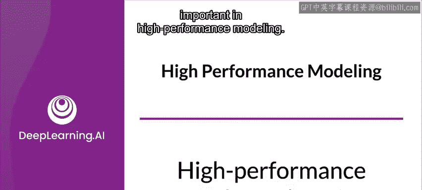
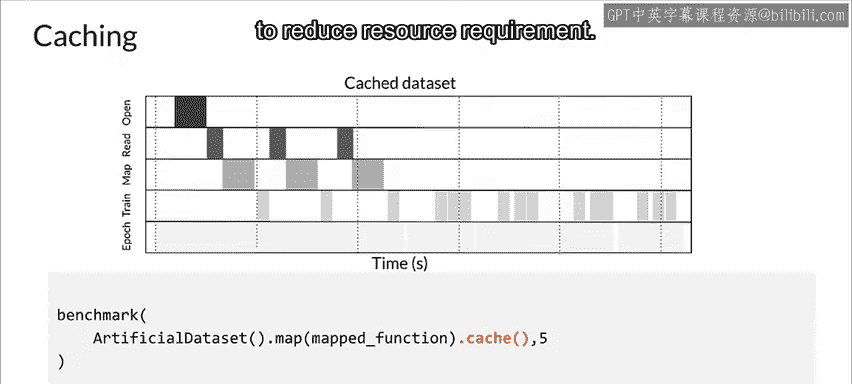

#  102：高性能数据输入 🚀


在本节课中，我们将要学习如何构建高性能的数据输入管道。这对于高效利用昂贵的计算资源（如GPU/TPU）至关重要，因为我们需要确保这些加速器在训练或推理过程中能够持续获得足够的数据，避免因等待数据而空闲。

---



## 为什么需要高性能输入管道？🤔

上一节我们提到了加速器的重要性，本节中我们来看看如何高效地为它们提供数据。

加速器是高性能建模、训练和推理的关键部分。但加速器价格昂贵，因此高效使用它们非常重要。这意味着要让它们保持忙碌状态，这要求你能够足够快地为它们提供足够的数据。这就是为什么在高性能建模中，高性能的数据摄取如此重要。


现在，我们来讨论为什么训练模型通常需要输入管道，以及围绕数据应用转换时可能出现的问题。

通常，转换处理的是预处理任务，这往往会增加训练输入管道的开销。例如，在对庞大的图像分类数据集进行数据增强时，许多转换通常是逐元素应用的。因此，如果应用转换花费的时间太长，可能会导致CPU在等待数据时利用率不足。

问题不仅限于转换。有时，你可能拥有根本无法装入内存的数据。构建一个可扩展的输入数据管道，使其能够足够快地提供数据以保持训练处理器忙碌，通常成为一个挑战。

最终，目标应该是高效利用可用硬件，减少从磁盘加载数据所需的时间，并减少预处理所需的时间。

输入管道是许多训练管道的重要组成部分，但推理管道通常也有类似的要求。在更大的训练管道（如TFX训练管道）背景下，高性能输入管道将是训练器组件的一部分，可能还包括像Transform这样可能需要对数据进行大量处理的其他组件。

---

## 设计高效输入管道的框架 🛠️

有多种方法可以设计高效的输入管道。一个可以提供帮助的框架是TensorFlow Data或TF.data。让我们以TF.data为例，看看如何设计高效的输入管道。

你可以将输入管道视为一个ETL（提取、转换、加载）过程，它提供了一个框架来促进应用性能优化。

以下是ETL过程的三个主要步骤：

1.  **提取**：从数据存储中提取数据，这些存储可能是本地的或远程的，例如硬盘、SSD、云存储和HDFS。
2.  **转换**：数据通常需要进行预处理。这包括打乱、批处理和重复数据。
3.  **加载**：将预处理后的数据加载到模型中，模型可能在GPU或TPU上进行训练，然后开始训练。

你安排这些转换的顺序可能会影响管道的性能。在使用任何数据转换（如`map`、`batch`、`shuffle`、`repeat`等）时，你需要注意这一点。

高性能输入管道的一个关键要求是跨各种系统并行处理数据，以尝试最大限度地有效利用可用的计算、IO和网络资源。特别是对于更昂贵的组件（如加速器），你希望尽可能让它们保持忙碌。

---

## 需要避免的低效模式与高效模式 🔄

让我们看一个容易陷入的典型模式，一个你真正想要避免的模式。

在这种场景下，包括CPU和加速器在内的关键硬件组件处于空闲状态，等待前一步骤完成。如果你仔细想想，ETL（提取、转换、加载）是思考数据性能的一个很好的心智模型。

现在，为了让你对流水线如何执行有一些直观理解，ETL的每个不同阶段都使用系统中的不同硬件组件：
*   **提取阶段**：使用你的磁盘和网络（如果你从远程系统加载）。
*   **转换阶段**：通常发生在CPU上，并且可能非常消耗CPU资源。
*   **加载阶段**：使用DMA（直接内存访问）子系统以及到加速器（可能是GPU或TPU）的连接。


上图展示了一种比前一种模式高效得多的模式，尽管它仍然不是最优的。在实践中，这种模式在许多情况下可能难以进一步优化。

如图所示，通过并行化操作，你可以使用一种称为**软件流水线**的技术来重叠ETL的不同部分。通过软件流水线，你可以同时为步骤5提取数据，为步骤4转换数据，为步骤3加载数据，最后为步骤2进行训练。这导致了对计算资源非常高效的利用。因此，你的训练速度更快，资源利用率更高。请注意，现在只有少数情况下你的硬盘和CPU实际上处于空闲状态。

通过流水线化训练过程，你可以通过重叠CPU预处理和加速器的模型执行来克服CPU瓶颈。当加速器忙于在后台训练模型时，CPU开始为下一个训练步骤准备数据。你可以看到，在使用流水线时，模型训练时间有显著改善。虽然你仍然可以预期有一些空闲时间，但通过使用流水线，空闲时间大大减少了。

---

## 优化数据管道的实践方法 ⚡

那么在实践中如何优化你的数据管道呢？以下是几种可以用于加速管道的基本方法。

以下是几种关键的优化技术：

*   **预取**：在当前步骤完成之前，开始为下一步加载数据。
*   **并行化**：并行化数据提取和转换。
*   **缓存**：缓存数据集，以便在新周期开始时立即开始训练（当你有足够缓存时）。
*   **优化顺序**：最后，你需要注意如何在管道中安排这些优化的顺序，以最大化管道的效率。

### 1. 预取

通过预取，你可以重叠生产者（输入管道）和消费者（模型）的工作。当模型正在执行步骤S时，输入管道正在为步骤S+1读取数据。这减少了步骤训练模型或从磁盘提取数据所需的总时间（取两者中耗时较长的那个）。

TF.data API提供了`tf.data.Dataset.prefetch`转换。你可以使用它来解耦数据生产的时间和数据消费的时间。此转换使用后台线程和内部缓冲区，在数据被请求之前提前从输入数据集中预取元素。理想情况下，预取的元素数量应等于或可能大于单个训练步骤消耗的批次数量。

你可以手动调整此值，或将其设置为`tf.data.experimental.AUTOTUNE`，如下例所示，这将配置TF.data运行时在运行时动态优化该值。

```python
dataset = dataset.prefetch(buffer_size=tf.data.experimental.AUTOTUNE)
```

### 2. 并行数据提取

在现实环境中，输入数据可能存储在远程，例如在GCS或S3上。在本地读取数据时运行良好的数据集管道，在远程读取数据时可能会在IO上遇到瓶颈，这是因为本地存储和远程存储之间存在以下差异：
*   **首字节时间**：从远程存储读取文件的第一个字节可能比从本地存储读取要长几个数量级。
*   **读取吞吐量**：虽然远程存储通常提供较大的总带宽，但读取单个文件可能只能利用这一带宽的一小部分。

为了减少数据提取开销，使用`tf.data.Dataset.interleave`转换来并行化数据加载步骤，包括交错其他数据集的内容。要重叠的数据集数量由`cycle_length`参数指定，而并行级别由`num_parallel_calls`参数设置。

与`prefetch`转换类似，`interleave`转换也支持`tf.data.experimental.AUTOTUNE`，这将把使用何种并行级别的决定权委托给TF.data运行时。

```python
dataset = files.interleave(
    tf.data.TFRecordDataset,
    cycle_length=tf.data.experimental.AUTOTUNE,
    num_parallel_calls=tf.data.experimental.AUTOTUNE
)
```

### 3. 并行数据转换

在准备数据时，输入元素可能需要进行预处理。例如，TF.data API提供了`tf.data.Dataset.map`转换，它将用户定义的函数应用于输入数据集的每个元素。逐元素的预处理可以在多个CPU核心上并行化。

与`prefetch`和`interleave`转换类似，`map`转换提供了`num_parallel_calls`参数来指定并行级别。为`num_parallel_calls`参数选择最佳值取决于你的硬件、训练数据的特征（如大小和形状）、你的映射函数的成本以及CPU上同时进行的其他处理。

一个简单的启发式方法是使用可用CPU核心的数量。然而，与`prefetch`和`interleave`转换一样，TF.data中的`map`转换也支持`tf.data.experimental.AUTOTUNE`参数，这将把使用何种并行级别的决定权委托给TF.data运行时。

```python
dataset = dataset.map(
    preprocess_function,
    num_parallel_calls=tf.data.experimental.AUTOTUNE
)
```

让我们看看当你在多个样本上并行应用预处理时会发生什么。在这里，预处理步骤重叠，减少了单次迭代的总时间。这可能是一个巨大的优势。你实现了相同的预处理函数，但将其并行应用于多个样本。

### 4. 缓存

TF.data数据集具有将数据集缓存到内存或本地存储的能力。在许多情况下，缓存是有利的，并能提高性能。

这将避免在每个周期执行一些操作（如文件打开和数据读取）。当你缓存一个数据集时，缓存之前的转换（如文件打开和数据读取）仅在第一个周期执行，后续周期将重用缓存的数据。

让我们考虑两种缓存场景：

1.  **在`map`后缓存**：如果传入`map`转换的用户定义函数计算成本很高，只要结果数据集能够装入内存或本地存储，那么在`map`转换之后应用`cache`转换是有意义的。
2.  **在`map`前缓存或离线预处理**：相反，如果用户定义函数增加了存储数据集所需的空间，超出了缓存容量，要么在`cache`转换之后应用它，要么考虑在训练作业之前预处理数据以减少资源需求。

```python
# 场景1：昂贵转换后缓存
dataset = dataset.map(expensive_function).cache()
# 场景2：缓存后应用转换或离线处理
dataset = dataset.cache().map(less_expensive_function)
```

---

## 总结 📝

在本节课中，我们一起学习了构建高性能机器学习数据输入管道的核心概念与实践方法。

我们首先理解了为什么需要高性能输入管道来避免昂贵的加速器（GPU/TPU）空闲。接着，我们引入了**ETL（提取、转换、加载）** 作为设计管道的核心框架。然后，我们对比了低效的顺序执行模式与高效的**软件流水线**模式，后者通过重叠不同阶段的工作来大幅提升资源利用率和训练速度。

最后，我们深入探讨了四种关键的优化技术：
1.  **预取**：使用`dataset.prefetch`重叠数据生产与消费。
2.  **并行提取**：使用`dataset.interleave`并行读取多个文件，应对远程存储延迟。
3.  **并行转换**：使用`dataset.map`的`num_parallel_calls`参数在多个CPU核心上并行预处理数据。
4.  **缓存**：使用`dataset.cache`将预处理结果存入内存或本地磁盘，避免重复计算。

重要的是，TF.data API为`prefetch`、`interleave`和`map`的并行参数提供了`tf.data.experimental.AUTOTUNE`选项，允许运行时自动寻找最优配置。通过合理组合运用这些技术，你可以构建出能够充分“喂饱”加速器、最大化硬件利用率的高性能数据管道，从而缩短模型训练时间。



