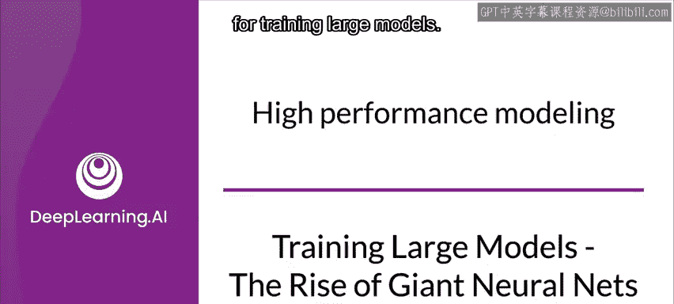
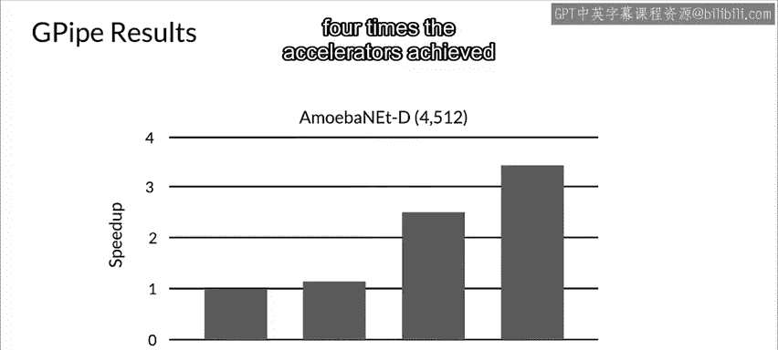

#  103：训练大型模型 - 巨型神经网络与并行化的兴起 🚀

在本节课中，我们将探讨高性能建模，特别是处理日益增大的模型时所面临的问题，并介绍一些用于训练大型模型的先进技术。

---

近年来，机器学习数据集和模型的规模持续增长，这为包括语音识别、视觉识别和语言处理在内的广泛任务带来了更好的结果。BigGAN、BERT和GPT-3等最新进展表明，更大的模型通常能带来更好的任务性能。

与此同时，GPU和TPU等硬件加速器的性能也在提升，但速度明显更慢。模型增长与硬件改进之间的差距，使得并行化的重要性日益凸显。

这里的并行化，指的是在多个硬件设备上训练单个机器学习模型。

---

## 并行化的挑战与机遇

一些模型架构，特别是小型模型，非常适合并行化，可以很容易地在硬件设备之间进行划分。

然而，对于巨型模型，同步成本会导致性能下降，从而阻碍其使用。模型大小与分类精度之间存在很强的相关性。

例如，2014年ImageNet视觉识别挑战赛的冠军是GoogleNet，它使用400万个参数实现了74.8%的Top-1准确率。仅仅三年后，2017年ImageNet的冠军是Squeeze-and-Excitation网络，它使用1.458亿个参数实现了82.7%的Top-1准确率。这意味着参数数量在三年内增加了36倍。

海量的权重和激活参数需要巨大的内存存储空间。因此，一个自然而然的问题是：随着模型需要越来越多的参数，这些参数存储在哪里？

过去几年，内存容量的增长与模型参数的增长相比非常有限。具体来说，TPU内存仅增加了大约三倍，而当前最先进的图像模型已经达到了云TPU V2上可用的内存上限。

因此，迫切需要一种高效、可扩展的基础设施，以实现大规模深度学习并克服当前加速器的内存限制。

---

## 克服内存限制的传统方法

在某种程度上，这不是一个新问题。让我们看看一些旧方法如何应对克服内存限制的问题，并思考今天是否还能应用它们。然后，我们再看看一些新方法及其取得的进展。

需要制定策略并实施解决方案来克服这些重要的内存限制。

**梯度累积**是一种可以克服GPU内存不足问题的策略。梯度累积是一种将完整批次拆分为几个小批次的机制。在反向传播过程中，模型不会随每个小批次更新，而是累积梯度。当一个完整批次完成后，所有先前小批次的累积梯度被用于反向传播来更新模型。

这个过程与使用完整批次训练网络一样有效，因为模型参数更新的次数相同。

**交换**是第二种方法。由于加速器上没有足够的存储空间，需要将激活值复制回CPU或内存，然后再复制回加速器。这里的问题是速度慢，CPU/内存与加速器之间的通信成为瓶颈。

---

## 并行化的基本方法

回到我们对并行化的讨论，其基本思想是将计算拆分到多个工作节点上。你已经看到了两种并行化方式：数据并行和模型并行。

*   **数据并行**：在不同工作节点间拆分输入数据。
*   **模型并行**：在不同工作节点间拆分模型本身。

在数据并行中，不同的工作节点（或GPU）处理相同的模型，但处理不同的数据。模型在多个工作节点上复制，每个工作节点执行前向和后向传播。当它完成这个过程后，会与其他设备同步更新后的模型权重，并计算整个小批次的更新权重。

在模型并行中，工作节点只需要同步共享参数，通常每个前向或反向传播步骤同步一次。此外，由于每个工作节点使用相同的训练数据处理模型的一个子部分，因此模型大小不是主要问题。

在使用模型并行进行训练时，模型被划分到K个工作节点上，每个工作节点持有模型的一部分。模型并行的一种简单方法是将一个N层神经网络划分到K个工作节点上，只需在每个工作节点上托管N/K层。更复杂的方法会通过分析每层的计算复杂度，确保每个工作节点都同样繁忙。

标准的模型并行能够训练更大的神经网络，但由于工作节点经常相互等待，并且在给定时间只有一个能执行更新，因此性能会受到很大影响。

---

## 数据并行的瓶颈

让我们回到数据并行，看一些基准测试。下图显示了三种不同硬件配置下，通信开销占总训练时间的百分比。

像AlexNet和VGG16这样的许多模型，即使在相对较慢的K80加速器上，也有很高的通信开销。有两个因素导致所有模型的通信开销增加：数据并行工作节点数量的增加，以及GPU计算能力的增加。

在数据并行中，输入数据集在多个GPU之间分区。每个GPU维护模型的完整副本，并在自己的数据分区上进行训练，同时定期与其他GPU同步权重，使用集体通信原语或参数服务器。

参数同步的频率影响统计效率和硬件效率。在每个小批次结束时同步，可以减少用于计算梯度的权重陈旧性，确保良好的统计效率。不幸的是，这要求每个GPU等待来自其他GPU的梯度，这会显著降低硬件效率。

由于神经网络的结构，通信延迟在数据并行训练中是不可避免的，其结果往往是通信主导总执行时间。加速器速度的快速提升进一步将训练瓶颈转向通信。

---

## 管道并行：一种新的解决方案

此外还有另一个问题。加速器内存有限，主机上的通信带宽也有限。这意味着需要通过将模型划分为多个分区并将不同分区分配给不同加速器，来在加速器上训练更大的模型。

但由于神经网络的顺序性质，简单的策略可能导致在计算过程中只有一个加速器处于活动状态，从而未充分利用加速器的计算能力。另一方面，标准的数据并行方法允许在多个加速器上使用不同的输入数据并发训练相同的模型，但无法增加单个加速器所能支持的最大模型大小。

数据并行和模型并行的问题导致了**管道并行**的发展。

在下图中，由于模型的顺序性质，简单的模型并行策略导致严重的利用不足，一次只有一个加速器处于活动状态。

为了在多个加速器上实现高效训练，需要找到一种方法，将模型划分到不同的加速器上，并自动将一个小批次的训练样本拆分成更小的微批次。通过跨微批次进行流水线执行，加速器可以并行操作。此外，梯度在微批次之间持续累积，因此分区数量不会影响模型质量。

---

## 管道并行的实现：Gpipe 与 PipeDream

**Google的Gpipe**是一个使用管道并行高效训练大规模模型的开源库。在下图中，Gpipe将输入小批次划分为更小的微批次，使不同的加速器能够同时处理不同的微批次。

Gpipe本质上提出了一种处理模型并行的新方法，它允许在多个硬件设备上训练大型模型，性能提升几乎是一比一的。它还有助于模型包含更多的参数，从而在训练中获得更好的结果。

**微软的PipeDream**也支持管道并行。Gpipe和PipeDream在许多方面都很相似。

像Gpipe和PipeDream这样的管道并行框架，集成了数据并行和模型并行，以实现高效率并保持模型精度。它们通过将小批次划分为更小的微批次，并允许不同的工作节点并行处理不同的微批次来实现这一点。因此，它们可以训练参数数量显著更多的模型。

---

## Gpipe 的工作原理与效果

Gpipe是一个开源的分布式机器学习库，它使用同步小批次梯度下降进行训练。它将模型划分到不同的加速器上，并自动将一个小批次的训练样本拆分为微批次。通过跨微批次进行流水线执行，加速器可以并行训练。

Gpipe接收神经网络架构、小批次大小以及可用于计算的硬件设备数量作为输入。然后，它自动将网络层划分为阶段，将小批次划分为微批次，并将它们分布在各个设备上，从而将模型划分为K个阶段。

Gpipe根据每层的激活函数和训练数据内容来估计其计算成本。Gpipe试图最大化模型参数的内存分配。

谷歌的研究团队在云TPU V2上进行了实验，每个TPU有8个加速器核心和64GB内存（每个加速器8GB）。如果没有Gpipe，由于内存限制，单个加速器最多只能训练8200万个模型参数。

得益于反向传播中的重新计算和批次拆分，Gpipe将中间激活内存从6.2GB减少到3.4GB，使单个加速器能够训练多达3.18亿个参数。他们还观察到，通过管道并行，最大模型大小与分区数量成正比，正如预期的那样。

使用Gpipe，在云TPU的八个加速器上测试AmoebaNet模型时，能够整合18亿个参数，比不使用Gpipe时多25倍。为了测试效率，他们测量了Gpipe对AmoebaNet-D模型吞吐量的影响。

由于训练至少需要两个加速器来容纳模型大小，他们测量了相对于没有管道并行、只有两个分区的简单情况的加速比。他们观察到，与简单方法相比，训练速度几乎呈线性提升：将模型分布在四倍的加速器上，实现了3.5倍的加速。

---

## 总结

本节课中，我们一起学习了训练大型模型所面临的挑战，特别是内存和计算瓶颈。我们回顾了梯度累积和交换等传统方法，深入探讨了数据并行和模型并行的基本原理及其局限性。最后，我们重点介绍了**管道并行**这一先进技术，它通过将小批次拆分为微批次并进行流水线执行，巧妙地结合了数据并行和模型并行的优点，从而能够高效地训练参数数量极其庞大的模型。Google的Gpipe和微软的PipeDream是这一领域的代表性框架，它们使得在现有硬件上训练巨型神经网络成为可能。