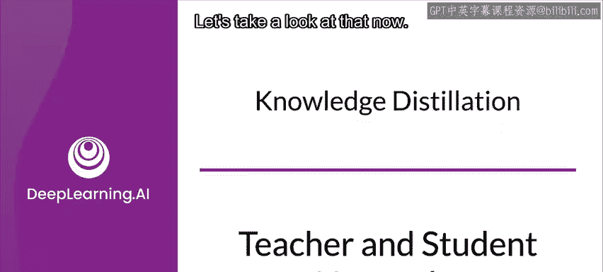
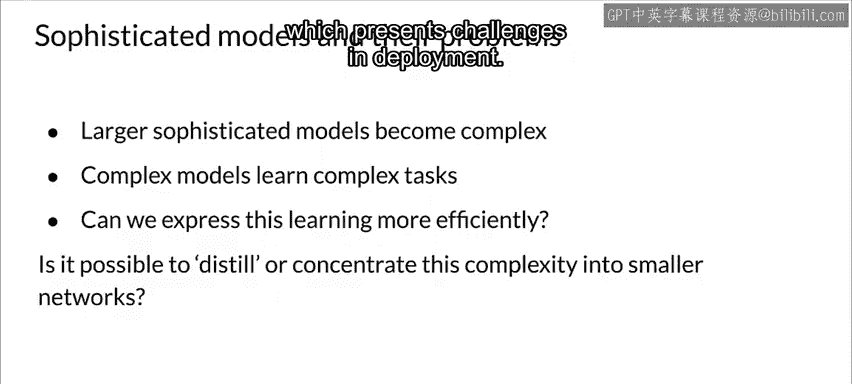
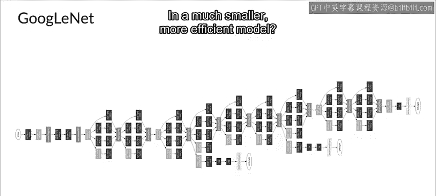
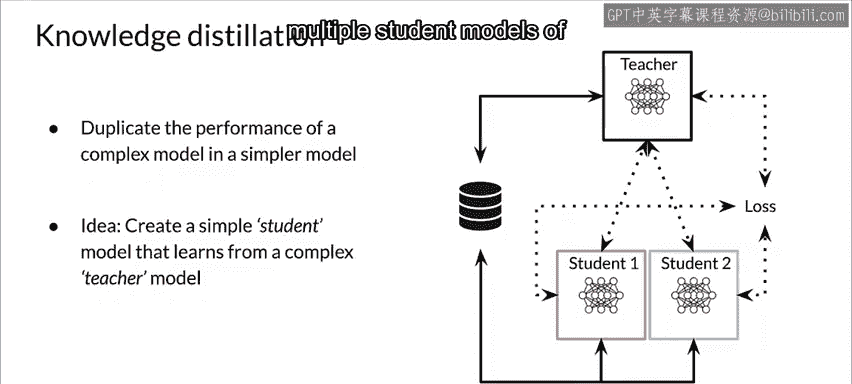

#  104：知识蒸馏（教师-学生网络）🧠➡️🎓

在本节课中，我们将学习一种名为“知识蒸馏”的技术。它旨在将大型、复杂模型（教师模型）学到的“知识”提炼并转移到一个小型、高效的模型（学生模型）中，从而解决复杂模型在移动设备等生产环境中部署困难的问题。

到目前为止，我们已经讨论了优化模型实现以提升效率的方法。

但是，你也可以尝试通过一种不同的训练方式，来捕捉或提炼模型已学到的知识，并将其封装到一个更紧凑的模型中。

这就是所谓的知识蒸馏。让我们来详细了解一下。

## 为何需要知识蒸馏？🤔

现在，你已经了解了几种不同的模型优化方法。

但如果你想部署一个相对复杂且体积庞大的模型，仅仅减少参数数量或降低模型复杂度，是否足以帮助你部署这些更强大、更大的模型呢？

让我们尝试回答这些问题。首先，我们来看看大型模型是如何变得复杂的，并探究是否可能用更小的模型达到同等的复杂程度。

模型为了学习复杂的任务，会试图捕捉更多的信息或知识，从而变得更大、更复杂。

然而，如果我们能更高效地表达或呈现这种学习成果，或许就能创造出与这些大型复杂模型等效的更小模型。

举个例子，我们来看一个在部署上存在挑战的复杂图像分类模型。

例如，让我们看看GoogleNet。它是一个如此深且复杂的网络，甚至无法完整地呈现在这张幻灯片上。

其深度赋予了它表达特征间复杂关系的能力，但也正因为它如此庞大，在许多生产环境（包括手机和边缘设备）中难以甚至无法部署。

那么，能否两全其美，将像GoogleNet这样的复杂模型中所包含的知识，捕捉到一个更小、更高效的模型中呢？这就是知识蒸馏的目标。

与我们之前看到的量化和剪枝不同，知识蒸馏并非优化网络实现，而是旨在创建一个更高效的模型，使其能捕捉到与更复杂模型相同的知识。如果需要，还可以对结果模型进一步应用优化。

## 知识蒸馏如何工作？⚙️

知识蒸馏是一种训练小型模型以模仿大型模型甚至模型集成的方法。

以下是其核心步骤：

首先，训练一个复杂的模型或模型集成，以达到较高的准确度水平。

然后，将该模型作为“教师”，用于指导一个更简单的“学生”模型进行训练。

最终，这个学生模型将成为实际部署到生产环境中的模型。

这个教师网络可以是固定的，也可以与学生的训练过程联合优化，甚至可以同时用于训练多个不同大小的学生模型。

## 总结 📝

本节课中，我们一起学习了知识蒸馏技术。我们了解到，通过让一个大型、高性能的教师模型指导一个小型学生模型，可以将复杂模型的知识“蒸馏”出来，从而得到一个既高效又保持高性能的、易于部署的模型。这为解决大型模型在生产环境中的部署难题提供了一种有效的思路。