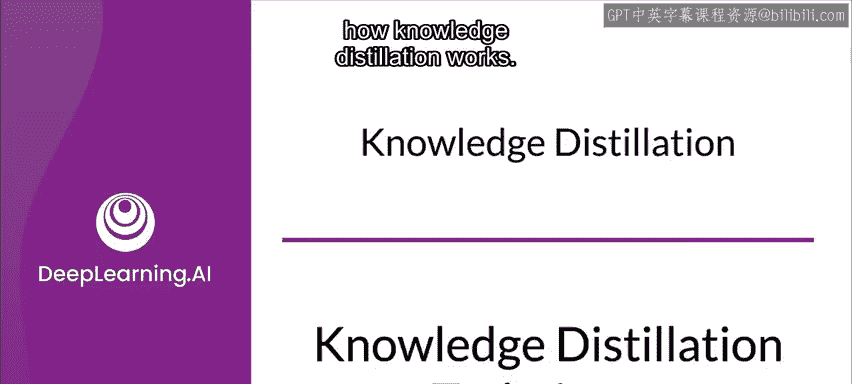
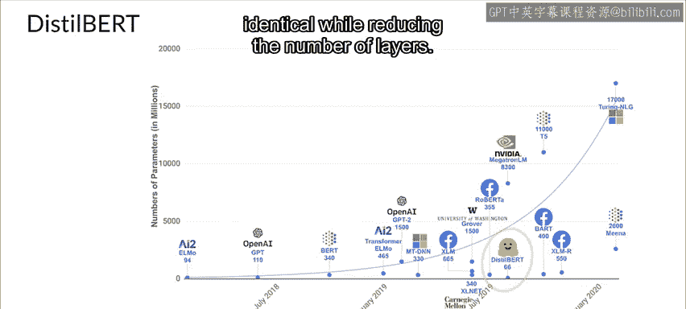

#  105：知识蒸馏技术 🧠


在本节课中，我们将深入探讨知识蒸馏技术的工作原理。知识蒸馏是一种模型压缩技术，旨在将大型、复杂模型（教师模型）的知识转移到小型、高效模型（学生模型）中。我们将学习其核心概念、训练目标以及实际应用。



---

## 教师模型与学生模型 👨‍🏫👨‍🎓

上一节我们介绍了知识蒸馏的基本概念，本节中我们来看看其中的两个核心角色：教师模型与学生模型。

在知识蒸馏中，教师模型和学生模型扮演着不同的角色。

*   教师模型：通常是一个大型、高性能的预训练模型。它的任务是提供“知识”。
*   学生模型：通常是一个更小、更高效的模型。它的任务是学习并模仿教师模型的行为。

---

## 训练目标与知识转移 🎯

了解了教师与学生的角色后，我们来看看它们是如何通过不同的训练目标进行知识转移的。

在知识蒸馏中，学生模型和教师模型的训练目标函数是不同的。

教师模型首先使用标准的目标函数进行训练，该函数旨在最大化模型的准确率或类似指标。这就是正常的模型训练过程。

随后，学生模型寻求可转移的知识。因此，它使用一个旨在匹配教师模型预测概率分布的目标函数。

需要注意的是，学生模型学习的不仅仅是教师模型的预测结果，更是其预测的概率。教师模型预测的概率构成了“软目标”，与最终的预测结果本身相比，这些软目标提供了更多关于教师模型所学知识的信息。

---

## 软目标与温度参数 🌡️

知识蒸馏并非神秘技术，但它确实涉及“暗知识”。现在我们来讨论这一点。

知识蒸馏的工作原理是通过最小化一个损失函数，将知识从教师模型转移到学生模型，该损失函数的目标是教师模型预测的类别概率分布。

具体而言，教师模型的逻辑值作为最终 Softmax 层的输入。通常使用逻辑值是因为它们为每个样本的所有目标类别概率提供了更多信息。

然而，在许多情况下，这个概率分布中正确类别的概率非常高，而其他所有类别的概率都接近于零。因此，实际上，它有时除了数据集中已提供的真实标签外，并未提供太多额外信息。

为了解决这个问题，Hinton、Vinyals 和 Dean 引入了 **Softmax 温度** 的概念。

通过提高学生和教师目标函数中的温度，可以改善教师模型分布的“柔软度”。在以下公式中，类别 `i` 的概率 `P` 由逻辑值 `Z` 计算得出：

```
P_i = exp(z_i / T) / Σ_j exp(z_j / T)
```

其中，`T` 指的是温度参数。当 `T = 1` 时，得到标准的 Softmax 函数。但随着 `T` 增大，Softmax 函数生成的概率分布会变得更“软”，从而提供更多信息，表明教师模型认为哪些类别与预测类别更相似。

作者将此称为教师模型中蕴含的“暗知识”，而正是这种暗知识在蒸馏过程中被转移到了学生模型中。

---

## 学生模型的训练技巧 ⚙️

有多种技术用于训练学生模型以匹配教师的软目标。以下是两种主要方法：

*   **方法一**：学生模型同时基于教师的逻辑值和真实标签进行训练，使用一个标准的目标函数，这两个目标函数在反向传播中进行加权和组合。
*   **方法二**：使用诸如 KL 散度等度量来比较学生模型预测分布与教师模型预测分布。

现在让我们看看第二种技术，因为它应用更广泛。

通常，知识蒸馏通过混合两个损失函数来完成，选择一个介于 0 和 1 之间的 alpha 值。损失函数公式如下：

```
L = α * L_CE + (1 - α) * L_KL
```

其中，`L_CE` 是来自硬标签的交叉熵损失，`L_KL` 是来自教师逻辑值的 Kullback-Leibler 散度损失。

在数据增强非常剧烈的情况下，由于对数据应用了激进的扰动，可能无法完全信任原始的硬标签。

这里的 Kullback-Leibler 散度是两个概率分布之间差异的度量。我们希望这两个概率分布尽可能接近，因此目标就是使学生模型预测的类别分布尽可能接近教师模型。

在计算相对于教师软目标的损失函数时，使用相同的 `T` 值来计算学生模型逻辑值的 Softmax。这个损失就是**蒸馏损失**。

作者还发现了另一个有趣的现象：蒸馏后的模型除了能产生教师的软目标外，还能产生正确的标签。这意味着可以计算学生模型预测的类别概率与真实标签（称为硬标签或硬目标）之间的标准损失。这个损失就是**学生损失**。在计算学生模型的概率时，将 Softmax 温度设置为 1。

---

## 知识蒸馏的量化结果与优势 📊

知识蒸馏的首个量化结果令人鼓舞。

Hinton 及其同事为一个自动语音识别任务训练了 10 个独立的模型，其架构和训练过程与当时的基线相同。当时的自动语音识别任务依赖于深度神经网络，将波形特征的一个短时上下文映射到隐马尔可夫模型离散状态的概率分布上。

对于这些模型，他们使用不同的初始参数值随机初始化权重。这样做本质上是为了确保训练后的模型具有足够的多样性。

在集成模型预测时，它们能轻松超越单个模型。他们也考虑了让每个模型看到不同的数据集，但发现这不会显著影响结果。因此，他们决定使用这种更直接的策略，将模型集成与单个模型进行比较。

对于蒸馏过程，他们尝试了不同的 Softmax 温度值，如 1、2.5 和 10。他们在硬目标的交叉熵上使用了 0.5 的相对权重。

结果表明，蒸馏确实可以从训练集中提取比仅使用硬标签训练单个模型更有用的信息。由 10 个模型组成的集成所实现的准确率提升中，超过 80% 被转移到了蒸馏后的模型上。

由于目标函数不匹配，集成模型在最终目标（23K 词测试集上的词错误率）上带来的增益较小。但同样，集成模型实现的词错误率降低也被转移到了蒸馏后的模型中。

由此，他们能够证明模型蒸馏策略确实是有益的，并且可以用来实现将模型集成蒸馏成单个模型的效果，该模型比直接从相同训练数据学习的相同大小的模型表现要好得多。

---

## 现实世界应用：DistilBERT 🌐

在现实世界中，人们更感兴趣的是部署一个接近最先进结果但体积小得多、速度快得多的低资源模型。这就是 Hugging Face 创建 **DistilBERT** 的原因。

DistilBERT 是 BERT 的蒸馏版本，它使用的参数减少了 40%，运行速度提高了 60%，同时在 GLUE 语言理解基准测试中保留了 BERT 97% 的性能。

本质上，它是 BERT 的一个较小版本。为了创建 DistilBERT，移除了通常用于下一句分类任务的标记类型嵌入和池化层。Hugging Face 的研究人员将知识蒸馏应用于 BERT，因此得名 DistilBERT。他们在减少层数的同时，保持了架构的其余部分相同。

---

## 总结 📝



本节课中，我们一起学习了知识蒸馏技术。我们了解了教师模型与学生模型的概念，探讨了通过软目标和温度参数进行知识转移的原理，分析了学生模型的训练技巧，并看到了知识蒸馏在提升模型效率方面的量化优势及其在现实世界（如 DistilBERT）中的成功应用。知识蒸馏是一种强大的模型压缩方法，能够在保持高性能的同时，显著减小模型体积并提升推理速度。