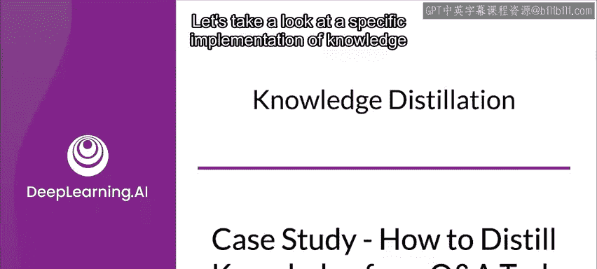
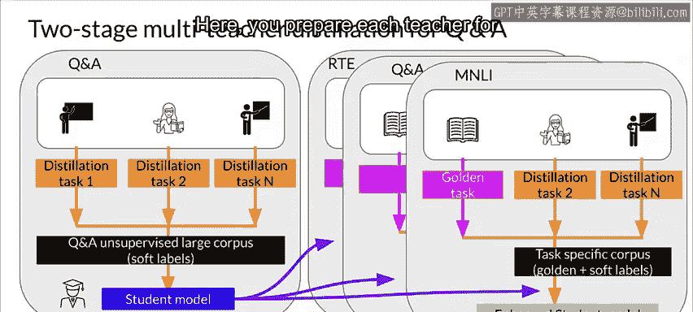
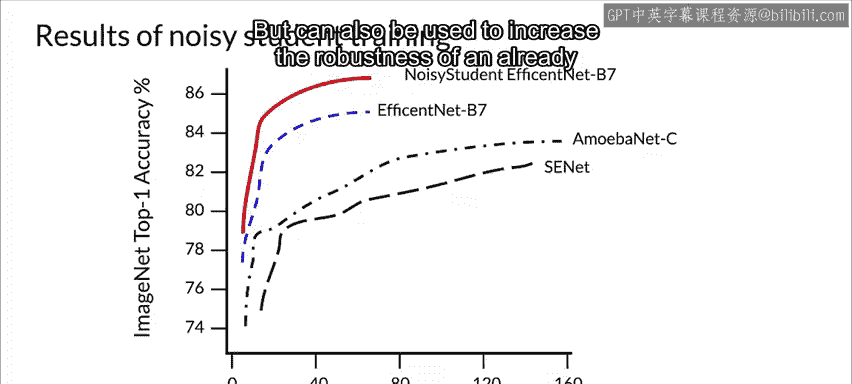

#  106：问答任务的知识蒸馏案例研究 📚

在本节课中，我们将学习知识蒸馏在具体任务——问答（Q&A）中的应用。我们将通过一个来自微软研究团队的具体实现案例，了解如何通过多教师知识蒸馏方法来压缩大型模型，同时保持其高性能。

---

## 概述

知识蒸馏是一种将大型、复杂模型（教师模型）的知识转移到小型、高效模型（学生模型）的技术。在问答任务中，直接部署像BERT或GPT这样的大型模型会面临参数量巨大、推理速度慢的挑战。传统的模型压缩方法往往会导致信息损失，使压缩后模型的性能不如原模型。为了解决这个问题，研究人员提出了创新的多阶段蒸馏方法。

上一节我们介绍了知识蒸馏的基本概念，本节中我们来看看它在实际问答系统中的具体实现。

---

## 多教师知识蒸馏（TMKD）方法

微软的研究人员提出了一种两阶段的多教师知识蒸馏方法，简称TMKD。该方法旨在解决信息损失问题，使学生模型的性能尽可能接近甚至达到教师模型的水平。

### 第一阶段：通用问答蒸馏预训练

首先，该方法为学生模型设计了一个通用的问答蒸馏预训练任务。这使学生模型能够在特定任务微调之前，就从大规模的无监督问答对数据中学习到良好的特征表示。

### 第二阶段：多教师知识蒸馏微调

随后，使用一个多教师知识蒸馏模型对这个预训练好的学生模型进行微调。这与我们之前介绍的一对一（一个教师对一个学生）的基础蒸馏方法不同。

---

## 从“一对一”到“多对多”

基础的知识蒸馏方法可被视为“一对一”模型。虽然它能有效减少参数和推理时间，但由于蒸馏过程中的信息损失，学生模型的性能有时无法与教师模型媲美。

这促使研究者创建了名为“多对多”的集成模型方法，它结合了**模型集成**和**知识蒸馏**。

以下是该方法的实现步骤：

1.  **训练多个教师模型**：首先，训练多个强大的教师模型（例如，不同超参数的BERT或GPT模型）。
2.  **为每个教师训练学生模型**：然后，为每一个教师模型分别训练一个对应的学生模型。
3.  **集成学生模型**：最后，将这些从不同教师那里学到的学生模型集成起来，产生最终结果。

这种方法让每个教师专注于特定的学习目标，不同的模型对训练数据有不同的泛化能力和过拟合方式，从而使学生模型能够融合更广泛的知识，达到接近教师模型的性能。

---

## TMKD的优势与实验验证

TMKD方法在多个公开基准和大规模数据集上的实验表明，它能够显著超越基线方法，甚至取得与原始教师模型相当的结果，同时大幅提升了模型推理速度。

为了支持这些结论，我们来逐一分析它的优势。

### 优势一：蒸馏预训练提升性能

TMKD的一个独特之处在于，它使用多教师蒸馏任务进行学生模型预训练，以提升模型性能。

为了分析预训练的影响，作者评估了两个模型：
*   **TKD模型**：一个基于三层BERT的模型，先在通用问答数据集上进行知识蒸馏预训练，然后在特定任务语料上使用单一教师进行微调。
*   **传统KD模型**：同样的模型结构，但没有蒸馏预训练阶段。

实验表明，TKD通过利用大规模无监督问答对进行蒸馏预训练，获得了显著的性能增益。

### 优势二：多教师联合学习的统一框架

TMKD的另一个好处是其能从多个教师那里联合学习的统一框架。

作者比较了多教师与单教师蒸馏的影响：
*   **MKD模型**：基于三层BERT，通过多教师蒸馏（无预训练阶段）训练。
*   **KD模型**：基于三层BERT，通过单教师蒸馏（无预训练阶段）训练，其目标是学习教师模型的平均分数。

MKD在大多数任务上优于KD，这表明多教师蒸馏方法能帮助学生模型学习更泛化的知识，融合来自不同教师的见解。

### 优势三：两阶段的互补效应

最后，作者比较了TKD、MKD和完整的TMKD。

结果显示，TMKD在所有数据集上都显著优于TKD和MKD。这验证了**蒸馏预训练**和**多教师微调**这两个阶段的互补影响。

---

## 扩展案例：Noisy Student训练法

在另一个例子中，来自Google Brain和卡内基梅隆大学的研究人员使用一种称为“Noisy Student”的半监督学习方法训练模型。

这种方法的知识蒸馏过程是迭代的，它使用了经典师生范式的变体，但有一个关键不同：**学生模型的参数量被有意设计得比教师模型更大**。

这样做是为了让模型对噪声标签具有鲁棒性，这与传统的知识蒸馏模式相反。

以下是“Noisy Student”的工作流程：

1.  首先，使用有标签图像训练一个EfficientNet作为教师模型。
2.  然后，使用教师模型在一个更大的无标签图像集上生成伪标签。
3.  接着，结合有标签图像和伪标签图像，训练一个更大的EfficientNet作为学生模型。
4.  通过将学生模型视为新的教师模型来重新标注无标签数据，并训练新的学生模型，将此算法迭代多次。

该方法的一个重要元素是，在训练学生模型时，通过**Dropout、随机深度、数据增强（如RandAugment）** 等方式为其添加噪声。

这种“制造困难”的做法迫使学生模型必须更努力地从伪标签中学习。给学生模型添加噪声确保了任务对学生来说更难，因此得名“Noisy Student”，这防止了学生模型仅仅机械地复制教师的知识。

需要注意的是，教师模型在生成伪标签时**不添加噪声**，以确保其准确性不受影响。

循环结束时，用优化后的学生网络替换原来的教师模型。

通过对比“Noisy Student”训练的结果，作者发现这种方法不仅能用于压缩模型（如DistilBERT），还能用于增强一个已经很优秀的模型的鲁棒性。结果显示，使用该方法训练的模型在ImageNet等基准测试中达到了新的顶尖水平。

---

## 总结

本节课中我们一起学习了知识蒸馏在问答任务中的具体应用。我们深入探讨了微软提出的**两阶段多教师知识蒸馏（TMKD）方法**，了解了它如何通过**蒸馏预训练**和**多教师联合微调**来提升小模型的性能。此外，我们还扩展了解了**“Noisy Student”训练法**，看到了知识蒸馏如何以迭代和添加噪声的方式，用于提升大模型本身的鲁棒性和性能。

这些案例表明，知识蒸馏是一个灵活而强大的工具，既能用于模型压缩和加速，也能用于提升模型的学习能力和泛化性能。