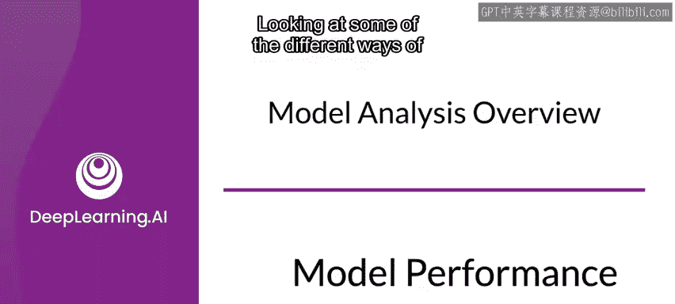
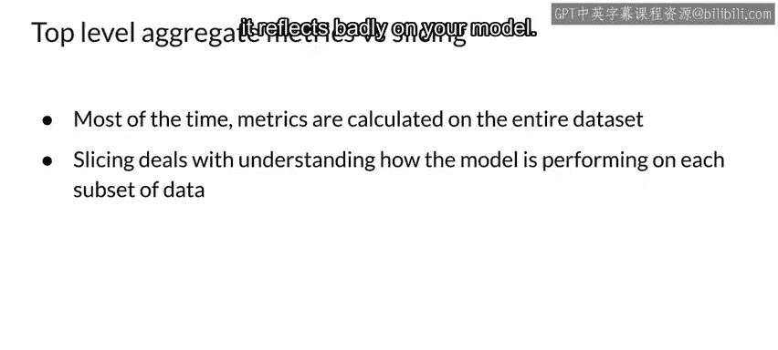

#  107：第29课 模型性能分析 📊

在本节课中，我们将深入学习模型性能分析。我们将首先回顾模型分析的基础知识，然后深入探讨一个关键工具——TensorFlow模型分析（TFMA）。我们还将了解模型调试、理解模型鲁棒性，并初步接触模型修复、公平性以及持续评估等概念。这是一个内容丰富的主题，让我们开始吧。

成功训练一个模型并使其收敛的感觉很好。这常常让人觉得任务已经完成。如果你是在为课程项目或论文训练模型，那么确实可以告一段落。但对于生产环境的机器学习，你现在需要进入开发的新阶段，这涉及到从多个方向对模型性能进行更深入的分析。这就是我们本周要学习的内容。

让我们从回顾模型分析的一些基础知识开始，看看分析模型和确定性能的不同方法。本周大部分内容，你将使用TensorFlow模型分析（TFMA）及其相关工具和技术。但首先，我们来回顾一下模型分析的一些要点。

这里需要强调的是，你不仅要在整个数据集上查看模型性能，还要在数据的各个独立切片上进行查看。在训练和/或部署后，你可能会注意到性能下降。因此，很自然地会去探究改进模型性能的可能方法。

此外，你需要预测未来可能看到的数据变化，并对自你最初训练模型以来已经发生的数据变化采取行动。选择需要分析的数据切片通常基于领域知识。这将使你能够确定模型是否有改进空间，并可能解决自最初训练模型以来发生的数据变化。

例如，如果你的模型旨在预测不同类型鞋子的需求，那么查看模型在单个鞋类（可能是不同颜色或款式）上的性能将非常重要。这需要为不同类型的鞋子对数据进行切片。

从高层次来看，分析模型性能主要有两种方法：黑盒评估和模型内省。

## 黑盒评估与模型内省 🔍

在黑盒评估中，你通常不考虑模型的内部结构。你只关心通过指标和损失来量化模型的性能。这在常规开发过程中通常是足够的。

但如果你对模型内部如何工作感兴趣，也许是为了寻找改进方法，你可以应用各种模型内省方法。当你尝试新的架构以理解数据在模型每一层内部如何流动时，模型内省方法非常有用。这可以帮助你调整和迭代模型架构，以提高性能和效率。

TensorBoard是用于黑盒评估的工具的一个例子。使用TensorBoard，我们可以监控模型每次迭代的损失和准确率。你还可以密切监控训练过程本身。请查看阅读列表以了解更多关于TensorBoard的信息。

在模型内省中，目标完全不同。你不仅对模型的最终结果感兴趣，还对每一层的细节感兴趣。在左侧，我们看到了模型卷积层中各种滤波器的最大激活区域。这是一个CNN模型。当我们运行一系列属于特定类别的图像时，利用这些模式，你可以检查模型在哪一层学习到了数据的特定结构。右侧是类别激活图的一个例子。在这里，你感兴趣的是知道图像的哪些部分主要负责对该类别做出期望的预测。利用这些信息，你可以尝试通过调整或包含更多与这些高亮区域相关的特征来提高模型的性能。

接下来，我们来看看性能指标和优化之间的区别。

## 性能指标与优化目标 ⚖️

首先是性能指标。根据你试图解决的问题，你需要使用某种度量来量化模型的成功。为此，你使用各种性能指标。对于不同类型的任务（如分类和回归等），性能指标会有所不同。你在设计和训练模型时已经熟悉了这些。

现在让我们关注优化部分。这是你的目标函数、成本函数或损失函数。人们对它的称呼不同。当你训练模型时，你试图最小化这个函数的值，以在损失曲面上找到一个最优值，希望是全局最优值。如果你再次查看TensorBoard，你会注意到有选项可以跟踪性能指标（如准确率）和优化目标（如每次训练和验证周期后的损失）。

让我们快速检查一下优化环境。这也被称为损失曲面。在这里，损失被表示为两个参数的函数。图中描绘的是一个鞍点，其中沿不同维度的曲率符号不同。一个维度向上弯曲，另一个向下弯曲。这是许多优化问题的典型情况。

动画显示了不同优化算法的轨迹。这些优化器中的每一个都根据其更新方法以不同的方式遍历曲面，并且可能需要不同的时间收敛到最优值。

当你评估训练性能时，你通常关注的是顶层指标。这是为了决定你的模型是否表现良好，但它并不能告诉你模型在数据的各个部分上表现如何。例如，不同商店的不同客户对你的模型体验可能大不相同。如果他们的体验不好，就会给你的模型带来负面影响。