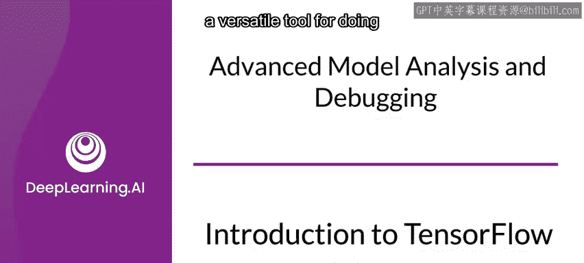
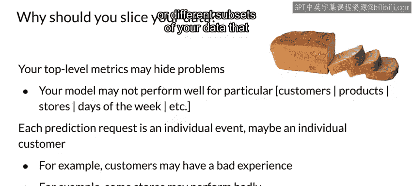
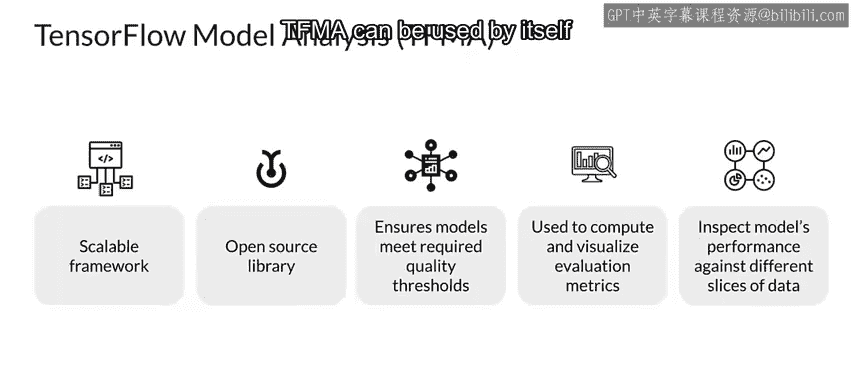
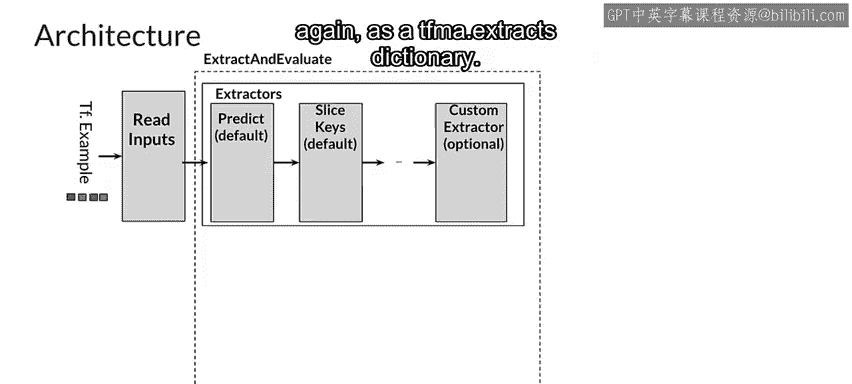
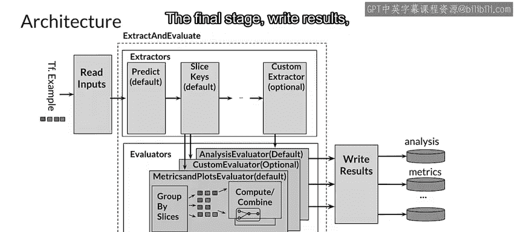
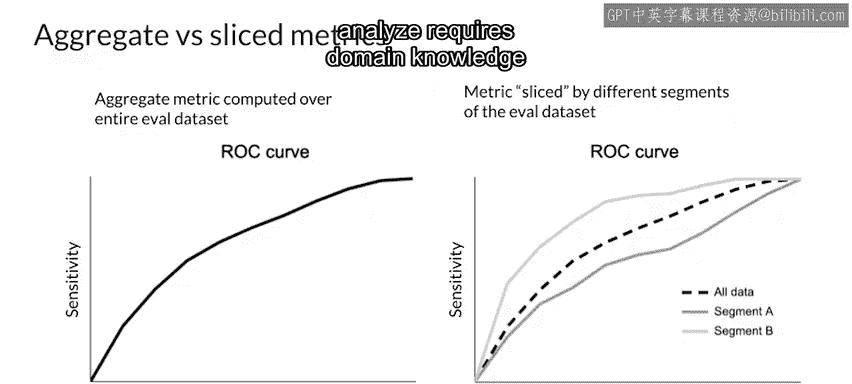
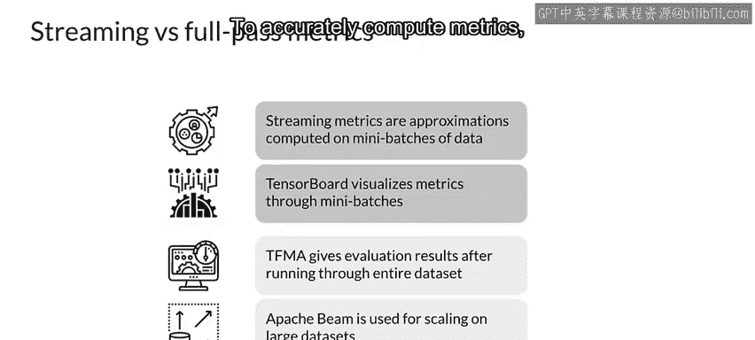

#  108：TensorFlow Model Analysis (TFMA) 简介 🔍

在本节课中，我们将学习 TensorFlow Model Analysis (TFMA) 这一工具。TFMA 是一个用于对模型性能进行深度分析的多功能框架。我们将了解其重要性、核心架构、工作流程以及它与 TensorBoard 的区别。

## 概述

整体性能指标很容易掩盖模型在特定数据部分存在的问题。例如，模型可能对特定客户、产品、店铺、星期几或对您的领域有意义的其他数据子集表现不佳。

考虑到向模型请求预测的客户，如果模型产生了一个糟糕的预测，那么该客户对模型的体验就是糟糕的，无论其整体指标表现多好。

为了让开发者能够更深入地审视模型性能，Google 创建了 TensorFlow Model Analysis (TFMA)。TFMA 是一个开源的、可扩展的框架，用于对模型性能进行深度分析，包括分析数据切片上的性能。

TFMA 也是机器学习流水线（如 TFX 流水线）的关键部分，用于在部署新训练模型版本之前执行深度分析。TFMA 内置了检查模型是否满足特定质量标准的能力，并能可视化评估指标、检查不同数据切片上的性能。TFMA 可以单独使用，也可以作为 TFX 等其他框架的一部分使用。

## TFMA 高层架构

上一节我们介绍了 TFMA 的基本概念，本节中我们来看看它的高层架构。

TFMA 流水线由四个主要组件构成：读取输入、提取器、评估器和写入结果。

以下是各组件的主要功能：

*   **读取输入**：此阶段由一个转换器组成，它接收原始输入（如 CSV 或 TFRecords 等），并将其转换为下一个阶段（提取）可以理解的字典格式。
*   **提取**：此阶段使用 Apache Beam 进行分布式处理。输入提取器和切片键提取器从原始数据集中形成切片，预测提取器将在每个切片上运行预测。结果再次以 `TFMA.extracts` 字典格式发送到下一阶段。
*   **评估**：此阶段同样使用 Apache Beam 进行分布式处理。有多个评估器，您也可以创建自定义评估器。例如，指标和绘图评估器从数据中提取所需字段，以根据上一阶段收到的预测来评估模型性能。
*   **写入结果**：顾名思义，此阶段将结果写入磁盘。

## TFMA 与 TensorBoard 的区别

了解了 TFMA 的架构后，我们来看看它与另一个常用工具 TensorBoard 有何不同。

TensorBoard 和 TFMA 在开发过程的不同阶段使用。总体而言，TensorBoard 用于分析训练过程本身，而 TFMA 用于对训练完成的模型进行深度分析。

以下是两者的主要区别：

*   **TensorBoard**：用于检查单个模型的训练过程，通常在训练期间监控进度。它也可以用于可视化多个模型的训练进度，在训练过程中将每个模型的性能与其全局训练步数进行对比绘图。
*   **TFMA**：在训练完成后，TFMA 允许开发者比较他们训练模型的不同版本。TensorBoard 可视化的是多个模型在全局训练步数上的流式指标，而 TFMA 可视化的是为单个模型在多个导出的已保存模型版本上计算出的指标。

## 为何需要切片分析

大多数模型评估结果关注的是整个训练数据集上的聚合或顶层指标，这种聚合常常会掩盖模型性能的问题。

例如，一个模型在整个评估数据集上可能有可接受的 AUC，但在特定切片上表现不佳。通常，一个平均性能良好的模型，可能存在通过查看聚合指标无法发现的故障模式。

切片指标允许您在更细粒度的层面上分析模型性能。此功能使开发者能够识别示例可能被错误标记的切片，或者模型预测过高或过低的切片。

例如，通过按小时对数据进行切片，TFMA 可用于分析一个预测出租车小费慷慨度的模型，对于白天和夜间乘车的乘客是否表现同样良好。

通常，确定哪些切片需要分析，需要关于您的数据和应用的领域知识。

## TFMA 的计算优势

上一节我们讨论了切片分析的重要性，本节中我们来看看 TFMA 在计算上的优势。

TensorBoard 在训练期间基于小批量计算指标，这些被称为流式指标，是基于观察到的小批量的近似值。

TFMA 使用 Apache Beam 对整个评估数据集进行一次完整的遍历。这不仅允许准确计算指标，而且由于 Beam 流水线可以使用分布式处理后端运行，因此可以扩展到海量的评估数据集。

需要注意的是，TFMA 计算的是与 TensorFlow 评估工作器相同的 TensorFlow 指标，只是通过对指定数据集的完整遍历来计算得更准确。TFMA 还可以配置为计算模型中未识别或未定义的其他指标。

此外，如果评估数据集被切片以计算特定分段的指标，每个分段可能只包含少量示例。因此，为了准确计算指标，对这些示例进行确定性的完整遍历非常重要。

## 总结

本节课中，我们一起学习了 TensorFlow Model Analysis (TFMA)。我们了解到 TFMA 是一个强大的开源框架，用于对训练完成的模型进行深度、可扩展的性能分析，尤其擅长通过数据切片来发现隐藏在整体指标下的问题。我们探讨了其四阶段的高层架构，明确了它与 TensorBoard 在用途和计算方式上的区别，并理解了其基于 Apache Beam 进行完整数据集遍历以确保指标计算准确性的优势。掌握 TFMA 有助于确保模型在部署前满足质量标准，并在实际应用中表现稳健。