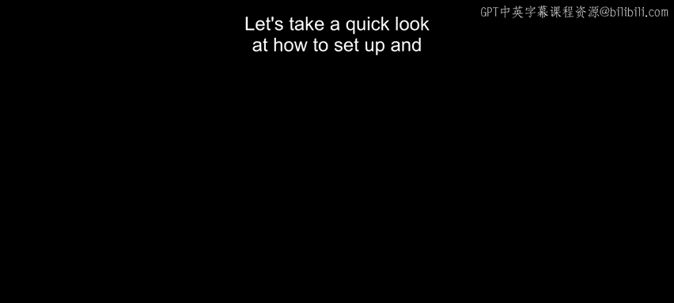
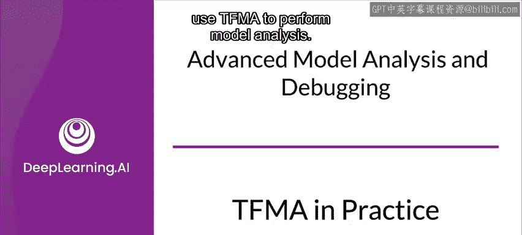
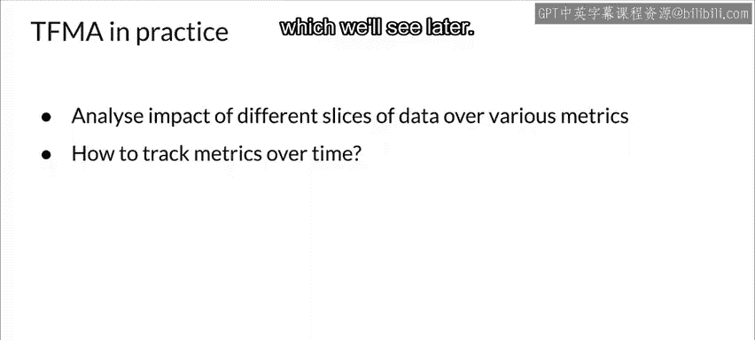
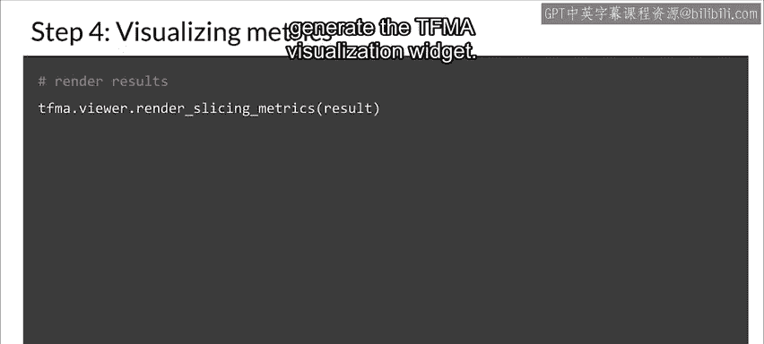
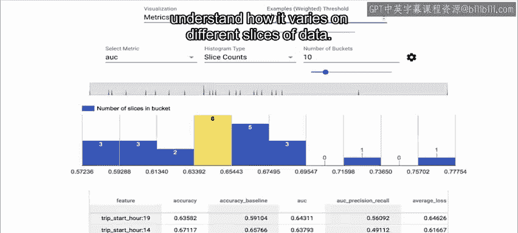

#  109：TFMA 实战指南 🛠️

在本节课中，我们将学习如何设置和使用 TensorFlow Model Analysis (TFMA) 来执行模型分析。我们将了解 TFMA 如何帮助您以不同方式评估模型性能，包括评估模型在不同数据切片上的表现，以及随时间跟踪指标。

---





## 准备工作与库导入

在开始之前，请注意，本示例在 TFX 管道之外独立使用 TFMA。当您在 TFX 管道中使用 TFMA 时，评估器组件已包含本示例中的许多步骤，因此您无需手动执行。通常，您只需向评估器组件提供 EvalConfig，我们稍后会看到这一点。

首先，我们需要导入所有必要的库。在本例中，我们需要 TensorFlow、TensorFlow Transform 和 TensorFlow Model Analysis。

```python
import tensorflow as tf
import tensorflow_transform as tft
import tensorflow_model_analysis as tfma
```

---

## 第一步：训练模型与生成 SavedModel

使用 TFMA 的第一步是训练您的模型并生成一个 SavedModel 对象。这通常是您为了部署模型而需要做的常规步骤。

原始输入示例在使用 TFMA 进行评估时，需要以与训练期间相同的方式进行预处理。例如，如果某个特征在训练前进行了归一化，那么在评估前也需要进行归一化。

如果您在 TFX 管道中训练模型并包含了 Transform 组件，那么训练期间完成的相同预处理和特征工程将已包含在您的 SavedModel 中。然而，如果您不是在 TFX 中训练的，则需要手动应用相同的预处理，这在本例中通过 `get_serving_tf_examples` 函数完成，其中使用了 TensorFlow Transform。



接下来，我们生成 SavedModel。在大多数情况下，您希望为 SavedModel 使用默认的服务签名，但您也可以在模型规范配置中明确指定不同的签名。

---

## 第二步：创建评估配置 (EvalConfig)

下一步涉及创建一个 EvalConfig 对象，该对象封装了 TFMA 的要求。

具体来说，首先您必须定义数据集的分片以及您希望用于分析模型的指标。然后，将模型、分片、指标和其他配置包装在一个 EvalConfig 对象中。这将决定 TFMA 在运行时执行的操作。这与您在 TFX 管道中提供给评估器组件的 EvalConfig 是相同的。

以下是定义配置的示例：

```python
# 定义分片规范
slice_spec = [
    tfma.slicer.SingleSliceSpec(columns=['feature_column_name']),
    tfma.slicer.SingleSliceSpec(columns=['another_feature'], feature_values={'value': 'specific_value'})
]

# 定义要计算的指标
metrics_specs = [
    tfma.metrics.specs_from_metrics([
        tf.keras.metrics.BinaryAccuracy(name='accuracy'),
        tf.keras.metrics.AUC(name='auc'),
    ])
]

# 创建 EvalConfig
eval_config = tfma.EvalConfig(
    model_specs=[tfma.ModelSpec(label_key='label')],
    slicing_specs=slice_spec,
    metrics_specs=metrics_specs
)
```

---

## 第三步：运行模型分析

设置好 EvalConfig 对象后，您现在可以开始分析模型了。这些示例仅使用一台机器执行分析，因此不需要使用编排器。

代码设置了评估图的路径和存储分析结果的目录。下一步是调用 `tfma.run_model_analysis` API。这将启动您的模型分析。此 API 也可以直接接受分片规范。

```python
# 设置输出路径
output_path = '/path/to/output/directory'

# 运行模型分析
eval_result = tfma.run_model_analysis(
    eval_shared_model=model_spec, # 您的模型规范
    eval_config=eval_config,
    data_location='/path/to/eval/data', # 评估数据位置
    output_path=output_path
)
```

---

## 第四步：可视化分析结果

最后，让我们渲染结果并可视化模型分析指标。TFMA 提供了可以在 Notebook 中运行的交互式小组件。这是您将包含在 Notebook 单元格中以生成 TFMA 可视化小组件的代码。

```python
# 在 Jupyter Notebook 中渲染结果
tfma.view.render_slicing_metrics(eval_result)
```

可视化工具看起来是这样的。该工具使您能够深入挖掘模型性能，并理解它在不同数据切片上的变化情况。

---

## 总结





在本节课中，我们一起学习了如何设置和使用 TensorFlow Model Analysis (TFMA)。我们从导入必要库开始，然后学习了如何训练模型并生成 SavedModel。接着，我们探讨了如何创建 EvalConfig 对象来定义分析需求，包括数据分片和评估指标。最后，我们运行了模型分析并学习了如何可视化结果，从而深入理解模型在不同数据切片上的表现。