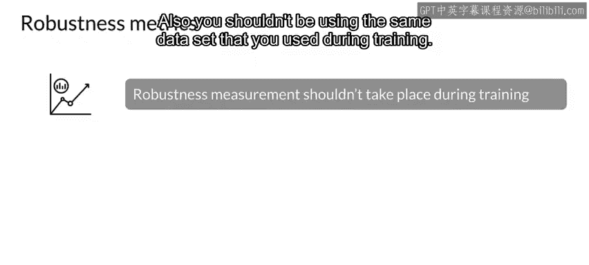
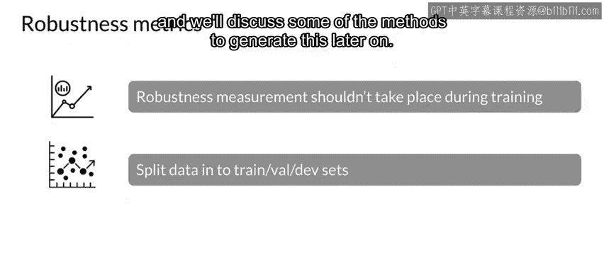
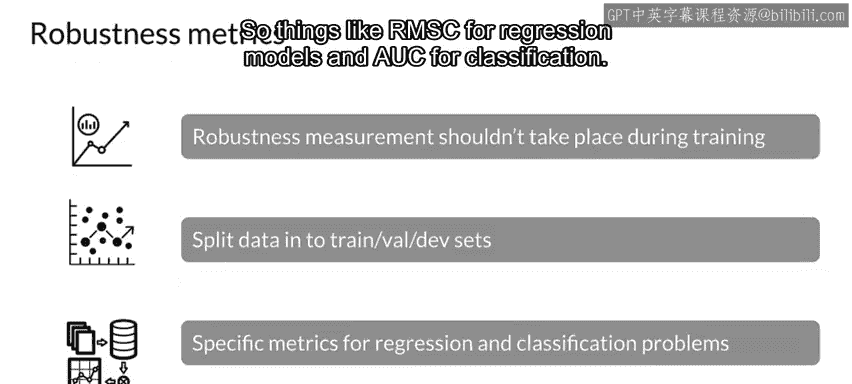
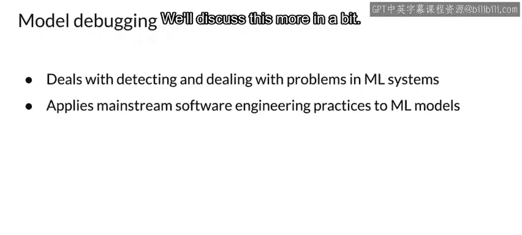
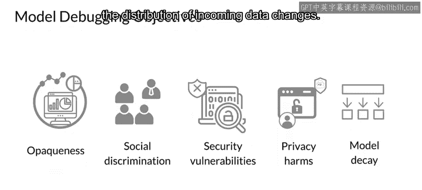
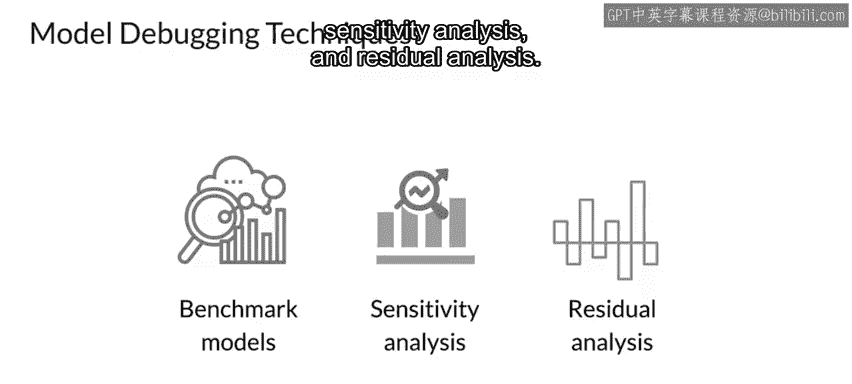

#  110：模型调试概述 🐛

在本节课中，我们将超越简单的性能指标，探讨如何分析和提升模型性能。我们将重点介绍模型调试的概念、目标及其核心方法。

上一节我们讨论了模型性能的基础评估，本节中我们来看看如何深入分析并提升模型的鲁棒性。

## 模型鲁棒性检查 🛡️

检查模型鲁棒性是超越简单性能或泛化能力测量的重要一步。

一个模型被认为是鲁棒的，即使一个或多个特征发生相当剧烈的变化，其结果也能保持一致的准确性。当然，鲁棒性有其限度，所有模型都对数据变化敏感。但是，一个模型随着数据变化而以渐进、可预测的方式改变，与一个模型突然产生截然不同的结果，两者之间存在明显差异。

那么，如何衡量模型的鲁棒性呢？首要的一点是，不应在模型训练期间衡量其鲁棒性，也不应使用训练期间使用的相同数据集。在开始训练过程之前，应将数据集拆分为训练集、验证集和测试集。

您可以使用在验证阶段也完全未被模型见过的测试集来测试模型鲁棒性。或者，更好的选择是生成各种新型数据，我们稍后将讨论一些生成此类数据的方法。

衡量指标本身将与训练时使用的类型相同，具体取决于模型类型。例如，回归模型使用**RMSE**，分类模型使用**AUC**。

## 提升鲁棒性与模型调试 🧪

接下来，我们看看提升模型鲁棒性的方法。

模型调试是一个新兴学科，专注于发现和修复模型中的问题，并提高模型鲁棒性。模型调试借鉴了模型风险管理、传统模型诊断和软件测试中的各种实践。它试图像测试代码一样测试机器学习模型，这与软件开发中的测试方式非常相似。它探查复杂的机器学习响应函数和决策边界，以检测和纠正机器学习系统中的准确性、公平性、安全性等问题。我们稍后将详细讨论这一点。

模型调试有几个目标。机器学习模型的一大问题是它们可能变得相当不透明，成为“黑箱”。模型调试试图通过突出数据在内部的流动方式来提高模型的透明度。另一个问题是社会歧视。您的模型是否对某些人群效果不佳？模型调试还旨在降低模型遭受攻击的脆弱性。例如，模型投入生产后，可能会收到某些旨在从模型中提取数据以了解模型构建方式的请求。当数据包含私人信息并已用于训练时，这尤其是一个问题。因此，数据在用于训练前是否经过匿名化处理？最后，随着时间的推移，随着输入数据分布的变化，您的模型性能会下降。

以下是三种最广泛使用的调试技术：

*   **基准模型**：使用简单或已知的模型作为性能比较的基准。
*   **敏感性分析**：系统地改变输入特征，观察模型输出的变化程度。
*   **残差分析**：检查模型预测值与实际值之间的差异（残差），以发现系统性误差模式。

本节课中我们一起学习了模型鲁棒性的概念及其重要性，并介绍了模型调试这一新兴领域的目标和三种核心方法（基准模型、敏感性分析、残差分析）。理解这些概念是构建可靠、可信赖的机器学习系统的关键一步。