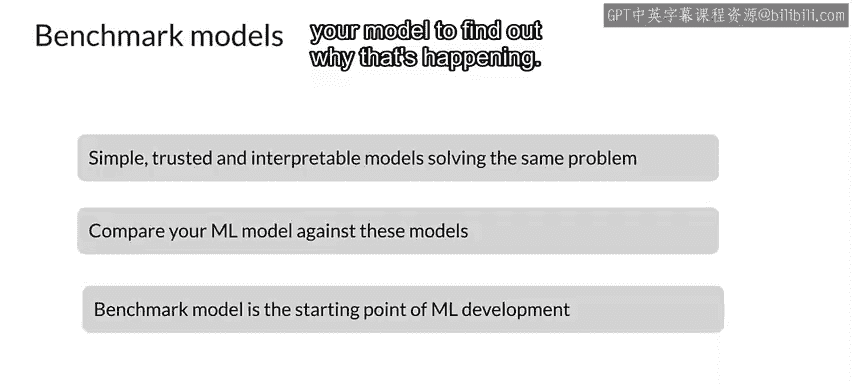

#  111：基准模型 🎯

在本节课中，我们将学习基准模型的概念及其在模型调试中的重要作用。基准模型是一种简单而强大的工具，用于评估和验证我们开发的复杂模型的性能。

我们将从讨论使用基准模型开始，这始终是一种良好的模型调试技术。一个不错的起点是将你的模型与基准模型进行比较。

基准模型是一种简单而有效的方法，用于检查模型的性能。基准模型通常是小而简单的模型，在开始正式开发之前，用于为你的问题建立性能基线。

它们通常不是最先进的模型，而是线性模型或其他具有非常稳定性能的简单模型。你可以将你的模型与基准模型进行比较，以查看它是否真的比更简单的基准模型表现更好，这是一种合理性检验。

如果你的模型没有超过基准模型，那可能意味着你的模型存在问题，或者一个简单的模型已经能够准确地对数据进行建模，并且这实际上就是你的应用所需要的全部。

一旦模型通过了基准测试，基准模型就可以作为一个可靠的调试工具。即使你的模型性能优于基准模型，你仍然可以评估哪些测试样本是你的模型预测失败，但基准模型预测正确的。

然后，你需要研究你的模型，找出为什么会发生这种情况。

---

上一节我们介绍了基准模型的基本概念，本节中我们来看看基准模型的具体应用场景和步骤。

以下是使用基准模型进行模型调试的关键步骤：

1.  **选择基准模型**：选择一个简单且性能稳定的模型作为基准，例如线性回归（用于回归问题）或逻辑回归（用于分类问题）。
2.  **在相同数据集上训练**：使用完全相同的数据集（训练集、验证集、测试集）来训练你的复杂模型和基准模型。
3.  **比较性能指标**：在测试集上计算并比较两个模型的性能指标，例如准确率、精确率、召回率或均方误差（MSE）。
4.  **分析预测差异**：如果复杂模型性能更优，进一步分析那些基准模型预测正确而复杂模型预测错误的样本，以发现潜在问题。
5.  **迭代优化**：根据分析结果，优化你的复杂模型（例如，调整特征、修改架构或增加数据）。

---

本节课中我们一起学习了基准模型的核心价值和应用方法。基准模型不仅是衡量模型性能的标尺，更是诊断模型问题的有效工具。通过将复杂模型与简单可靠的基准模型进行比较，我们可以快速验证模型的有效性，并定位性能瓶颈，从而更高效地进行模型开发和调试。记住，一个无法超越简单基准的复杂模型，很可能存在根本性的设计或数据问题。