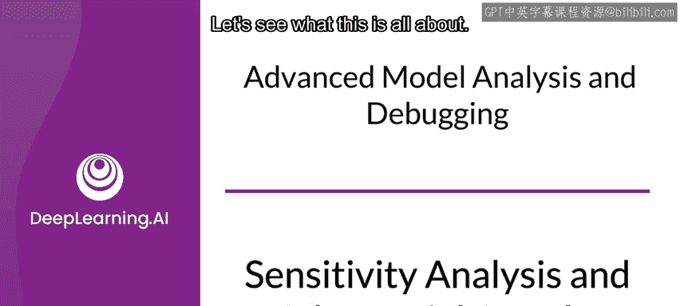
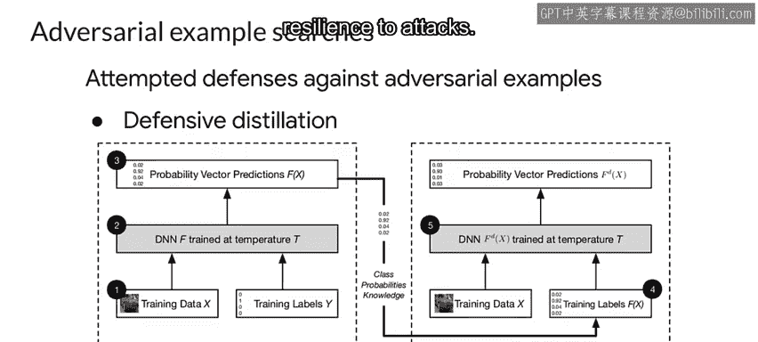

#  112：敏感度分析与对抗性攻击 🛡️

在本节课中，我们将学习如何评估机器学习模型的性能，特别是其面对对抗性攻击时的脆弱性。我们将探讨敏感度分析的概念、方法，以及如何识别和防御对抗性攻击。

## 概述

敏感度分析是评估模型性能的重要方法，包括评估模型对对抗性攻击的脆弱性。让我们深入了解其内容。

敏感度分析通过检查每个特征对模型预测的影响，帮助你理解模型。

在敏感度分析中，你通过改变单个特征的值（同时保持其他特征不变）进行实验，并观察模型结果。

如果改变特征值导致模型结果发生剧烈变化，这意味着该特征对预测有很大影响。

通常，你根据某种分布或过程人为地改变特征值，并忽略数据的标签。

你实际上并不关注预测是否正确，而是关注它改变了多少。不同的敏感度分析方法使用不同的技术来改变特征值。

让我们探讨几种不同的方法。

## 敏感度分析方法

上一节我们介绍了敏感度分析的基本概念，本节中我们来看看几种具体的分析方法。

以下是几种常见的敏感度分析方法：

*   **随机攻击**：你生成大量随机输入数据并测试模型的输出。随机攻击可以揭示各种意想不到的软件和数学错误。如果你不知道从何处开始调试机器学习系统，随机攻击是一个很好的起点。
*   **部分依赖图**：部分依赖图显示一个或两个特征的边际效应及其对模型结果的影响。部分依赖图可以显示标签与特定特征之间的关系是线性的、单调的还是更复杂的。例如，当应用于线性回归模型时，部分依赖图总是显示线性关系。
*   **开源工具**：PDPbox 和 PICbox 是可用于创建部分依赖图的开源软件包。请查阅阅读列表以获取更多信息。

## 对抗性攻击

现在我们已经介绍了两种敏感度分析技术，值得一问的是，你的模型对攻击有多脆弱？包括神经网络在内的几个机器学习问题，都可能被欺骗，从而错误分类对抗性样本。这些样本通过对数据进行微小但精心设计的更改而形成，使得模型以高置信度返回错误答案。

这可能带来令人担忧的影响。想象一下，仅基于略微损坏的数据就对重要问题做出错误决定。

根据错误结果对你的应用程序造成的灾难性程度，你可能需要测试模型的漏洞，并根据你的分析，加固你的模型以使其更能抵御攻击。

那么这些攻击是什么样的呢？这里有一个著名的例子，包含两组图像。

仅对左列图像应用微小的扭曲，就产生了右列图像，而一个在 ImageNet 上训练的模型将其分类为鸵鸟。

那么这个问题有多严重呢？这取决于你的应用程序。但让我们讨论几个例子。

*   **自动驾驶汽车**：识别交通标志、其他车辆、人等非常重要。不幸的是，我们在现实生活中已经看到了这样的例子。但正如这个例子所示，如果一个标志以某种方式被改变，它就可以欺骗模型，结果可能是灾难性的。
*   **应用程序质量**：如果你的企业销售用于检测垃圾邮件的软件，而钓鱼邮件能够通过，这会对你的产品产生负面影响。
*   **关键任务应用**：一个更可怕的例子。随着你越来越多地依赖机器学习来完成关键任务应用程序，你需要考虑安全影响。行李箱扫描仪基本上只是一个物体分类器。但如果它容易受到攻击，结果可能是危险的。

## 攻击类型

未来隐私论坛是一个研究隐私和安全的行业组织，它提出由机器学习促成的安全和隐私危害大致分为两类：信息危害和行为危害。

信息危害涉及信息的意外或未预期的泄露。另一方面，行为危害涉及操纵模型本身的行为，影响模型的预测或结果。

让我们看看信息危害。

以下是几种信息危害攻击：

*   **成员推断攻击**：旨在根据模型输出的样本推断某个个体的数据是否被用于训练模型。虽然看起来很复杂，但研究表明，这些攻击所需的复杂程度远低于通常假设的水平。
*   **模型反演攻击**：使用模型输出来重建训练数据。在一个著名的例子中，研究人员能够重建个人面部的图像。另一项研究关注使用遗传信息来推荐特定药物剂量的机器学习系统，它能够直接预测个体患者的遗传标记。
*   **模型提取攻击**：使用模型输出来重建模型本身。这已被证明可以针对像 BigML 和 Amazon Machine Learning 这样的模型即服务提供商，并且可能损害隐私和安全，以及底层模型本身的知识产权。

那么行为危害呢？

以下是几种行为危害攻击：

*   **模型投毒攻击**：当攻击者将恶意数据插入训练数据中以改变模型行为时发生。例如，为特定个人创建人为的低保险费。
*   **规避攻击**：当推理请求中的数据故意导致模型对该数据进行错误分类时发生。这些攻击发生在各种场景中，并且数据的变化可能不会被人类察觉。我们之前提到的被篡改的停车标志就是规避攻击的一个例子。

## 防御与加固

在加固你的模型之前，你需要有某种方法来衡量其受攻击的脆弱性。

CleverHans 是一个开源 Python 库，你可以用它来对你的模型进行基准测试，以衡量它们对对抗性样本的脆弱性。

为了加固你的模型以抵御对抗性攻击，一种方法是在你的训练数据中包含对抗性图像集，以便分类器能够理解噪声的各种分布，并且你的模型学会识别正确的类别。这被称为对抗性训练。由 CleverHans 等工具创建的示例可以添加到你的数据集中，但这样做会限制你使用它们来衡量模型脆弱性的能力，因为你几乎是在用你的训练数据进行测试。

Foolbox 是另一个开源 Python 库，它可以让你轻松地对深度学习网络等机器学习模型运行对抗性攻击。它建立在 EagerPy 之上，并原生支持 PyTorch、TensorFlow 和 JAX 中的模型。

不幸的是，检测漏洞比修复漏洞更容易。这是一个新兴领域，就像安全领域的许多事情一样，攻击者和防御者之间正在进行一场军备竞赛。

一个相当先进的方法是防御性蒸馏。由于它不使用特定的对抗性示例，它可能为新的攻击提供更普遍的加固。顾名思义，这与知识蒸馏训练非常相似，目标是提高模型的鲁棒性并降低敏感性，从而降低受攻击的脆弱性。

在一项研究中，防御性蒸馏将样本创建的有效性从 95% 降低到不到 0.5%。防御性蒸馏与我们之前在模型优化部分讨论的 Hinton 等人提出的原始蒸馏之间的主要区别在于，我们保持相同的网络架构来训练原始网络和蒸馏网络。换句话说，作者提出使用知识蒸馏来提高模型自身的抗攻击能力，而不是在不同架构之间转移知识。

## 总结

本节课中，我们一起学习了敏感度分析的概念及其在评估模型性能中的作用。我们探讨了随机攻击和部分依赖图等分析方法，并深入了解了对抗性攻击的类型，如信息危害和行为危害。最后，我们讨论了使用 CleverHans 和 Foolbox 等工具进行漏洞检测，以及通过对抗性训练和防御性蒸馏等技术来加固模型。理解并应对这些挑战对于构建健壮、可靠的机器学习系统至关重要。