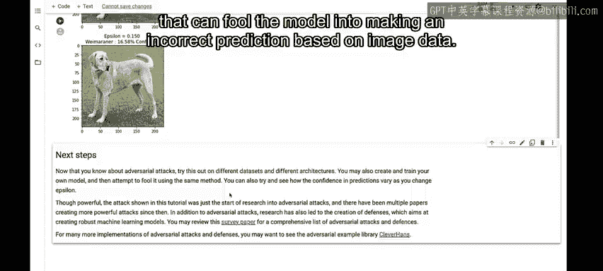

#  113：对抗攻击演示 🛡️


在本节课中，我们将学习一种针对机器学习模型的攻击方法——对抗攻击。我们将通过一个具体的演示，了解攻击者如何利用“快速梯度符号法”生成对抗样本，从而欺骗一个原本表现良好的图像分类模型，使其做出错误的预测。

## 什么是对抗样本？🤔

上一节我们介绍了课程背景，本节中我们来看看对抗攻击的核心概念。

对抗样本是一种专门设计的输入，其目的是混淆神经网络，导致模型对给定的输入进行错误分类。这些输入对人眼来说与正常样本几乎没有区别，但却能导致模型无法正确识别图像内容。

## 快速梯度符号法攻击 ⚔️

了解了对抗样本的概念后，我们来看看本次演示中使用的具体攻击方法。

存在多种类型的对抗攻击。然而，本演示的重点是**快速梯度符号法**攻击。这是一种**白盒攻击**，其目标是确保模型错误分类。白盒攻击是指攻击者拥有对被攻击模型的完全访问权限。

以下是该攻击方法的一个著名示例，取自Goodfellow等人的一篇具有里程碑意义的论文：
*   左侧的熊猫图片被模型以较高的置信度正确分类。
*   添加了一些人眼难以察觉的噪声。
*   结果是，模型现在以极高的置信度认为那只熊猫是一只长臂猿。

## 实战演示：攻击图像分类模型 🖼️➡️🐕

理论介绍完毕，现在让我们通过一个实际的代码示例，看看这种攻击是如何实施的。我们将看到这种攻击实现起来有多么简单。

我们将在Colab环境中运行此演示。首先进行一些必要的导入并加载一个预训练的MobileNet V2模型及ImageNet类别名称。

```python
import tensorflow as tf
import matplotlib.pyplot as plt

pretrained_model = tf.keras.applications.MobileNetV2(include_top=True, weights='imagenet')
```

接下来，我们下载并查看原始图像，本例中是一只拉布拉多犬。

```python
# 下载并预处理图像
image_path = tf.keras.utils.get_file('Labrador.jpg', 'https://...')
original_image = preprocess(image_path)
plt.imshow(original_image)
```

## 生成对抗图像 🔧

现在，我们将使用快速梯度符号法来创建对抗图像。以下是用于生成扰动的主要代码，其原理非常简单直接：

```python
def create_adversarial_pattern(input_image, input_label):
    with tf.GradientTape() as tape:
        tape.watch(input_image)
        prediction = pretrained_model(input_image)
        loss = loss_object(input_label, prediction)
    gradient = tape.gradient(loss, input_image)
    perturbations = tf.sign(gradient)
    return perturbations
```

生成扰动后，我们可以将其可视化。观察下图，大多数人不会预期添加这样的扰动会对模型判断产生任何影响，但事实并非如此。


## 探索攻击参数 Epsilon 📊

为了理解攻击强度的影响，我们将尝试不同的 **`epsilon`** 值，这是该方法的一个关键参数。我们将观察不同的 `epsilon` 值如何导致模型做出不同的预测。

以下是用于展示图像和预测结果的辅助方法。我们测试了几个不同的 `epsilon` 值及其对应的模型预测：

*   **原始图像**：模型以高置信度识别为“拉布拉多犬”。
*   **`epsilon = 0.01`**：模型将其误分类为“萨路基犬”（一种细犬）。
*   **`epsilon` 值稍高**：模型认为它是“威玛犬”。
*   **`epsilon` 值继续增高**：模型仍然以更高的置信度认为是“威玛犬”。

## 总结 📝

本节课中我们一起学习了对抗攻击的基本概念。我们通过一个具体的演示，展示了如何使用**快速梯度符号法**这种简单的白盒攻击方法，通过向原始图像添加人眼难以察觉的微小扰动（由 **`epsilon`** 参数控制），成功欺骗了一个强大的图像分类模型，使其将拉布拉多犬错误地识别为其他犬种。这个例子清晰地表明，机器学习模型在面对精心设计的对抗样本时可能非常脆弱，这也是MLOps和生产环境中需要考虑模型安全性和鲁棒性的重要原因。



