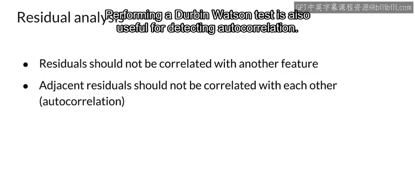

#  114：残差分析 📊

在本节课中，我们将学习模型调试的最后一项技术——残差分析。这是一种主要用于回归模型的诊断方法，通过分析预测值与真实值之间的差异（即残差）来评估模型性能并发现潜在的改进空间。

上一节我们介绍了其他模型调试技术，本节中我们来看看残差分析的具体应用。

## 什么是残差分析？

残差分析是一种模型调试技术。在大多数情况下，它适用于回归模型，因为它需要测量预测值与真实值之间的距离。

**残差公式**：`残差 = 真实值 - 预测值`

然而，这项技术要求拥有用于比较的真实值，这在许多在线或实时场景中可能难以获取。

## 残差分析的目标

理想情况下，你希望残差遵循随机分布。如果发现残差之间存在相关性，这通常表明你的模型还有改进的余地。

如果你训练过回归模型，可能对均方根误差（RMSE）等指标很熟悉。残差分析也会用到这类误差指标，但它主要关注**误差的分布**，通常使用残差图来直观检查残差的分布情况。

如果你的模型训练良好，并且已经捕捉到了数据中的预测信息，那么残差应该是随机分布的。然而，如果你看到系统性的或相关的残差，那就说明模型未能捕捉到某些预测信息，你可以据此寻找改进模型的方法。

## 进行残差分析时的检查要点

以下是进行残差分析时需要注意的几个关键点。

**残差不应与未被使用的特征相关**
残差不应与另一个可用但未被纳入特征向量的特征相关。如果你能用另一个特征来预测残差，那么这个特征就应该被包含在特征向量中。这需要检查未使用的特征与残差之间是否存在相关性。

**相邻残差不应彼此相关**
换句话说，它们不应存在自相关性。如果你能用一个残差来预测下一个残差，那就说明模型未能捕捉到某些预测信息。通常（但不总是），你可以在残差图中直观地看到这一点。理解这一点时，数据的顺序可能很重要。

例如，如果一个残差之后更可能出现另一个符号相同的残差，则相邻残差呈正相关。进行**杜宾-瓦森检验**也有助于检测自相关性。

## 总结

本节课中，我们一起学习了残差分析这项重要的模型调试技术。我们了解到，残差分析通过检查预测误差的分布来诊断回归模型。核心目标是确保残差随机分布，无系统性模式或自相关性。若发现残差与遗漏特征相关或自身存在自相关，则表明模型有改进空间，可以通过纳入新特征或调整模型结构来提升性能。