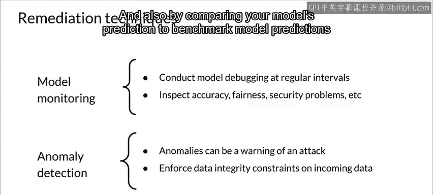

#  115：模型修复 🛠️


在本节课中，我们将探讨如何提升机器学习模型的鲁棒性，并学习一系列模型修复技术。我们将从数据增强、模型可解释性入手，进而讨论如何减少模型偏见，并介绍模型调试与持续监控的重要性。

---


## 分析鲁棒性与修复方法

上一节我们讨论了如何分析模型的鲁棒性。本节中，我们来看看如何通过具体技术来提升它。

模型修复是指当发现模型在鲁棒性、公平性或安全性等方面存在不足时，所采取的一系列改进措施。

---

## 提升模型鲁棒性的技术

为了提升模型的鲁棒性，你可以采取以下几种方法。

### 确保训练数据代表性

首先，必须确保你的训练数据能够准确反映模型部署后将接收到的请求。这是构建鲁棒模型的基础。

### 数据增强

数据增强可以帮助模型更好地泛化，从而通常能降低其对输入变化的敏感性。

以下是几种常见的数据生成方式：
*   **生成式技术**：使用生成模型（如GANs）创建新数据。
*   **解释性技术**：基于对数据分布的理解来生成样本。
*   **添加噪声**：简单地向现有数据中添加随机噪声。

数据增强也是纠正数据不平衡问题的有效手段。

### 理解模型内部机制

理解模型的内部工作机制同样重要。通常，更复杂的模型如同“黑箱”，我们有时并未深入探究其内部运行逻辑。

然而，存在一些工具和技术可以帮助提升模型的可解释性，这反过来也有助于改善模型的鲁棒性。

此外，某些模型架构本身就更容易解释，包括：
*   **基于树的模型**（如决策树、随机森林）。
*   **专门为可解释性设计的神经网络模型**。

### 模型编辑

模型编辑是另一种修复技术。对于一些模型，例如决策树，其学习到的参数可以直接被理解。

如果你发现模型在某些方面表现不佳，可以直接调整模型参数来提升其性能和鲁棒性。

### 模型断言

模型断言是将业务规则或简单的合理性检查应用于模型的输出结果，并在交付结果前对其进行修改或绕过。

例如：
*   如果预测某人的年龄，结果**永远不应为负数**。
*   如果预测信用额度，则**永远不应超过某个最大金额**。

这可以通过在输出层添加后处理逻辑来实现，例如：
```python
def apply_assertions(prediction):
    if prediction < 0:
        return 0
    elif prediction > MAX_CREDIT_LIMIT:
        return MAX_CREDIT_LIMIT
    else:
        return prediction
```

---

## 减少或消除模型偏见

接下来，我们看看如何减少或消除模型偏见，这被称为**歧视修复**。

### 使用多样化的数据集

最佳的解决方案是拥有一个多样化的数据集，它能代表将要使用你模型的所有人群。

### 组建多元化的开发团队

让具有不同背景、并在伦理、隐私、社会科学等相关领域有专长的人员加入开发团队也大有裨益。

### 谨慎的特征选择与数据重加权

在训练数据阶段，通过**采样**和**重新加权**数据行来最小化歧视，也是很有帮助的方法。

### 训练时考虑公平性指标

在训练时，选择超参数和决策截断阈值时应考虑公平性指标。这需要使用像 **Fairness Indicators** 这样的工具来度量公平性。

这也可能涉及直接训练公平模型，具体方法包括：
*   **学习公平表示**。
*   使用如 **AIF360** 等工具进行**对抗性去偏**。
*   使用同时考虑**准确性和公平性指标**的双目标损失函数，例如：
    `总损失 = α * 准确率损失 + β * 公平性损失`

### 预测后处理

在训练后改变模型预测，例如使用 **AIF360** 或 **TensorFlow Model Analysis** 中的**拒绝选项分类**等工具，也有助于减少不希望的偏见。

像 **Google Model Remediation Library** 这样的工具库可以帮助提升模型公平性。请查阅课程末尾的参考资料，获取相关库和资源的链接。

---

## 模型调试与持续监控

模型调试并非仅在开发阶段进行，它需要对模型进行**持续监控**。

随着数据和世界的变化，以及新攻击方式的出现，模型的准确性、公平性或安全性特征在其整个生命周期内都会发生变化。

你应该将监控构建到你的流程中，以便定期检查模型是否存在准确性、公平性和安全性问题。

在机器学习中，奇怪或异常的输入和预测值总是令人担忧，并可能预示着攻击。

幸运的是，可以利用多种工具和技术实时捕获并纠正异常输入和预测，包括：
*   对输入流施加**数据完整性约束**。
*   对输入和预测应用**统计过程控制方法**。
*   通过**自编码器**和**隔离森林**进行异常检测。
*   将你的模型预测与**基准模型预测**进行比较。

---

## 总结



本节课中，我们一起学习了多种模型修复技术。我们从提升模型鲁棒性的方法开始，涵盖了**数据增强**、提高**模型可解释性**、**模型编辑**和**模型断言**。接着，我们探讨了如何通过使用多样化数据、谨慎的特征工程、在训练中纳入公平性指标以及后处理技术来**减少模型偏见**。最后，我们强调了**持续监控**和**实时异常检测**对于维护模型长期健康与安全的重要性。记住，构建负责任的机器学习系统是一个需要不断迭代和改进的过程。