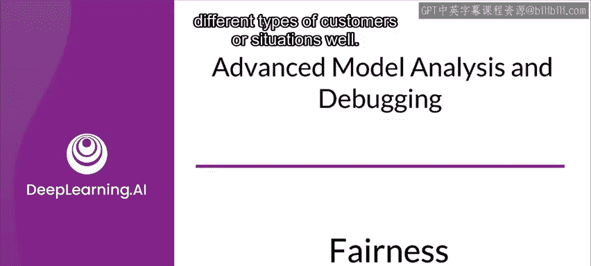
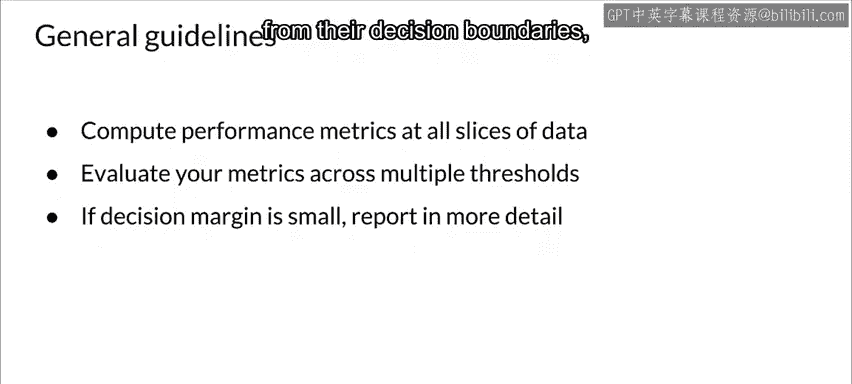

#  116：38_公平性 🧠⚖️

在本节课中，我们将学习如何确保机器学习模型的公平性，并介绍如何使用公平性指标库来评估公平性。除了提升模型性能，确保模型在不同场景下公平运行，避免对任何人群产生偏见，是负责任地服务社区和客户的重要环节。

---

## 公平性的重要性

上一节我们介绍了模型性能分析，本节中我们来看看公平性。确保模型不会对使用者造成伤害至关重要。公平性指标库是TensorFlow团队开发的开源工具，旨在方便地计算二元和多类分类器中常见的公平性指标。

该库基于TensorFlow模型分析框架构建，具有良好的扩展性。

---

## 公平性指标库的主要功能

公平性指标库的核心功能是便于测量二元和多类分类器的常见公平性指标。

以下是其主要功能：

*   可以比较模型在不同子组间的性能，并与基线或其他模型进行对比。
*   支持使用置信区间来揭示统计上显著的差异。
*   支持在多个阈值上进行评估。

需要明确的是，公平性指标库主要用于**测量**公平性，而非直接进行**修正**以提升公平性。

---

## 如何测量公平性：数据切片

在尝试减轻偏见和检查公平时，查看数据切片能提供丰富的信息。

测量公平性时，识别对公平性敏感的数据切片并测量模型在这些切片上的性能非常重要。如果仅使用整个数据集测量公平性，很容易掩盖针对特定人群的公平性问题。

同样重要的是，为你的数据集和用户考虑并选择合适的度量指标，否则可能测量错误而无法发现问题。这通常基于领域知识。

请记住，测量公平性只是评估更广泛用户体验的一部分。

---

## 识别相关数据切片

首先，思考用户可能体验你应用程序的不同情境。

以下是识别切片的关键步骤：

*   明确你应用程序的不同用户类型。
*   思考还有哪些人会受到体验的影响。

人类社会极其复杂，理解人及其社会身份、社会结构和文化体系本身都是广阔的研究领域。在可能的情况下，建议咨询相关领域专家，例如社会科学家、社会语言学家、文化人类学家，以及将使用你应用程序的社区成员。

一个好的经验法则是尽可能多地对数据组进行切片。要特别关注涉及敏感特征的数据切片，例如：
*   种族
*   民族
*   性别
*   国籍
*   收入
*   性取向
*   残疾状况

理想情况下，你应该使用带有标签的数据。如果没有，则可以应用统计学方法，在假设任何预期差异的情况下，查看结果的分布。

---

## 使用公平性指标的指导原则

让我们看看使用公平性指标时，为避免常见陷阱的一些重要指导原则。

以下是关键指导原则：

1.  刚开始使用公平性指标时，应对所有可用数据切片进行各种公平性测试。
2.  接下来，应跨多个阈值评估公平性指标，以理解阈值如何影响不同群体的性能。
3.  最后，对于那些预测结果与决策边界没有明显分离的情况，应考虑报告标签被预测的比率。

---

## 总结

本节课中，我们一起学习了机器学习模型公平性的重要性，并详细介绍了TensorFlow公平性指标库的功能与使用方法。我们探讨了通过数据切片来识别和测量公平性问题，以及在实际应用中应遵循的指导原则。记住，构建公平的模型是创建负责任、可信赖人工智能系统的关键一步。