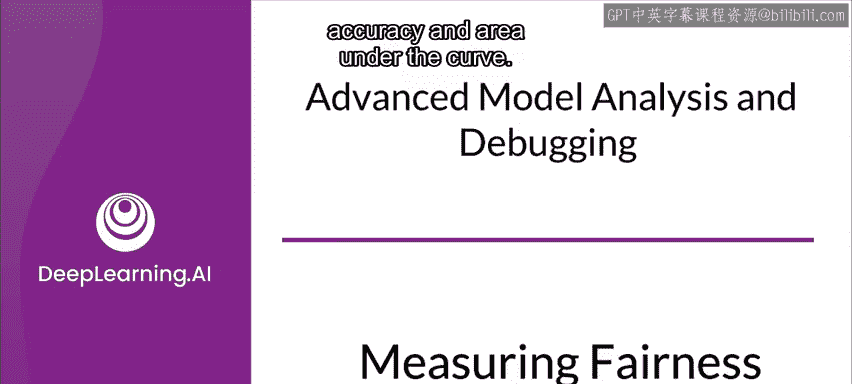
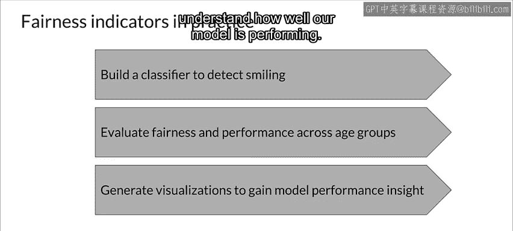

#  117：39_衡量公平性 😊

在本节课中，我们将学习机器学习模型公平性的各种衡量指标。我们将了解这些指标的定义、适用场景，并通过一个具体的数据集案例来实践如何评估模型的公平性。

---

现在，让我们看看公平性指标工具中提供的各种公平性度量标准。

这包括正负率、真正假正例比率、准确率和曲线下面积。我们将从这些指标的快速概述开始。

## 基本正负率 📊

上一节我们介绍了公平性指标的概念，本节中我们来看看最基础的衡量标准。

基本正负率显示被分类为正例或负例的数据点的百分比。这些指标独立于真实标签。它们有助于理解人口统计平等性，即结果在不同子群体间应保持平等。

这适用于不同群体获得相同比例结果至关重要的用例。

以下是基本正负率的定义：
*   **正例率**：模型预测为正例的数据点占总数据点的百分比。
*   **负例率**：模型预测为负例的数据点占总数据点的百分比。

## 真正率与假负率 ⚖️

了解了基础比率后，我们来看看与正类机会平等相关的指标。

真正率，也称为TPR；假负率，也称为FNR。

真正率衡量的是，在真实标签为正例的数据点中，被正确预测为正例的百分比。类似地，假负率衡量的是，在真实标签为正例的数据点中，被错误预测为负例的百分比。

这个指标关系到正类的机会平等，它应在不同子群体间保持相等。这通常适用于以下用例：确保每个群体中相同比例的合格候选人获得积极评价至关重要，例如贷款申请或学校录取。

以下是相关公式：
*   **真正率 = 真正例 / (真正例 + 假负例)**
*   **假负率 = 假负例 / (真正例 + 假负例)**

## 真负率与假正率 ⚖️

接下来，我们探讨与负类机会平等相关的指标。

真负率，也称为TNR；假正率，也称为FPR。

真负率衡量的是，在真实标签为负例的数据点中，被正确预测为负例的百分比。类似地，假正率是真实标签为负例的数据点中，被错误预测为正例的百分比。

这个指标关系到负类的机会平等，它应在不同子群体间保持相等。这适用于以下用例：将某物错误分类为正例比正确分类正例更令人担忧。这在滥用检测案例中最常见，其中正例通常会导致负面行动。这对于面部分析技术（如人脸检测或人脸属性识别）也很重要。

以下是相关公式：
*   **真负率 = 真负例 / (真负例 + 假正例)**
*   **假正率 = 假正例 / (真负例 + 假正例)**

## 准确率与AUC 📈

最后，我们来了解准确率和曲线下面积这两组公平性指标。

准确率是被正确标记的数据点的百分比。AUC是在每个类别被赋予相同权重（与样本数量无关）时，被正确标记的数据点的百分比。

这两个指标都与预测平等性相关，应在不同子群体间保持相等。这适用于任务精度至关重要，但不必特定于某个方向的用例，例如人脸识别或人脸聚类。

以下是相关公式：
*   **准确率 = (真正例 + 真负例) / 总样本数**

## 重要考量与注意事项 ⚠️

在介绍了各类指标后，我们需要理解如何正确解读和使用它们。

以下是使用公平性指标时需要考虑的一些要点：
*   两个群体之间指标的显著差异可能表明你的模型存在公平性问题。你应该根据你的用例来解释结果。
*   其次，使用公平性指标实现群体间的平等并不能保证你的模型是公平的。系统非常复杂。在一个甚至所有提供的指标上实现平等都不能保证公平性。
*   公平性评估应在整个开发过程以及发布后持续进行。就像改进产品是一个持续的过程，并根据用户和市场反馈进行调整一样，使产品公平公正也需要持续的关注。随着模型的不同方面发生变化，例如训练数据、来自其他模型的输入或设计本身，公平性指标很可能会发生变化。
*   最后，应对罕见和恶意示例进行对抗性测试。公平性评估并非旨在取代对抗性测试，而是为了针对罕见的有针对性的示例提供额外的防御，这一点至关重要，因为这些示例可能不会包含在训练或评估数据中。

## 实践案例：CelebA数据集 😊

现在，让我们看一个使用公平性指标的具体例子。

让我们考虑CelebA数据集，它包含20万张名人图像。除了名人的图像，每个示例还有40个属性注释。其中一些属性是头发类型、面部特征、时尚配饰等。每张图像还有五个面部标志位置，标记眼睛、鼻子和嘴巴的位置。

通常假设，在这个数据集的标注过程中，微笑属性是通过对象脸上愉悦、友善或有趣的表情类型来确定的。

因此，你将练习使用公平性指标来探索此数据集中的微笑属性。

以下是实践步骤：
1.  首先，你将开始构建一个分类模型，以识别图像中的人是否在微笑。
2.  模型准备就绪后，你将使用公平性指标评估模型在不同年龄组中的表现。
3.  最后，你将绘制一些指标图表，以了解我们的模型表现如何。

---

本节课中，我们一起学习了衡量机器学习模型公平性的核心指标，包括基本正负率、真正/假负率、真负/假正率以及准确率和AUC。我们理解了这些指标分别适用于评估不同维度的公平性，并认识到公平性评估是一个需要结合具体业务场景、贯穿模型生命周期并辅以对抗测试的持续过程。最后，我们通过CelebA数据集的微笑属性分类案例，了解了公平性评估的实践流程。