#  118：持续评估与监控 📊

在本节课中，我们将学习如何确保已部署的机器学习模型在生产环境中保持健康运行。核心在于理解并实施**持续评估与监控**，以便在模型性能下降时获得早期预警。

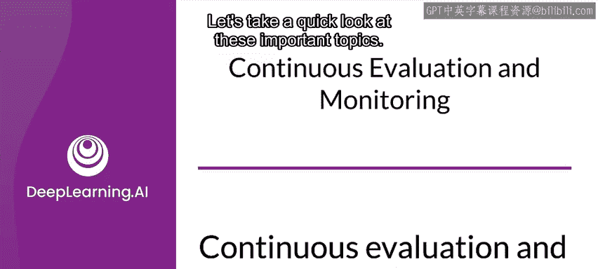

---

## 模型性能为何会变化？🔄

上一节我们介绍了模型部署后的基本流程，本节中我们来看看模型上线后可能面临的核心挑战。

训练模型时，我们使用的是当时可用的训练数据。这些数据代表了数据收集和标注时世界的一个快照。但世界会变化，对于许多领域，数据也会随之变化。一段时间后，当模型被用于生成预测时，它可能对当前世界的状态了解不足，从而无法做出准确的预测。

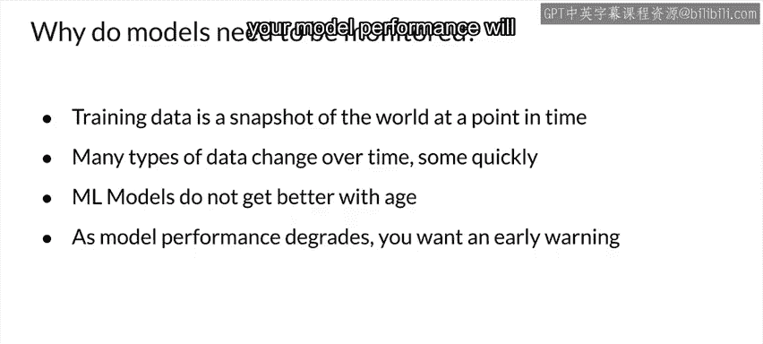

例如，一个预测电影销量的模型如果基于90年代收集的数据训练，它可能会预测客户会购买VHS录像带。这在今天显然不是一个好的预测。当模型性能变差时，你的应用程序和客户将受到影响。

为了避免在问题爆发后才手忙脚乱地收集新训练数据并修复模型，你需要一个关于模型性能变化的早期预警。持续监控和评估你的数据及模型性能有助于提供这种预警。

---

## 理解数据漂移与偏移 📈

让我们深入了解数据可能发生变化的几种形式。

最极端的形式是**概念漂移**，它指的是输入数据和标签之间关系的变化。即使你的其他数据没有变化，概念漂移也可能发生。例如，六个月前购买红色靴子的同一位客户，如果时尚潮流改变，今天可能想要白色运动鞋。模型的输入可能完全相同（取决于你捕获了哪些特征），但正确的预测已经改变。

还有**新兴概念**，指的是数据分布中以前数据集中不存在的新模式。这可以通过几种方式发生。标签可能变得过时，可能需要添加新标签，就像我们之前的VHS例子。

根据分布变化的类型，数据集偏移可分为两种类型：

以下是两种主要的数据集偏移类型：

1.  **协变量偏移**：输入数据的分布发生变化，但给定输入时输出的条件概率保持不变。标签的分布没有改变。
    *   **公式描述**：`P(Y|X)` 不变，但 `P(X)` 改变。
2.  **先验概率偏移**：基本上是协变量偏移的反面。标签的分布发生变化，但输入数据保持不变。概念漂移可以被视为一种先验概率偏移。
    *   **公式描述**：`P(X)` 不变，但 `P(Y)` 和/或 `P(Y|X)` 改变。

---

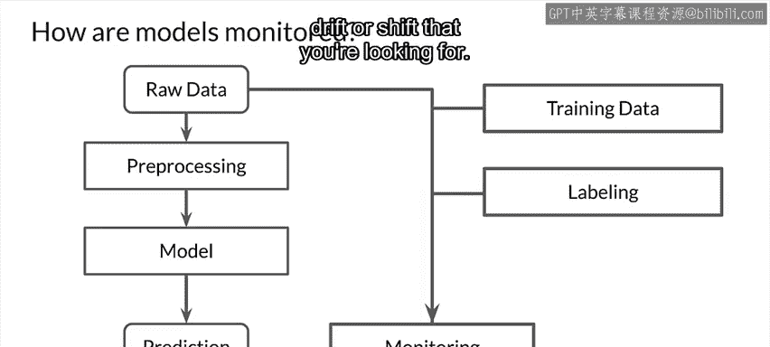

## 如何监控数据与模型？🔍

现在，让我们思考如何在生产环境中监控数据和模型性能。

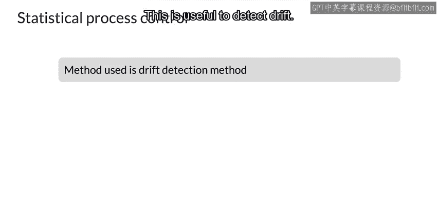

首先，设想一个生产环境中的已训练模型。从用于预测的原始数据开始，在做出预测之前，你可能需要对原始数据进行一些预处理，然后模型根据输入数据生成预测。

现在，让我们添加监控和评估环节：

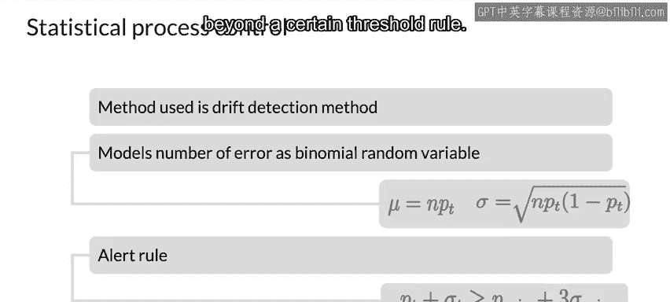

1.  **监控接收到的原始数据**：将其与你训练模型时使用的数据进行比较。这让你可以寻找输入数据随时间的变化，即协变量偏移。
2.  **监控模型生成的预测**：这使你能够检测先验概率偏移。
3.  **添加标注流程**：这有助于检测概念漂移。请注意，在许多情况下，为新输入数据的样本生成标签会有显著的延迟。

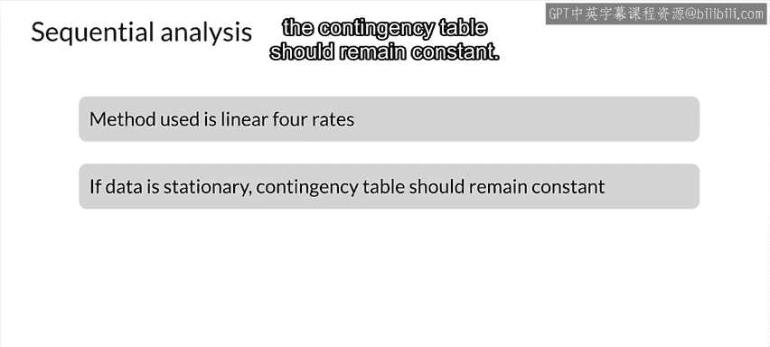

添加了监控之后，如何寻找漂移和偏移呢？方法分为**有监督**和**无监督**两种，取决于你是否拥有输入数据流的标签以及你要寻找的漂移或偏移类型。

---

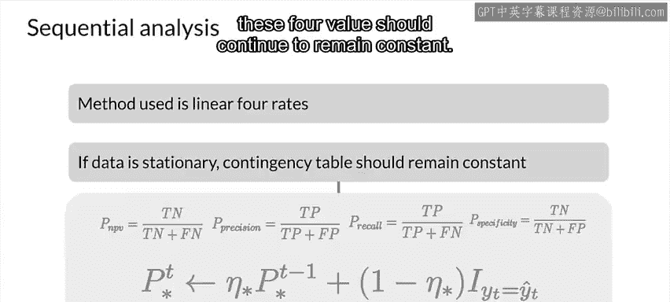

## 有监督监控技术 🎯

有监督技术需要数据的真实标签。以下是三种主要方法：

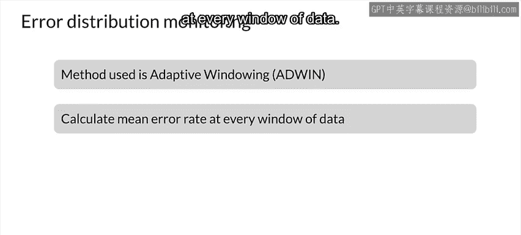

### 1. 统计过程控制

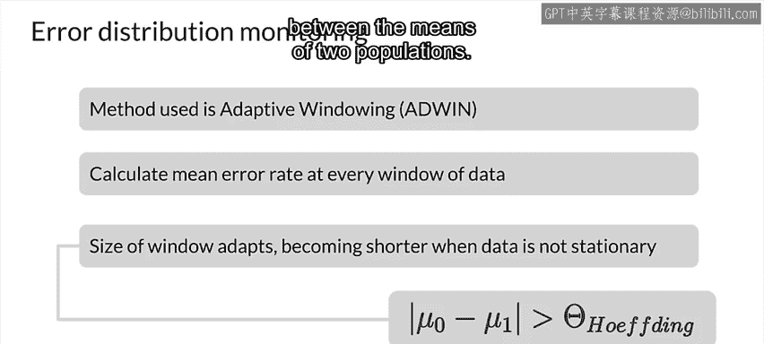

这种方法自20世纪20年代以来主要用于制造业的质量控制。它使用统计方法来监控和控制一个过程，对于已部署的模型而言，这个过程就是用于预测请求的输入原始数据流。它假设数据流是平稳的（取决于你的应用可能成立也可能不成立），并且错误遵循二项分布。它分析错误率，并在分布参数超出某个阈值规则时触发漂移警报。

### 2. 序列分析

在序列分析中，我们使用一种称为**线性四率**的方法。基本思想是，如果数据是平稳的，列联表应保持恒定。这里的列联表对应于你可能熟悉的分类器真值表：真正例、假正例、假反例、真反例。你用这些来计算四个率：净预测值、精确率、召回率和特异度。如果模型预测正确，这四个值应保持恒定。

### 3. 错误分布监控

这里选择的方法称为**自适应窗口法**。在此方法中，你将输入数据划分为窗口，窗口大小根据数据自适应调整。然后计算每个数据窗口的平均错误率。最后，计算每个连续窗口平均错误率均值的绝对差，并将其与基于霍夫丁界的阈值进行比较。霍夫丁界用于检验两个总体均值之间的差异。

---

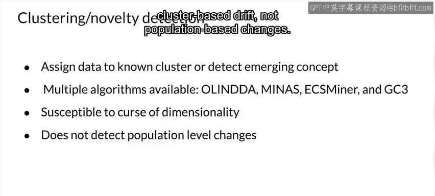

## 无监督监控技术 🕵️♂️

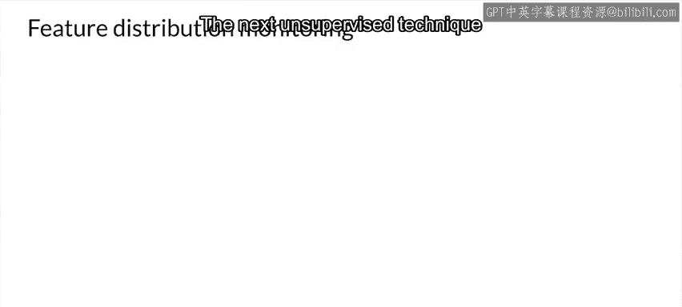

有监督技术的主要问题是你需要标签，而生成标签可能成本高昂且速度慢。无监督技术则不需要标签。请注意，即使你拥有标签，除了有监督技术外，也可以使用无监督技术。

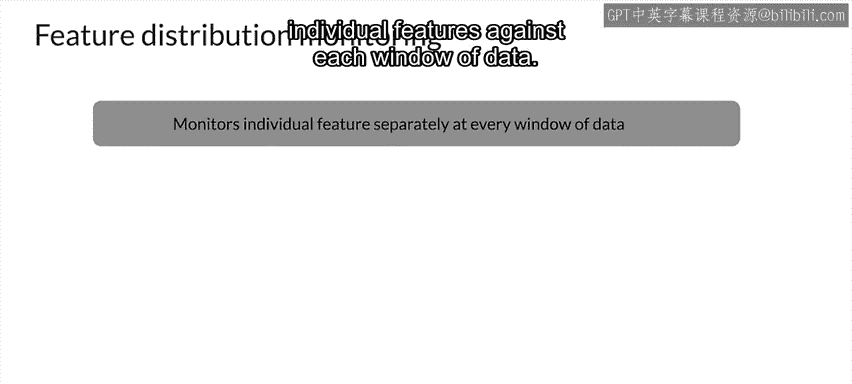

以下是三种主要的无监督监控技术：

### 1. 聚类或新颖性检测

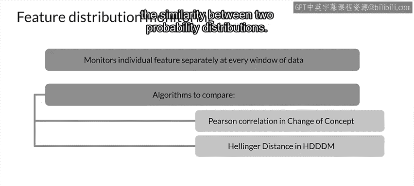

在此方法中，你将输入数据聚类到已知类别之一。如果你发现新数据的特征远离已知类别的特征，那么你就知道遇到了新兴概念。根据你选择的聚类类型，有多种算法可用（如Olinda, Minas, ES Minor, GC3）。虽然聚类可视化和处理低维数据效果很好，但一旦维度数量显著增长，维度灾难就会出现。此时这些方法开始变得低效，但你可以使用PCA等降维技术来使其易于管理。此方法的缺点是它只检测基于聚类的漂移，而非基于总体的变化。

### 2. 特征分布监控

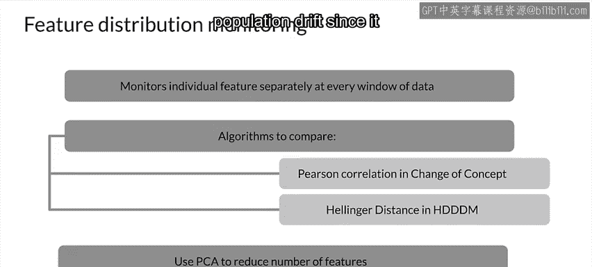

在特征分布监控中，我们分别监控数据集的每个特征。你将输入数据分割成统一大小的窗口，然后将各个特征与每个数据窗口进行比较。有多种算法可用于进行比较，其中最流行的两种是：
*   **皮尔逊相关性**：用于“概念变化”技术。
*   **海林格距离**：用于海林格距离漂移检测方法。海林格距离用于量化两个概率分布之间的相似性。

与新颖性检测类似，如果出现维度灾难，你可以利用PCA等降维技术来减少特征数量。此方法的缺点是无法检测总体漂移，因为它只查看单个特征。

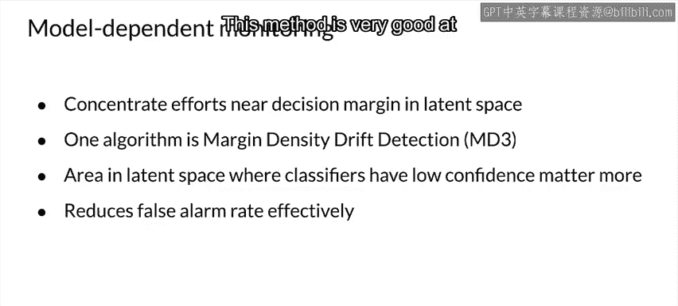

### 3. 模型依赖监控

此方法监控模型潜在特征空间中决策边界或边界附近的空间。使用的算法之一是**边界密度漂移检测**。模型置信度低的边界附近的空间比其他地方更重要，此方法寻找落入边界内的输入数据。边界内样本数量的变化（边界密度）即指示漂移。此方法非常擅长降低误报率。

---

## 实践工具与服务示例 🛠️

有许多方法可以评估模型性能的不同方面，包括查看输入请求流和模型生成的预测。包括谷歌在内的云托管提供商都提供了可用于持续评估数据和/或模型的服务。

让我们以**谷歌云AI持续评估**为例，它主要关注概念漂移，作为可用服务类型的一个示例。

谷歌云AI持续评估会定期从你部署到AI平台预测的已训练模型中采样预测输入和输出。AI平台数据标注服务随后为收到的预测请求样本分配人工审核员以提供真实标签，或者你也可以使用其他技术提供自己的真实标签。数据标注服务然后将模型的预测与真实标签进行比较，以提供关于模型随时间性能表现的持续反馈。

流程如下：
1.  将训练好的模型作为模型版本部署到AI平台预测。
2.  为该模型版本创建评估任务。
3.  当模型提供在线预测时，部分预测的输入和输出会保存在BigQuery表中（可自定义采样数据量）。
4.  评估任务间歇性运行，生成评估指标，你可以在谷歌云控制台中查看。

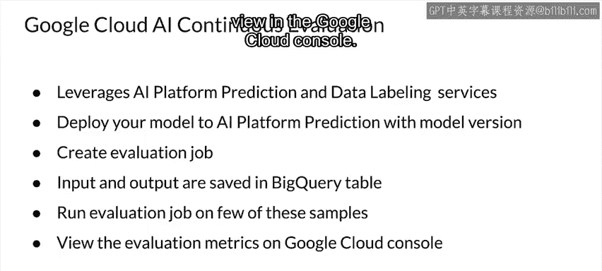

---

## 何时重新训练模型？⏰

你应该多久重新训练一次模型？这个问题没有固定答案，很大程度上取决于数据和所建模的世界。数据的变化速率和你所建模世界的变化速率将决定你需要多频繁地重新训练模型以适应变化。

当然，你可以随时重新训练模型，包括当你改进了模型设计时。过于频繁地重新训练是可以的，但可能导致计算资源成本更高。重新训练不够频繁则可能导致模型性能下降。理想情况下，你应该充分监控数据和模型，以便能够使用评估结果自动触发重新训练。如果无法做到这一点或部署尚未达到该成熟度水平，那么你也可以按计划重新训练。

**示例**：假设你销售体育用品，并使用模型预测销售额以便订购库存。在冬季，你的模型表现良好，库存订购近乎完美。然而，随着春天临近，你开始看到客户行为的变化。以前购买滑雪板的同一位客户开始购买网球拍。但由于你实施了持续监控，你及早发现了问题，并使用近期客户互动和销售的新数据重新训练了模型，使你的库存恢复近乎完美。

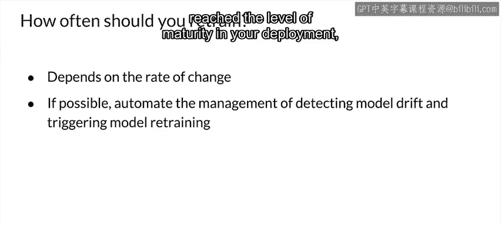

---

## 总结 📝

本节课中我们一起学习了机器学习模型部署后保持健康运行的关键：**持续评估与监控**。

我们首先探讨了模型性能随时间变化的原因，特别是**数据漂移**（如协变量偏移）和**概念漂移**。接着，我们介绍了监控的框架，包括对原始数据、模型预测以及通过标注流程进行监控。

然后，我们详细讲解了**有监督监控技术**（如统计过程控制、序列分析、错误分布监控）和**无监督监控技术**（如聚类检测、特征分布监控、模型依赖监控），并分析了各自的优缺点。我们还以谷歌云AI持续评估为例，了解了可用的云服务工具。

最后，我们讨论了**重新训练模型的时机**，强调需要根据数据变化速率和业务需求，通过监控结果来指导决策，以实现成本与性能的平衡。

通过实施有效的持续评估与监控，你可以在模型性能显著影响业务之前及时发现问题并采取行动，确保机器学习系统长期稳定地创造价值。