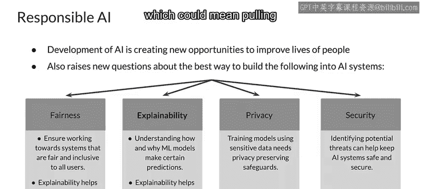
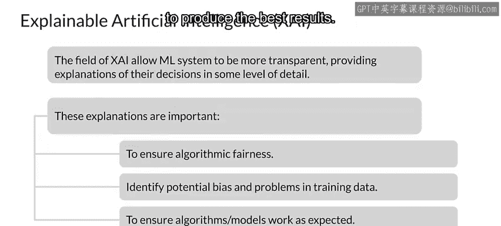
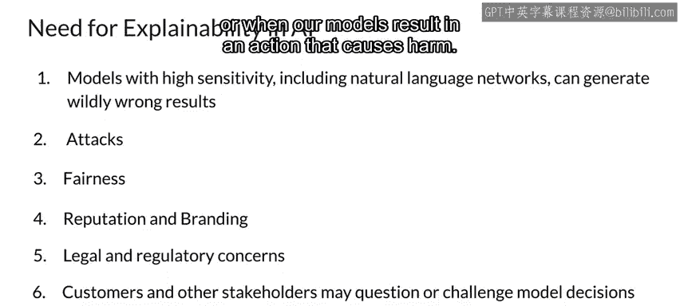
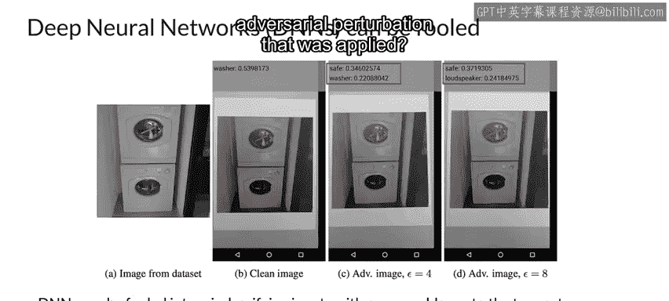

#  119：可解释的AI 🔍

在本节课中，我们将要学习可解释人工智能（Explainable AI）的概念、重要性及其在机器学习工程生产实践中的应用。我们将探讨为什么理解模型决策过程至关重要，并介绍一些核心的解释技术。

---

欢迎回来。本周的主题是可解释性。

向你自己，也可能向其他人解释，为什么你的模型做出了特定的决策。

在许多生产环境的机器学习应用中，可解释性正变得越来越重要，原因有很多，包括公平性、监管要求和法律要求，以及为了更好地理解你的模型，以便修复问题或改进它。

因此，让我们开始探讨可解释性。我们将从讨论可解释人工智能开始。

随着模型变得越来越复杂，可解释性变得越来越重要，同时也变得越来越困难。但好消息是，实现可解释性的技术也在不断进步。

具体来说，你可以理解为我们将要研究可解释性。

## 可解释性与负责任的人工智能 🤝

可解释性和可说明性是更广泛的“负责任的人工智能”领域的一部分。

人工智能的发展及其在越来越多问题上的成功应用，使得执行以前不可能完成的任务的能力迅速增长。这创造了许多新的巨大机遇，但同时也将巨大的权力赋予了模型的结果。

有时，人们会对模型及其如何负责任地处理影响人们并可能造成伤害的诸多因素提出疑问。因此，我们之前讨论过的公平性问题，是负责任人工智能的核心。在更小的意义上，可说明性和可解释性是实现负责任人工智能的关键，因为我们需要理解模型是如何生成其结果的。

隐私也是负责任人工智能的一部分，因为模型通常使用个人可识别信息（PII）进行操作，并且通常使用PII进行训练。当然，安全性也是一个问题，并且与隐私相关，因为我们讨论过的一种攻击就是从模型中提取训练数据，这可能意味着从模型中提取私人信息。

## 解释模型结果的不同方式 🛠️

模型产生的结果可以通过不同的方式解释。

最先进的技术之一是创建一种本质上可解释的模型架构。一个简单的例子是基于决策树的模型，其本质上是可解释的。但如今，越来越多先进且复杂的模型架构也被设计成具有内在可解释性。这就是可解释人工智能（XAI）领域。

可解释性在许多方面都很重要，包括确保公平性、寻找训练数据中的偏见问题、满足监管、法律和品牌声誉要求，以及单纯地研究模型内部结构以优化其产生最佳结果。

## 为什么AI可解释性如此重要？❓

从根本上说，这是因为我们需要解释模型做出的结果和决策。这对于高敏感性的模型尤其重要，包括自然语言模型，这些模型在面对某些示例时，可能会产生完全错误的结果。

这也包括对攻击的脆弱性，我们需要持续评估这种脆弱性，而不仅仅是在攻击发生之后。当然，公平性是一个关键问题，因为我们希望确保公平对待模型的每一位用户。

这也会影响我们的声誉和品牌形象，尤其是在客户或其他利益相关者可能质疑或挑战我们模型的决策时，但事实上，在任何我们生成预测的情况下都可能发生。当然，还存在法律和监管方面的担忧，特别是当有人非常不满，以至于在法庭上挑战我们和我们的模型时，或者当我们的模型导致有害行为时。

## 深度神经网络的脆弱性：对抗性攻击 🎯

深度神经网络可能会被欺骗，从而对输入进行错误分类，产生与真实类别毫无相似之处的结果。这在图像分类的例子中最容易看到，但根本上，它可以发生在任何模型架构上。

本幻灯片上的示例演示了一种黑盒攻击，即攻击是在无法访问模型的情况下构建的。该示例基于一个使用物理对抗样本进行图像分类的手机应用程序。

你看到的是数据集中一张干净的洗衣机图像，即左侧的图像A。该图像被用来生成具有不同程度扰动的对抗性图像。接下来是打印出干净图像和对抗性图像，然后使用Tensorflow相机演示应用程序对它们进行分类。

干净的图像B通过相机感知时被正确识别为洗衣机，而图像C和D中增加的对抗性扰动导致了更严重的错误分类。关键结果是图像D，模型认为洗衣机要么是一个保险箱，要么是一个扬声器，但绝对不是洗衣机。😊，看着这张图片，你同意模型的判断吗？可能不同意吧？

你能看出所施加的对抗性扰动吗？这并不容易看出来。

这或许是此类模型攻击中最著名的例子：通过添加难以察觉的、精心设计的小量噪声，一张熊猫的图片可以被错误分类为长臂猿，并且置信度高达99.3%。这远高于模型最初认为它是熊猫的置信度。😊。

---

## 总结 📝

本节课中，我们一起学习了可解释人工智能的核心概念。我们了解到，随着模型复杂度的增加，理解其决策过程对于确保公平性、满足法规要求、维护品牌声誉以及优化模型性能变得至关重要。我们探讨了可解释性作为“负责任的人工智能”一部分的角色，并看到了即使是先进的深度神经网络也可能受到对抗性攻击的影响，这进一步凸显了拥有可解释模型的重要性。掌握这些知识是构建可靠、可信赖的生产级机器学习系统的关键一步。