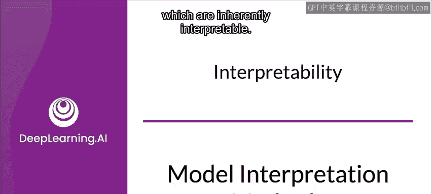
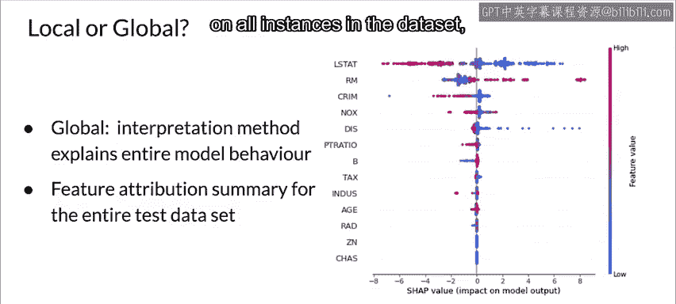

#  120：模型解释方法 🧠




在本节课中，我们将要学习模型解释的基本方法。理解模型为何做出特定预测至关重要，这有助于建立信任、确保公平性、实现透明化，并促进模型诊断与调试。

---

## 模型解释的定义与重要性

模型的可解释性没有一个严格的数学定义。Beron 和 Cotton 提供了一个很好的定义：如果一个系统（或模型）的运作过程能够被人类通过内省或生成的解释所理解，那么它就是可解释的。换句话说，如果人类有办法弄清楚模型为何产生某个特定结果，那么该模型就是可解释的。

然而，从实践角度看，所需的解释工作量也必须是可行的。衡量模型可解释性的一个标准，就是理解一个给定结果所需付出的努力或分析量。

理想情况下，你应该能够通过查询模型来理解其算法决策的**内容**、**原因**和**方式**。这能帮助你识别和验证驱动模型输出的关键变量，从而在即使面对未预见情况时，也能建立对预测系统可靠性的信任。这种诊断有助于确保模型的安全性和可问责性。

---

## 模型解释方法的分类标准

有多种标准可用于对模型解释方法进行分类。例如，解释方法可以根据其是**内在的**还是**事后**的来分组；也可以是**模型特定**的或**模型无关**的；还可以根据其解释范围是**局部**的还是**全局**的来划分。

接下来，我们逐一讨论这些分类标准。

---

## 内在可解释模型 vs. 事后解释方法

一种对模型可解释性方法进行分类的方式，是看模型本身是否是**内在可解释**的。

内在可解释的模型架构已经存在很长时间，其经典例子是**线性模型**和**基于树的模型**。然而，最近也出现了更先进的模型架构，例如**格模型**，它们能够在复杂的建模问题上同时实现可解释性和高精度。例如，格模型的精度可以匹配甚至在某些情况下超过神经网络。

现在，让我们考虑**事后**方法。

事后方法将模型视为“黑箱”，通常不区分不同的模型架构。它们倾向于以相同方式对待所有模型，并在训练后应用，试图通过检查特定结果来理解模型生成它们的原因。不过，也存在一些方法（特别是针对卷积网络），会检查网络内部的层以试图理解结果是如何生成的。

然而，由于事后方法并不评估导致结果生成的实际操作序列，因此对于特定结果的原因解释是否正确，总是存在一定程度的不确定性。通常，内在可解释模型对于其为何生成特定结果能提供更高的确定性。这类分析的例子包括**特征重要性**和**部分依赖图**。

---

## 解释方法的输出类型

各种解释方法也可以根据其产生的结果类型进行大致分类。

以下是几种主要的输出类型：

*   **特征统计摘要**：一些方法创建特征的统计摘要。
*   **单值特征解释**：一些方法为特征返回单个值。例如，**特征重要性**为每个特征返回一个数字。一个更复杂的例子是**成对特征交互强度**，它为每对特征关联一个数字。
*   **可视化摘要**：一些方法依赖可视化来总结特征，例如**部分依赖图**。部分依赖图是显示某个特征与其平均预测输出之间关系的曲线。在这种情况下，绘制曲线比简单地在表格中表示数值更有意义且更直观。

---

## 模型特定方法与模型无关方法

一些方法会查看模型的内部结构。内在可解释模型的解释就属于这一类。

例如，对于线性模型这类较简单的模型，你可以查看学习到的权重来进行解释。类似地，基于树的模型中学习到的树结构本身就是一种解释。在格模型中，每一层的参数就是该层的输出，这使得分析和调试模型的每个部分相对容易。

**模型特定方法**仅限于特定的模型类型。例如，回归权重和线性模型的解释就是模型特定的。根据定义，解释内在可解释模型的技术也是模型特定的。但模型特定方法并不仅限于内在可解释模型，也存在专门针对神经网络解释的工具。

**模型无关方法**则不特定于任何特定模型。它们可以在任何模型训练完成后应用。本质上，它们属于事后方法。这些方法无法访问模型的内部结构（如权重、参数等），它们通常通过分析特征输入和输出对，并试图推断其关系来工作。

---

## 局部解释与全局解释

除了将解释方法分为模型无关或模型特定，还可以根据它们生成的解释是**局部**的还是**全局**的来分组。

可解释性方法可以是局部的或全局的，这取决于该方法是解释单个预测还是解释整个模型的行为。有时，解释范围可能介于局部和全局之间。

**局部可解释性方法**解释单个预测。例如，对数据集中单个示例的预测进行**特征归因**。特征归因衡量了每个特征对给定结果的预测贡献了多少。

以下是一个使用名为 **Shap** 的库进行特征归因的示例，它解释了一个在波士顿房价数据集上训练的梯度提升集成树对单个示例的预测。这个例子展示了局部解释的样子。

```python
# 示例：使用 SHAP 库进行局部特征归因
import shap
# ... 加载模型和单个数据实例 ...
explainer = shap.TreeExplainer(model)
shap_values = explainer.shap_values(instance)
shap.force_plot(explainer.expected_value, shap_values, instance)
```

图表显示了各特征在将模型输出从**基准值**推向**实际模型输出**过程中的贡献。红色特征将模型推向更高值，蓝色特征则将模型输出推向更低值。

**全局方法**解释整个模型的行为。例如，如果某个方法为整个测试集上的预测创建了特征归因的摘要，那么它就可以被认为是全局的。

以下是一个由 Shap 库创建的全局解释示例。它显示了波士顿房价数据集预测中，每个样本的每个特征的 Shap 值（特征归因）。颜色代表特征值，红色表示高，蓝色表示低。你可以看到，例如，随着 `LSTAT`（低收入人口比例）的增加，往往会导致预测房价下降。由于这个解释展示了数据集中所有实例的所有特征归因的概览，因此它被认为是全局的。

---

## 总结



本节课中，我们一起学习了模型解释的核心概念与方法。我们首先明确了模型可解释性的定义及其在建立信任、确保公平与透明方面的重要性。接着，我们系统性地探讨了模型解释方法的多种分类维度：**内在可解释模型**（如线性模型、决策树、格模型）与**事后解释方法**；根据输出类型划分的**统计摘要**、**单值解释**与**可视化**；**模型特定方法**与**模型无关方法**；以及**局部解释**（针对单个预测）与**全局解释**（针对整个模型行为）。理解这些分类有助于我们在实际工作中，根据模型类型和业务需求，选择合适的工具和技术来打开模型“黑箱”，使其决策过程更加可信和可控。