#  121：内生可解释模型 📊

在本节课中，我们将学习什么是内生可解释模型，并探讨几种具体的可解释模型架构，包括线性模型和格点模型。我们将了解这些模型如何通过其透明和直观的工作原理，帮助我们理解模型是如何得出特定预测结果的。

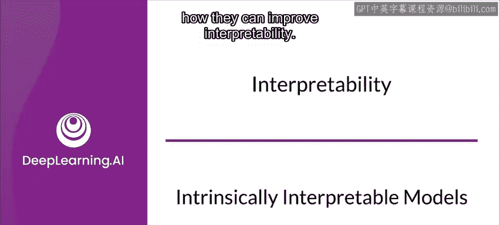

---

## 什么是内生可解释模型？🤔

自统计分析和机器学习的早期阶段以来，就存在一些本质上可解释的模型架构。

内生可解释模型的一个定义是：模型的工作原理足够透明和直观，通过检查模型本身，就能相对容易地理解模型是如何产生特定结果的。

许多经典模型具有高度可解释性，例如基于树的模型和线性模型。然而，尽管我们看到神经网络能够产生惊人的结果，但它们往往非常不透明，尤其是那些更大、更复杂的架构，这使得它们在试图解释时如同“黑箱”。这限制了我们解释其结果的能力，并迫使我们使用事后分析工具来试图理解它们如何得出特定结果。

不过，一些专门为可解释性设计的新架构已经被创建出来，它们同时保留了深度神经网络的能力。这仍然是一个活跃的研究领域。

---

## 单调性：提升可解释性的关键 🔑

有助于提高可解释性的一个关键特征是特征的单调性。

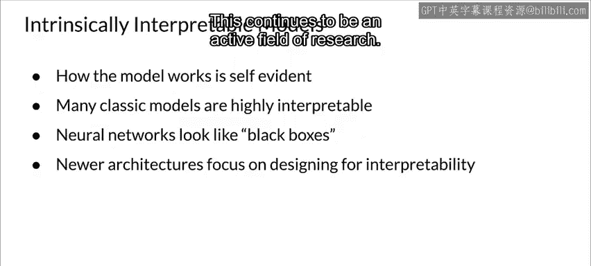

单调性意味着，随着特征值的变化，该特征对模型结果的贡献要么持续增加，要么持续减少，要么保持不变。这里的关键因素是“一致性”。这与许多问题中许多特征的领域知识相匹配。

因此，当你试图理解一个模型结果时，如果特征是单调的，它就符合你对所建模现实世界的直觉。例如，如果你试图创建一个预测二手车价值的模型，在所有其他特征保持不变的情况下，汽车行驶的里程数越多，其价值应该越低。你不会期望一辆里程数更多的车比里程数更少的车更值钱。这符合你对世界的认知，因此你的模型也应该与之匹配，里程数特征应该是单调的。

在下图中，蓝色和绿色曲线是单调的，而红色曲线不是，因为它没有持续增加、减少或保持不变。

---

## 可解释的模型架构 🏗️

上一节我们介绍了单调性的概念，本节中我们来看看几种被认为是可解释的模型架构。

首先，线性模型非常可解释，因为线性关系易于理解和解释，并且线性模型的特征总是单调的。

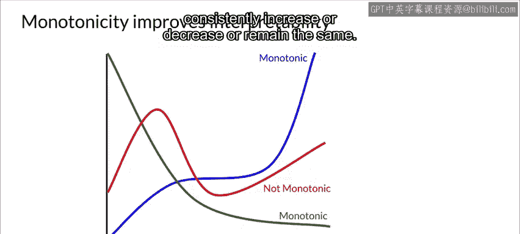

一些其他模型架构也具有线性方面。例如，当用于回归时，规则拟合模型是线性的；在所有情况下，TFLattice模型在格点之间使用线性插值，我们稍后会学习到。

有些模型可以自动包含特征交互，或对特征交互施加约束。理论上，你可以通过特征工程在所有模型中包含特征交互。符合我们领域知识的交互往往使模型更具可解释性。

以下是几种可解释模型架构的特点：

*   **线性模型**：关系简单直观，特征贡献易于量化。
*   **规则拟合模型（用于回归时）**：本质上是线性的，易于解释。
*   **TFLattice模型**：在格点间使用线性插值，并允许注入领域知识。

---

## 准确性与可解释性的权衡 ⚖️

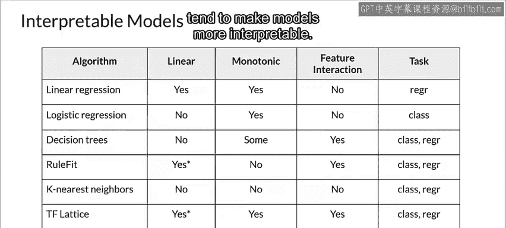

根据你试图建模的损失面的特征，更复杂的模型架构可以实现高精度。但这往往以牺牲可解释性为代价。

由于前面讨论的许多原因，可解释性可能是模型的严格要求。因此，你需要在可以解释的模型和能够生成所需精度的模型之间找到平衡。

再次强调，一些新创建的架构在提供更高精度的同时，也提供了良好的可解释性。TensorFlow Lattice 就是这类架构的一个例子。

---

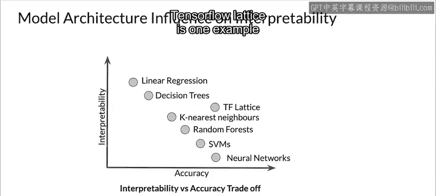

## 线性回归：可解释性的典范 📈

可解释性的典范可能是我们的老朋友——线性回归。

线性回归非常容易理解特征贡献之间的关系，即使是多元线性回归也是如此。随着特征值的增加或减少，它们对模型结果的贡献也相应增加或减少。

这里展示的例子根据空气温度模拟了蟋蟀每分钟鸣叫的次数。这是一个非常简单的线性关系，因此线性回归可以很好地建模它。顺便说一句，这也意味着当你在夜晚外出时，如果你仔细听蟋蟀的叫声并数它们鸣叫的次数，你就可以测量空气的温度。

你可以查阅多贝尔定律以了解更多信息。

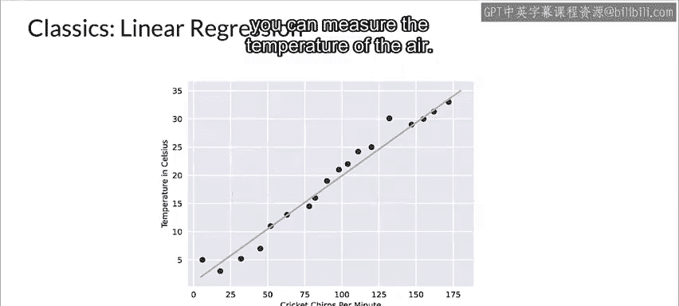

当然，一个特征对模型结果的实际贡献将取决于其权重。这对于线性模型尤其容易看出。

对于数值特征，特征值每增加或减少一个单位，预测值就会根据相应权重的值增加或减少。对于二元特征，预测值会根据特征值是1还是0，增加或减少权重值的大小。

---

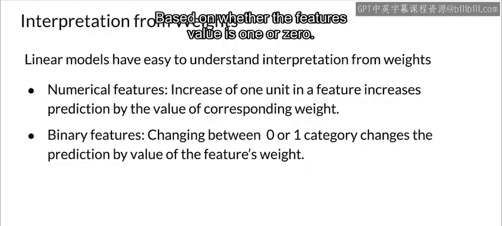

## 如何衡量特征重要性？📊

我们如何确定给定特征对于进行预测的相关性？特征重要性告诉我们一个特征对于生成模型结果有多重要。特征越重要，我们就越想将其包含在特征向量中。

但不同模型的特征重要性计算方式不同，因为不同模型计算结果的方
式不同。

对于线性回归模型，特征的T统计量的绝对值是衡量该特征重要性的一个好指标。T统计量是特征的已学习或估计的权重，除以其标准误差。因此，特征的权重越大，其重要性就越高；但权重的方差越大（换句话说，我们对权重正确值的确定性越低），该特征的重要性就越低。

以下是计算特征重要性的关键点：

*   **T统计量**：`T = 权重 / 标准误差`
*   **重要性**：`重要性 ∝ |T|`
*   **权重方差越大**，我们对权重的确定性越低，特征重要性相对降低。

---

## 深入了解格点模型 🧊

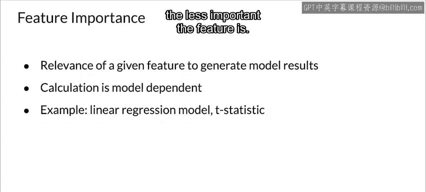

你可能不熟悉格点模型，让我们来看看它们是如何工作的。

格点模型在特征空间上覆盖一个网格，并在网格的每个顶点设置它试图学习的函数值。当预测请求到来时，如果它们没有直接落在顶点上，则使用来自最近网格顶点的线性插值来计算结果。

这样做的好处之一是通过在特征空间上施加规则网格来正则化模型，并大大降低对训练数据覆盖范围之外的样本的敏感性。

然而，TensorFlow Lattice 模型超越了简单的格点模型。

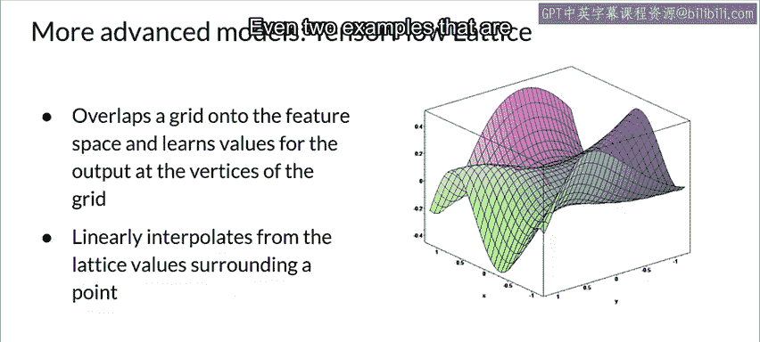

---

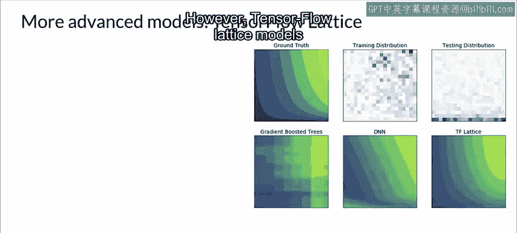

## TensorFlow Lattice：结合领域知识 🧠

TensorFlow Lattice 进一步允许你添加约束并将领域知识注入模型。这些图表显示了正则化和领域知识的好处。

比较左上角和右下角的图表，注意与其他类型的模型相比，该模型与真实情况有多么接近。

当你知道领域中某些特征是单调的或凸的，或者一个或多个特征存在交互时，你可以在模型学习过程中将这些知识注入模型。对于可解释性而言，这意味着特征值和结果很可能符合你对预期结果的领域知识。

你还可以表达特征之间的关系或交互，以表明一个特征反映了对另一个特征的信任度。例如，更多的评论数量让你对餐厅的平均星级评分更有信心。当你在网上购物时，你自己可能也考虑过这一点。

所有这些基于你的领域知识或你对所建模世界的认知的约束，都有助于模型产生有意义的结果，从而使它们更具可解释性。此外，由于模型在顶点之间使用线性插值，它在可解释性方面也具有线性模型的许多优点。

但是，除了基于领域知识添加约束的所有好处之外，TensorFlow Lattice 模型在复杂问题上的精度水平也与深度神经网络相似。当然，TensorFlow Lattice 模型也比神经网络更容易解释。

---

## 格点模型的局限性 ⚠️

然而，格点模型确实有一个弱点。维度是它们的“氪石”。

格点的参数数量随着输入特征的数量呈指数级增长，这对于具有大量特征的数据集会产生扩展性问题。作为一个粗略的经验法则，处理20个或更少的特征可能没问题，但这也取决于你指定的顶点数量。

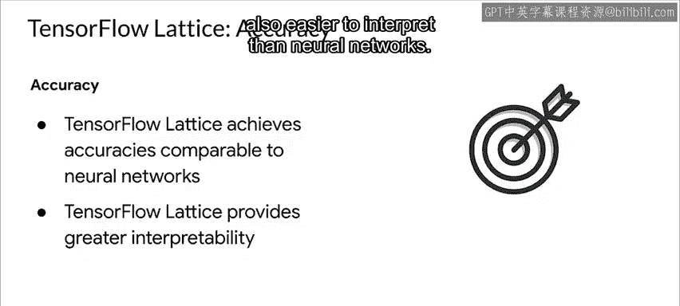

不过，有另一种方法来应对这个维度“氪石”，那就是使用集成方法。但这超出了本次演示的范围。

---

## 总结 📝

在本节课中，我们一起学习了内生可解释模型的概念。我们探讨了单调性作为提升模型可解释性的关键特性，并深入了解了线性回归和格点模型等可解释架构的工作原理。特别是，我们看到了 TensorFlow Lattice 如何通过注入领域知识（如单调性约束）和利用线性插值，在保持高精度的同时提供出色的可解释性。最后，我们也了解了格点模型在处理高维数据时面临的挑战。理解这些模型有助于我们在需要模型透明度和可解释性的场景中做出更合适的选择。

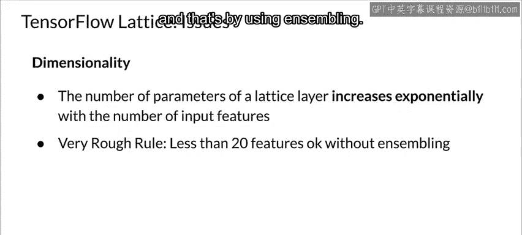

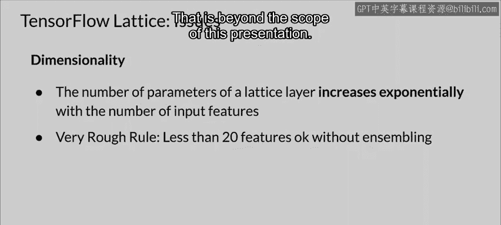

