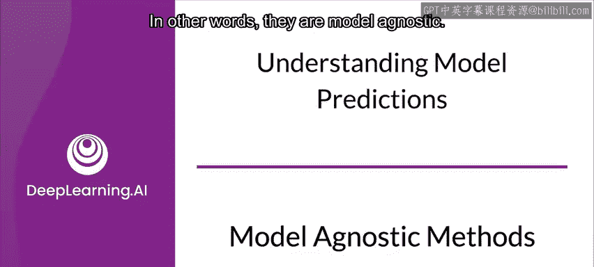
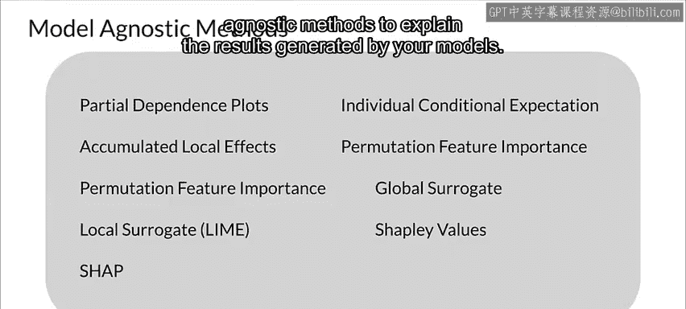

#  122：模型无关解释方法 🔍

在本节课中，我们将学习模型无关的解释方法。当模型本身不具备内在可解释性时，这些方法可以帮助我们理解模型的预测结果。我们将探讨模型无关方法的核心概念、特点以及几种常见的实现方式。

---

## 模型无关方法的必要性

上一节我们介绍了模型内在可解释性的重要性。然而，由于各种原因，我们并非总能使用具备内在可解释性的模型。

你可能需要尝试解释那些本身不易解释的模型的预测结果。

幸运的是，存在多种不依赖于特定模型类型的方法。换句话说，它们是模型无关的。现在让我们来看看其中一些方法。

---

## 模型无关方法的核心特点

模型无关方法将解释与模型本身分离开来。这些方法可以在模型训练完成后应用于任何模型。

例如，它们可以应用于线性回归、决策树，甚至是像神经网络这样的黑盒模型。

一个理想的模型无关方法应具备以下特点：

以下是模型无关方法应具备的几个关键特性：

*   **模型灵活性**：方法不应局限于特定类型的模型。
*   **解释灵活性**：解释不应局限于某种特定形式。方法应能提供公式形式的解释，或者在某些情况下，提供图形化的解释（例如特征重要性图）。
*   **表示灵活性**：所使用的特征表示应在被解释模型的上下文中具有意义。

让我们以一个使用词嵌入的文本分类器为例。在这种情况下，解释中使用单个词语的存在与否是有意义的。

---

## 常见的模型无关方法

目前有许多正在使用的模型无关方法，数量太多，无法在此一一详述。我将讨论其中几种，让你了解如何使用模型无关方法来解释模型生成的结果。

以下是几种常见的模型无关解释方法：

*   **部分依赖图**：通过可视化某个特征在保持其他特征平均值不变的情况下，对模型预测输出的边际效应，来理解特征与预测之间的关系。
*   **个体条件期望图**：展示对于单个数据实例，某个特征的变化如何影响模型的预测，有助于理解模型在局部区域的行为。
*   **置换特征重要性**：通过随机打乱某个特征的值并观察模型性能下降的程度，来衡量该特征对模型预测的重要性。其核心思想是：如果一个特征很重要，打乱它会显著降低模型性能。
*   **全局代理模型**：训练一个简单的、可解释的模型（如线性回归或决策树）来近似复杂黑盒模型的预测。通过解释这个代理模型来间接理解原模型。
*   **局部可解释模型**：例如 **LIME**，通过在单个预测点附近构建一个简单的局部模型来解释该点的预测。其公式可简化为：`explanation_model ≈ complex_model` 在 `x` 点附近。
*   **SHAP值**：基于博弈论的 **SHapley Additive exPlanations**，为每个特征分配一个值，表示该特征对特定预测的贡献度。其核心是加性特征归因：`prediction = base_value + sum(SHAP_values_for_all_features)`。

---

本节课中，我们一起学习了模型无关的解释方法。我们了解到，当模型本身是黑盒时，这些方法能够将解释与模型分离，提供模型灵活性、解释灵活性和表示灵活性。我们简要介绍了几种常见的方法，如部分依赖图、置换特征重要性、LIME和SHAP值，它们都能帮助我们以不同方式理解和解释复杂模型的预测行为。