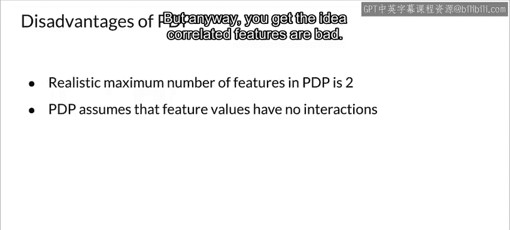

#  123：部分依赖图 📊


在本节课中，我们将要学习一种广泛使用的模型可解释性方法——部分依赖图。我们将了解它的工作原理、如何解读，以及它的优缺点。


---

## 什么是部分依赖图？

上一节我们介绍了模型可解释性的重要性，本节中我们来看看一种具体的全局解释方法。

部分依赖图是一种帮助你理解特定特征对模型预测结果的影响，以及这些特征与训练数据中目标变量之间关系类型的方法。它通常专注于分析一个或两个特征对模型预测结果的边际影响。

这些关系可能是线性的、单调的，也可能是更复杂的类型。例如，对于一个线性回归模型，部分依赖图将始终显示线性单调关系。PDP是一种全局方法，因为它考虑了所有数据实例，并评估特征与结果之间的全局关系。

---

## 部分依赖图如何工作？

部分函数 **F_S(x)** 通过计算训练数据中的平均值来估计，这种方法也称为蒙特卡洛方法。

以下公式展示了部分函数的估计过程：

```
F_S(x) ≈ (1/n) * Σ_{i=1}^{n} f(x_S, x_C_i)
```

其中：
*   **n** 是训练数据集中的样本数量。
*   **S** 是我们感兴趣的特征集合。
*   **C** 是所有其他特征的集合。
*   **x_C_i** 是第 i 个样本中我们不感兴趣的特征的值。

部分函数告诉我们，对于特征集合 **S** 的给定值，其对预测结果的平均边际效应是多少。

PDP 有一个重要的假设：集合 **C** 中的特征与集合 **S** 中的特征不相关。如果这个假设被违反，计算出的平均值将包含非常不可能甚至不可能的数据点。

---

## 一个具体例子：自行车租赁预测

让我们看一个在自行车租赁数据集上训练的随机森林模型例子，该模型用于预测每天租赁的自行车数量，使用的特征包括温度、湿度和风速。

以下是温度、湿度和风速的部分依赖图：


请注意，当温度上升到大约 15 摄氏度（59 华氏度）时，租赁自行车的人可能会更多。这是合理的，因为人们喜欢在天气好的时候骑自行车，而这个温度正是开始变好的时候。但请注意，这个趋势在大约 25 摄氏度（77 华氏度）以上趋于平稳并开始下降。

你还可以看到湿度也是一个因素，当湿度高于约 60% 时，人们开始对骑自行车的兴趣降低。你觉得呢？这些图符合你的骑车偏好吗？

---

## 处理分类特征

对于分类特征，我们通过强制所有实例具有相同的类别值来计算其 PDP。

以下是自行车租赁数据集中分类特征“季节”的 PDP 图，它有四个可能的值：春、夏、秋、冬。



为了计算“夏季”的 PDP，我们强制数据集中的所有实例在“季节”特征上的值等于“夏季”。此图显示了不同季节的值。请注意，季节变化对自行车租赁的影响差异不大，除了春季的租赁数量略低。坦率地说，我没想到会是这样，但数据就是这样告诉我们的。

---

## 部分依赖图的优缺点

了解了 PDP 的应用后，我们来系统地总结一下它的优势与局限。

**部分依赖图的主要优点如下：**

*   **结果直观**：结果往往很直观，尤其是在特征不相关的情况下。当特征不相关时，PDP 图显示的是改变一个特征时预测结果的平均变化。
*   **因果解释**：对 PDP 的解释通常具有因果性，即如果我们改变一个特征并测量结果的变化，我们期望结果是一致的。
*   **易于实现**：PDP 相对容易实现，本课末尾的参考资料部分列出了一些可用的软件包。

**然而，像大多数方法一样，PDP 也有一些缺点：**

*   **可视化限制**：实际上，你一次只能处理两个特征，因为人类很难可视化超过三个维度，但这并不是 PDP 本身的错。
*   **独立性假设**：更严重的限制是独立性假设。PDP 假设你正在分析的特征与其他特征不相关。正如我们在特征选择的讨论中学到的，无论如何，消除相关特征都是一个好主意。但如果你仍然有相关的特征，PDP 就无法正常工作。

例如，假设你想根据一个人的身高和体重来预测他的步行速度。PDP 会假设身高和体重不相关，这显然是一个错误的假设。结果，我们可能会将身高两米、体重 50 公斤的人纳入计算，这对于时装模特来说都有点不现实（尽管我搜索时惊讶地发现有些人确实很接近）。总之，你明白了：相关的特征会导致问题。

---

## 总结


本节课中，我们一起学习了部分依赖图这一重要的模型可解释性工具。我们了解了它的定义、工作原理、如何通过公式和代码理解其计算过程，并通过自行车租赁的实例看到了它的应用。我们还讨论了 PDP 直观、易于解释的优点，以及其受限于特征独立假设和可视化维度的缺点。掌握 PDP 能帮助你在理解复杂模型预测行为时，聚焦于单个或少数特征的影响。