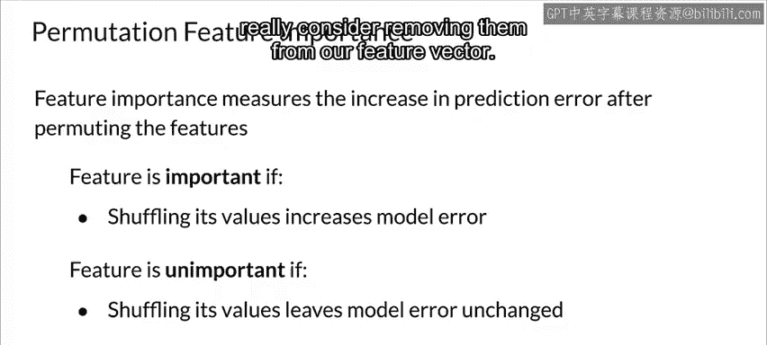
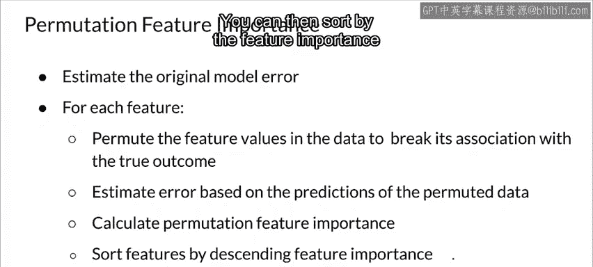
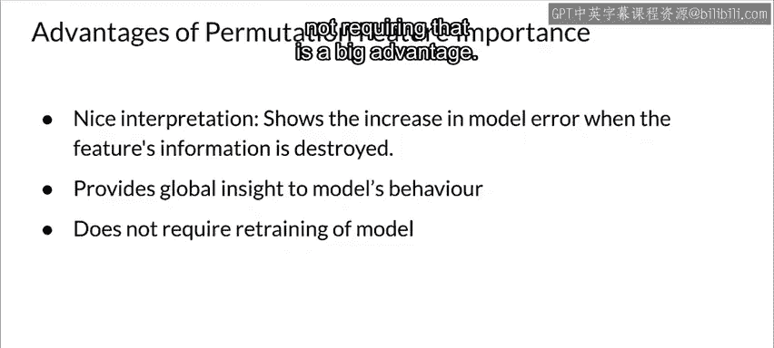
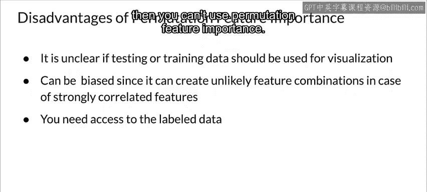

#  124：排列特征重要性 📊

在本节课中，我们将学习一种名为“排列特征重要性”的技术，用于衡量模型中各个特征的重要性。我们将了解其工作原理、算法步骤、优势与局限性。

---

## 概述

排列特征重要性是一种通过打乱（排列）某个特征的值，并观察模型预测误差的变化，来衡量该特征重要性的方法。如果打乱某个特征的值导致模型误差显著增加，说明该特征对模型预测很重要；反之，则说明该特征不重要。

## 基本概念与算法

上一节我们概述了排列特征重要性的核心思想。本节中，我们来看看其具体的算法步骤。

以下是排列特征重要性的基本算法流程：

1.  **输入**：训练好的模型、特征数据集、真实标签（目标值）以及一个误差评估指标。
2.  **计算基准误差**：使用原始（未打乱的）特征数据，计算模型的初始预测误差。记此误差为 `original_error`。
3.  **迭代评估每个特征**：对数据集中的每一个特征，执行以下操作：
    *   打乱（排列）该特征在所有样本中的值，其他特征保持不变。
    *   使用打乱后的新数据集，让模型进行预测，并计算新的预测误差。记此误差为 `permuted_error`。
4.  **计算特征重要性**：对于每个特征，通过比较打乱前后的误差来计算其重要性。通常有两种方式：
    *   **比率**：`importance = permuted_error / original_error`
    *   **差值**：`importance = permuted_error - original_error`
5.  **排序与分析**：根据计算出的重要性值对所有特征进行排序。重要性值越高（差值越大或比率越大），表明该特征越重要。

## 优势

了解了算法步骤后，我们来看看排列特征重要性有哪些优点。

排列特征重要性具有直观的解释性：特征重要性等于破坏该特征信息后模型误差的增加量。这为我们理解模型行为提供了一个高度概括的全局视角。

此外，由于在打乱某个特征时，也破坏了它与其他特征之间的交互效应，因此该方法能够反映出特征间的相互作用。这意味着它同时考虑了特征的主效应和交互效应对模型性能的影响。

😊 一个巨大的优势是，**该方法不需要重新训练模型**。其他一些方法（如删除特征法）需要删除特征后重新训练模型再比较误差，而重新训练模型可能非常耗时。无需重新训练是一个显著优点。

## 局限性

上一节我们探讨了该方法的优势，本节中我们来看看它存在哪些固有的局限性。

排列特征重要性也存在一些缺点。一个略显奇怪的问题是，**不清楚应该使用训练数据还是测试数据来计算排列重要性**，两者各有优缺点。

与部分依赖图（PDP）类似，**高度相关的特征**再次成为一个问题，可能会影响重要性评估的准确性。

同时，该方法**需要能够访问原始的带标签训练数据集**。如果你从他人那里获得模型，但对方未提供训练数据，则无法使用此方法。

---

## 总结

本节课中，我们一起学习了排列特征重要性。我们了解到，它是一种通过打乱特征值并观察模型误差变化来评估特征重要性的方法。其核心优势在于解释性强、能捕捉特征交互且无需重新训练模型。然而，它也面临数据选择（训练集/测试集）、特征相关性以及依赖原始训练数据等挑战。当发现不重要的特征时，应考虑将其从特征向量中移除，以简化模型。