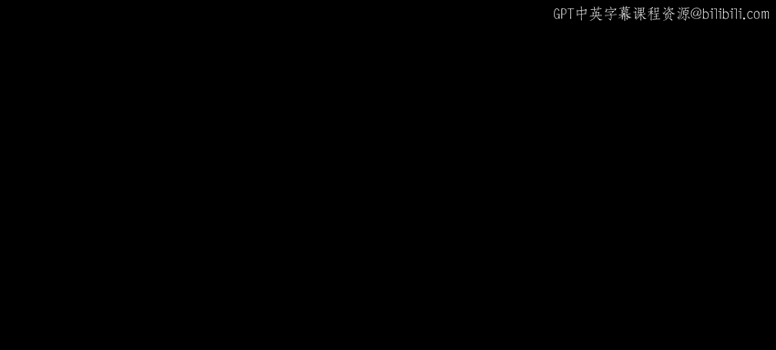
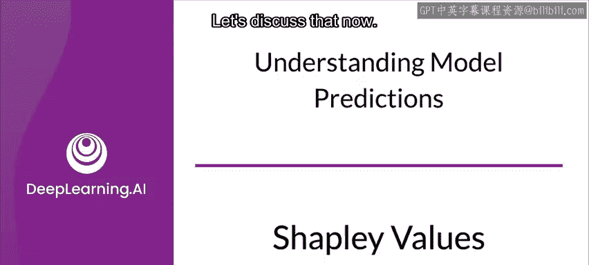
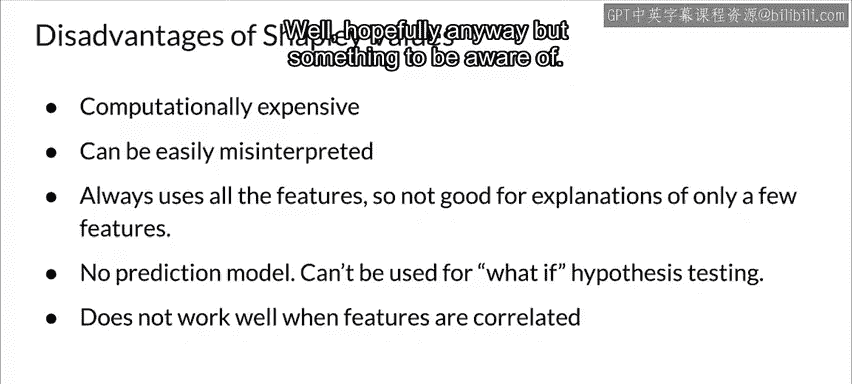

#  125：47_Shapley值 🎯

在本节课中，我们将要学习一个衡量特征重要性的核心概念——**Shapley值**。我们将了解它的理论基础、如何应用于机器学习模型的解释，以及它的优缺点。

---

## 什么是Shapley值？🤔

Shapley值是合作博弈论中的一个概念。它以Lloyd Shapley的名字命名，他在1951年提出了这一概念，并于2012年因此获得了诺贝尔经济学奖。对于每一个合作博弈，Shapley值在所有参与者之间，对联盟产生的总剩余价值进行一种独特的分配。

上一节我们介绍了Shapley值的起源，本节中我们来看看它在博弈论中是如何运作的。

在博弈论中，可以想象一组参与者进行合作，并因其合作产生了总体收益。由于一些参与者可能比其他人贡献更多，或者拥有不同的议价能力，我们应该如何在参与者之间分配收益？换句话说，每个参与者对整体合作有多重要？他或她可以合理地期望得到多少回报？Shapley值为这个问题提供了一个可能的答案。

---

## 如何应用于机器学习？💡

那么，如何将这个思想应用到机器学习中呢？对于机器学习和可解释性而言，参与者就是数据集的特征。我们使用Shapley值来确定每个特征对结果贡献了多少。

正如你可能预期的，模型的预测就是“收益”。了解特征的贡献将帮助你理解在生成模型结果时，哪些是重要的因素。因为它不特定于任何特定类型的模型，所以无论模型架构如何，都可以使用Shapley值。

以上是对Shapley值背后思想的快速概述。现在让我们聚焦于一个具体的例子。

---

## 一个具体示例：公寓价格预测 🏢

假设你训练了一个机器学习模型来预测公寓价格。你需要解释为什么模型对某个公寓的预测价格是30万欧元。

你需要处理哪些数据呢？在这个例子中，该公寓面积为50平方米，位于二楼，附近有一个公园，并且禁止养猫。所有公寓的平均预测价格是31万欧元。

Shapley值源于博弈论。因此，让我们阐明如何将它们应用于机器学习的可解释性。

*   **博弈**：针对数据集中单个实例的预测任务。具体来说，是这个实例的实际预测值与所有实例的平均预测值之间的差值。
*   **参与者**：是该实例的特征值，它们“协作”产生了博弈的“收益”。

在公寓的例子中，特征值 `park = nearby`、`cat = banned`、`area = 50`、`floor = second` 共同作用，得出了30万欧元的预测。

我们的目标是解释实际预测值（30万）与平均预测值（31万）之间的差值，即1万欧元的损失。

以下是特征贡献的一种可能解释：
*   附近的公园贡献了 +3万欧元。
*   50平方米的面积贡献了 +1万欧元。
*   位于二楼贡献了 0欧元。
*   禁止养猫贡献了 -5万欧元。

这些贡献值加起来正好是 -1万欧元，即最终预测减去平均预测公寓价格。你可以将其视为绝对值1万欧元，或者视为平均值的约3.3%。

这是一种可能的解释。但我们是如何得到这些数字的呢？

---

## Shapley值的理论基础与优势 ⚖️

与解释模型结果的其他方法不同，Shapley值建立在坚实的理论基础之上。其他方法可能凭直觉说得通（这对可解释性很重要），但没有同样严谨的理论基础。这也是Shapley因其工作获得诺贝尔奖的原因之一。

该理论定义了必须满足的四个属性：**效率**、**对称性**、**虚拟性**和**可加性**。

Shapley值的一个关键优势在于，它在一个实例的特征值之间进行**公平分配**。有人认为，在法律要求可解释性的情况下（例如欧盟的“解释权”），Shapley可能是唯一能提供完整解释的方法。一些人认为，Shapley值可能是唯一符合法律要求的方法，因为它基于坚实的理论并公平地分配了影响。

Shapley值还允许**对比解释**。你不仅可以比较一个预测值与整个数据集的平均预测值，还可以将其与一个子集甚至单个数据点进行比较。这种对比能力是像LIME这样的局部模型所不具备的。

---

## Shapley值的局限性 ⚠️

像任何方法一样，Shapley也有一些缺点。

以下是其主要局限性：
1.  **计算成本高**：这可能是最重要的缺点。在现实世界的大多数情况下，这意味着通常只能计算一个近似解。
2.  **容易被误解**：Shapley值**不是**从模型训练中移除某个特征后预测值的差值。它是一个特征值对**实际预测与平均预测之间差值**的贡献。
3.  **必须使用所有特征**：如果你只想解释少数几个特征，Shapley可能不是合适的方法，因为它总是使用所有特征。人类更喜欢选择性的解释（例如LIME等方法产生的解释），因此对于非专业人士需要处理的解释，那些方法可能是更好的选择。另一个可能的解决方案是使用基于Shapley值的**SHAP**，它可以仅用少数特征提供解释（我们将在下一节讨论SHAP）。
4.  **不创建模型**：与其他一些方法不同，Shapley不创建一个模型。这意味着你不能用它来测试输入的变化（例如，如果我换成100平方米的公寓，预测会如何变化？）。
5.  **特征相关性影响**：与许多其他方法一样，当特征之间存在相关性时，它的效果不佳。但你已经知道，在进行特征选择时，应该从特征向量中移除相关的特征，所以这对你来说不是问题，对吧？无论如何，希望如此，但这是需要注意的一点。

---

## 总结 📝

本节课中我们一起学习了**Shapley值**。我们了解到它是一个源于合作博弈论、用于公平分配“收益”的概念。在机器学习中，它被用来衡量每个特征对单个预测结果的贡献，通过比较该预测与平均预测的差值来实现。Shapley值具有坚实的理论基础和公平分配的特性，使其在某些法律合规场景下具有优势。然而，它也存在计算成本高、必须使用所有特征、无法测试输入变化以及对特征相关性敏感等局限性。理解这些优缺点有助于我们在实际工作中选择合适的模型解释方法。