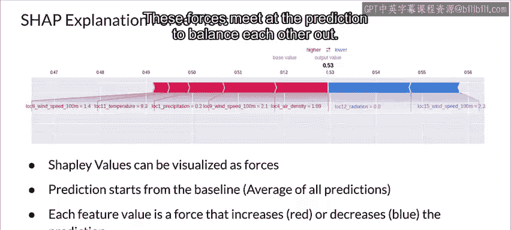
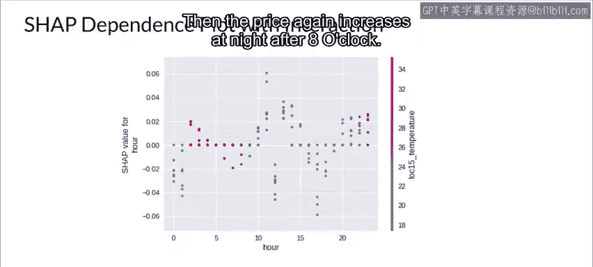

#  126：48_Shapley可加性解释 📊

在本节课中，我们将学习开源Shap库。这是一个用于处理Shapley值及其他类似指标的强大工具。我们将了解其理论基础、核心功能以及如何通过可视化结果来解释机器学习模型。

---

## 开源Shap库简介

上一节我们介绍了Shapley值的概念。本节中，我们来看看一个名为Shap的开源库，它是处理Shapley值及相关度量的强大工具。

Shap是Shapley Additive Explanations的缩写。它是一种基于博弈论的方法，用于解释任何机器学习模型的输出，因此具有模型无关性。它通过使用博弈论中的经典Shapley值及其相关扩展，将最优信用分配与局部解释联系起来。这些扩展是近期多篇论文的研究主题。需要记住，Shapley在1951年创立了其初始理论，而近期的研究者们一直在扩展他的工作。

---

## Shap库的核心功能与解释器

Shap库为特定预测中的每个特征分配一个重要性值，并包含一些非常有用的扩展功能，其中许多都基于近期的理论研究。

以下是Shap库提供的主要解释器：

*   **Tree Explainer**：一种针对树集成模型的高速精确算法。
*   **Deep Explainer**：一种针对深度学习模型中Shap值的高速近似算法。
*   **Gradient Explainer**：该解释器将积分梯度、Shap和平滑梯度的思想结合到一个单一的期望值方程中。
*   **Kernel Explainer**：该解释器使用特殊加权的局部线性回归来估计任何模型的Shap值。

此外，该库还包含多种用于可视化结果的图表，这有助于你解释模型。

---

## 可视化解释：力图

我们可以将Shapley值可视化为一种“力”。每个特征值都是一股推动预测值增加或减少的力。

预测从一个基线开始，对于Shapley值而言，这个基线是所有预测的平均值。在力图中，每个Shapley值都显示为一个箭头，将预测推向增加（正值，图中显示为红色）或减少（负值，图中显示为蓝色）。这些力在预测点处交汇，以达到相互平衡。

---

## 可视化解释：摘要图与依赖图

摘要图将特征重要性与特征效应结合起来。摘要图上的每个点都是一个特征在一个实例上的Shapley值。颜色代表特征值的高低（从低/蓝色到高/红色）。在Y轴方向上，重叠的点会进行轻微抖动，这样我们就能感受到每个特征的Shap值分布情况。特征按照其重要性进行排序。因此，在这个例子中，我们可以快速看出两个最重要的特征是“day”和“hour”。

在Shap依赖图中，特征值绘制在X轴上，Shap值绘制在Y轴上。从本例的图中，你可以看到“hour”特征与“loke 15 temperature”特征之间的相关性较低。具体来说，在这个例子中，凌晨时分（午夜刚过），能源价格会下降。在下午10点到12点之间，价格会上涨，然后在3点之后回落。接着，晚上8点之后，价格会再次上涨。

---

## 课程总结

本节课中，我们一起学习了开源Shap库。我们了解到Shap是一个基于博弈论Shapley值的模型无关解释工具。它提供了多种高效的解释器（如Tree、Deep、Gradient、Kernel Explainer）来处理不同类型的模型，并提供了力图、摘要图和依赖图等强大的可视化手段，帮助我们直观理解各个特征如何影响模型的单个预测及整体行为。