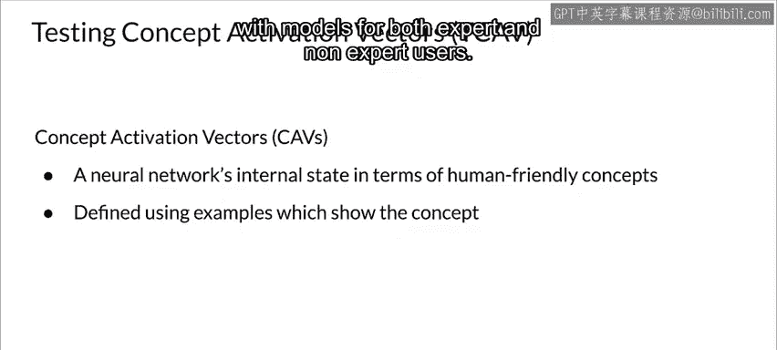

#  127：测试概念激活向量 🧠

在本节课中，我们将学习一种名为“测试概念激活向量”的高级方法，它用于解释深度学习模型的内部状态。

深度学习模型的解释因其规模、复杂性以及通常不透明的内部状态而充满挑战。此外，许多系统（如图像分类器）处理的是低级特征，而非高级概念。

为了应对这些挑战，谷歌团队引入了概念激活向量。它能够以人类友好的概念来解释神经网络的内部状态。这些高级概念是通过为待检查模型定义一组示例输入数据来确定的。

例如，对于一个图像模型，要定义“卷曲”这个概念，可以使用一组发型和纹理图像。请注意，这些示例并不局限于训练数据，它们可以由用户提供的新数据来定义。事实证明，示例是与专家和非专家用户进行模型交互的有效手段。

## 概念激活向量的应用 📊

上一节我们介绍了概念激活向量的基本思想，本节中我们来看看它的具体应用。

你可以使用概念激活向量来根据其与某个概念的关系对示例（在本例中是图像）进行排序。这对于定性地确认概念激活向量是否正确反映了感兴趣的概念非常有用。

由于概念激活向量代表了瓶颈层向量空间中某个概念的方向，我们可以计算一组感兴趣图片与概念激活向量之间的余弦相似度，从而对图片进行排序。请注意，被排序的图片并未用于训练此处展示的概念激活向量。这里展示了两个感兴趣的概念：“CEO”和“模特女性”，以及根据与概念的相似度排序后的图像。

以下是两个具体的排序示例：

*   **CEO概念**：左侧是根据从ImageNet收集的更抽象“CEO”概念学习到的概念激活向量，对条纹图像进行的排序。前三张图像与“CEO”概念最相似，看起来像是细条纹，这可能与CEO可能佩戴的领带或西装有关。这证实了CEO更可能穿细条纹而非横条纹的想法。
*   **模特女性概念**：右侧是根据“模特女性”概念激活向量对领带图像进行的排序。同样，前三张图像与“模特女性”概念最相似，展示了女性佩戴的领带。而底部三张图像都展示了男性佩戴的领带。这也表明，概念激活向量可以作为一种独立的相似度排序工具，用于对图像进行排序，以揭示学习概念激活向量所用示例图像中可能存在的任何偏见。

## 总结 📝

本节课中，我们一起学习了概念激活向量这一高级解释方法。我们了解到，CAV通过定义人类友好的高级概念（如“卷曲”、“CEO”），并利用示例数据在模型内部向量空间中定位这些概念的方向，从而实现对模型内部状态的解释。我们还看到了如何利用CAV对图像进行排序，以验证概念的有效性，并揭示数据中可能存在的模式或偏见。这种方法为理解和调试复杂的深度学习模型提供了一个有力的工具。