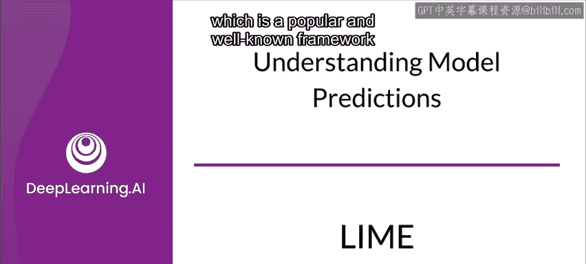
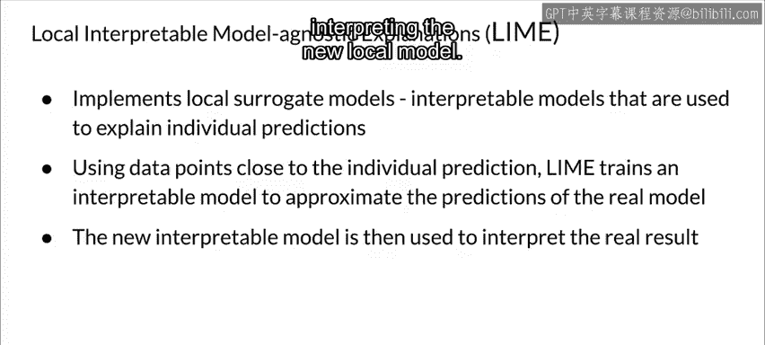

#  128：LIME 局部可解释模型 📊

在本节课中，我们将学习一个名为 **LIME** 的流行框架，它用于生成模型预测的局部解释。我们将了解其核心思想、工作原理以及如何通过一个简单的可解释模型来近似理解复杂“黑盒”模型的决策过程。

---

## 概述

LIME 是一个广为人知的框架，用于创建模型结果的局部解释。其核心思想非常直观：我们暂时忽略原始训练数据，只关注一个可以输入数据点并获得预测的“黑盒”模型。通过探查这个黑盒，并观察输入数据变化时预测如何改变，LIME 能够构建一个局部可解释的模型，帮助我们理解特定预测背后的原因。

---

## LIME 的核心思想

上一节我们概述了 LIME 的目标，本节中我们来看看其具体的工作流程。整个过程始于一个我们只能进行输入和获得预测的“黑盒”模型。

你的目标是理解模型为何做出某个特定预测。LIME 通过向模型提供原始数据的各种变体，并观察预测结果的变化来实现这一目标。

---

## LIME 的工作流程

以下是 LIME 生成解释的具体步骤：

1.  **生成扰动数据**：LIME 在待解释的数据点周围生成一系列经过扰动的样本。
2.  **获取黑盒预测**：将这些扰动后的样本输入原始的黑盒模型，获取对应的预测结果。
3.  **训练可解释模型**：利用这个由（扰动样本，模型预测）构成的新数据集，LIME 训练一个简单的、可解释的模型（例如线性模型或决策树）。这个新模型的训练样本会根据其与原始待解释数据点的距离进行加权，距离越近，权重越高。
4.  **解释预测**：最后，通过解释这个新训练的、在局部有效的简单模型，来理解原始黑盒模型在特定数据点上的预测。

这个新模型只需要在待解释的数据点附近对原始模型的预测有较好的近似精度，这种特性被称为 **局部保真度**。它不需要在整个数据空间上都表现良好。

---

## 总结

本节课中，我们一起学习了 **LIME** 框架。我们了解到，LIME 通过探查黑盒模型在扰动数据上的表现，构建一个加权的、简单的可解释模型（如线性模型），从而为复杂的模型预测提供局部解释。其核心在于追求**局部保真度**，而非全局准确性，这使其成为理解单个预测原因的强大工具。