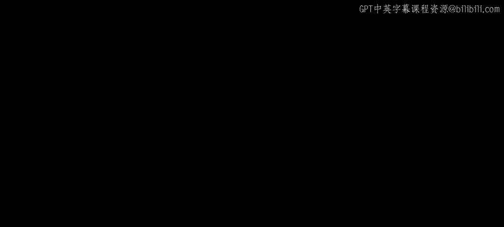
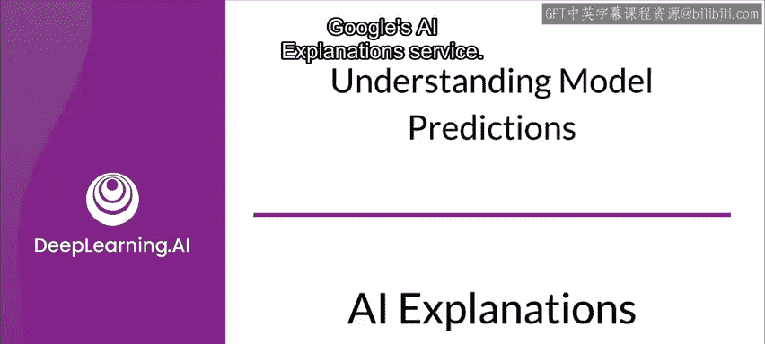
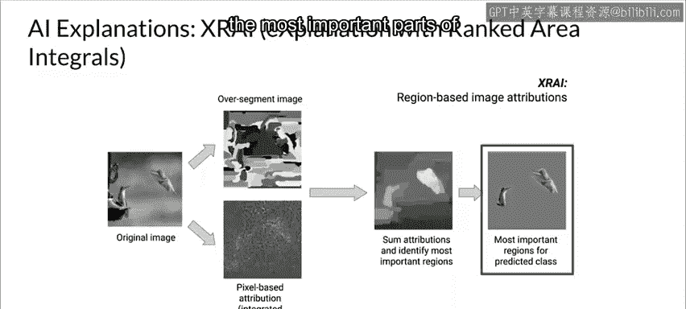

#  129：AI 模型解释工具与服务 🧠



在本节课中，我们将学习如何利用基于云的工具和服务来解释模型的结果。这些服务能帮助我们理解模型的预测依据，验证模型行为，并识别潜在的偏差。



上一节我们讨论了模型可解释性的基本概念，本节中我们来看看具体的云服务工具。

## 基于云的解释服务

除了本地工具，基于云的工具和服务对于解释模型结果也极具价值。现在，让我们看看其中一项服务：Google 的 AI 解释服务。

另一种实现可解释性的方案是利用云服务商提供的托管服务，例如 Google AI Platform 的 AI Explanations。AI Explanations 将特征归因功能集成到了 Google AI Platform 的预测服务中。

## AI Explanations 工作原理

当你通过 AI Platform 请求预测时，AI Explanations 能帮助你理解模型针对分类和回归任务的输出。它会告诉你数据中的每个特征对预测结果贡献了多少。

你可以利用这些信息来验证模型行为是否符合预期，识别模型中的任何偏差，并获得改进模型及训练数据的思路。

以下是 AI Explanations 的核心工作流程：

*   **特征归因**：指示每个特征对给定预测的贡献程度。
*   **集成服务**：AI Explanations 与 Google AI Platform Prediction 托管服务协同工作。
*   **输出差异**：通常使用 AI Platform Predictions 请求预测时，你只会得到预测结果。然而，当你请求解释时，你将同时获得预测结果和这些预测对应的特征归因信息。

## 可视化辅助理解

系统还提供了可视化工具来帮助你理解特征归因。

对于表格数据集，特征归因的示例如下所示：
```python
# 特征归因结果示例（伪代码）
特征贡献度 = {
    “年龄”: +0.32,
    “收入”: -0.15,
    “历史信用”: +0.48
}
```

对于图像数据，可视化示例如下。它们为每张图像提供覆盖层，高亮显示对最终预测贡献最大的像素区域。

## 特征归因方法

AI Explanations 目前提供三种特征归因方法，包括：
*   Sampled Shapley
*   Integrated Gradients
*   XRAI

归根结底，所有这些方法都基于 **Shapley 值**。我们已经充分讨论过 Shapley 值，此处不再赘述。让我们看看另外两种方法：Integrated Gradients 和 XRAI。

### Integrated Gradients（积分梯度）

Integrated Gradients 是一种生成特征归因的不同方法，它具有与 Shapley 值相同的公理特性。该方法基于梯度，当应用于深度网络时，其效率比原始的 Shapley 三次方法高出数个数量级。

在积分梯度方法中，预测输出相对于输入特征的梯度是沿着一条积分路径计算的。梯度根据你可指定的缩放参数在不同间隔点进行计算。对于图像数据，可以将缩放参数想象成一个滑块，它将图像的所有像素逐渐调暗至黑色。

“梯度被积分”意味着它们首先被平均在一起，然后计算平均梯度与原始输入的逐元素乘积。

### XRAI（基于区域积分排序的解释）

XRAI 方法专门针对图像分类任务。它在积分梯度方法的基础上增加了额外步骤，以确定图像的哪些区域对给定预测的贡献最大。

以下是 XRAI 的工作步骤：

1.  **像素级归因**：使用积分梯度方法对输入图像进行像素级归因计算。
2.  **图像过分割**：将图像过度分割，创建由小区域组成的拼图。
3.  **区域归因聚合**：汇总每个分割区域内的像素级归因，以确定该区域的归因密度。
4.  **区域排序**：对每个区域进行排序，按从最正向到最负向的顺序排列。这决定了图像的哪些区域最显著，或对给定预测的贡献最强。

## 工作流程示例

这里有一个蜂鸟图像的示例。从左侧开始：
1.  原始图像被分割成不同区域，同时使用积分梯度计算像素级归因。
2.  每个区域内的归因被加总。
3.  区域被排序以确定最重要的结果。



如右侧图像所示，这张图中最重要的部分是蜂鸟本身。

---

## 本周内容总结 🎯

本节课中我们一起学习了模型可解释性与可说明性，并从几个不同的角度进行了探讨。我们看了一些本质上可解释的模型，了解了局部解释与全局解释的概念，并研究了几种不同的事后解释方法，包括对可解释性非常重要的 Shapley 值，以及帮助我们应用它们的 Shap 库。

我们还了解了一些较新的方法，包括 TCAV 和格子模型。希望你觉得这是收获丰富的一课，我们下次再见。