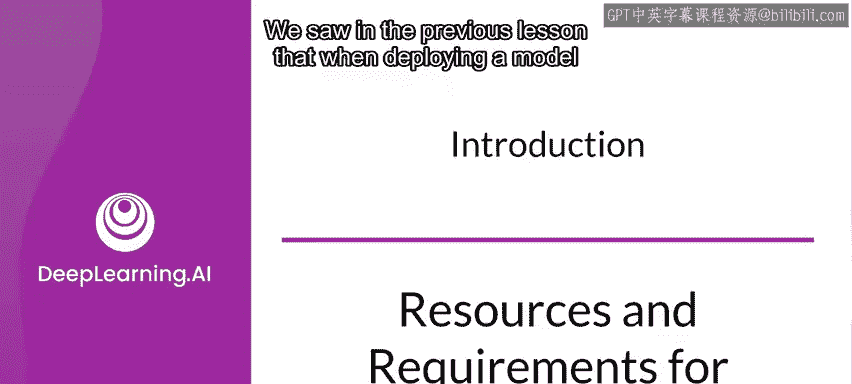
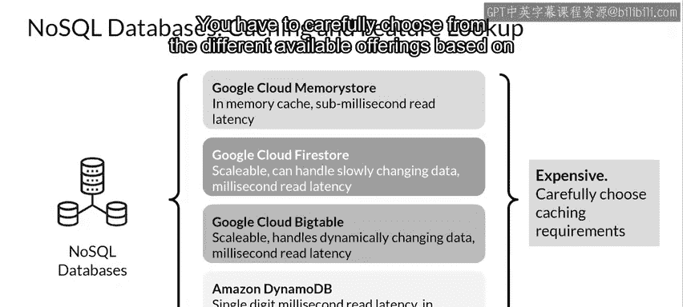

#  131：模型服务基础设施简介 🏗️

在本节课中，我们将要学习模型部署到生产环境时，如何权衡资源成本与性能约束，并了解构建高效模型服务基础设施的关键考量。

---

上一节课我们了解到，将模型部署到生产环境时，需要做出一些决策，以在最小化延迟和成本的同时最大化吞吐量。

现在，我们来看看资源成本相关的一些问题以及可能遇到的约束。

## 模型复杂性与资源成本的权衡 ⚖️

模型变得复杂通常有充分理由。为了提高准确性或建模更复杂的关系，很自然地会倾向于采用更复杂的模型架构，并纳入越来越多的特征。这通常会导致更长的预测延迟，但有望提升预测准确性。

然而，随着模型变得更复杂、特征越来越多，训练和服务基础设施的每个部分对资源的需求都会增加。

资源需求的增加意味着成本上升、硬件要求提高、更大的模型注册表管理，从而导致更高的支持和维护负担。

如同生活中的许多事情一样，关键在于找到正确的平衡点。在成本与复杂性之间找到恰当的平衡，是经验丰富的从业者会随着时间积累的技能。

因此，模型的预测效果与其预测延迟速度之间存在权衡，具体取决于你的用例，你需要决定两个指标。

以下是这两个关键指标：

*   **模型的优化指标**：这反映了模型的预测效果，包括**准确率**、**精确率**、**召回率**等。这些指标的良好值是模型质量的强有力信号。
*   **模型的约束指标**：这反映了模型必须满足的操作约束，例如**预测延迟**。

例如，你可以将延迟阈值设定为一个特定值，比如200毫秒，任何不满足此阈值的模型都不会被接受。

约束指标的另一个例子是模型的大小，如果你计划将模型部署到移动设备和嵌入式设备等低功耗硬件上，这一点当然非常重要。

你可以采取的一种方法是，先指定服务基础设施（CPU、GPU等），然后开始增加模型复杂性以提高模型的预测能力，直到在该基础设施上触及一个或多个约束指标。然后，你可以评估结果，要么接受当前模型，要么努力改进准确性、降低复杂性，或者决定提高服务基础设施的规格。

## 基础设施设计：加速器与数据存储 🚀

在设计服务和训练基础设施时，需要考虑的一个因素是使用GPU和TPU等加速器。它们各有不同的优势，但也都有成本和潜在的限制。

GPU倾向于针对并行吞吐量进行优化，常用于训练基础设施。而GPU除了在训练中有用外，对于大型复杂模型和大批量大小（尤其是在推理期间）也有优势。这些决策会对项目预算产生重大影响。

因此，在应用大量性能较低的加速器与使用少量性能更强的加速器之间也存在权衡。通常在团队或部门中工作时，这些选择需要针对广泛的模型范围做出，而不仅仅是你当前正在处理的新模型，因为资源总是共享的。

## 特征检索与缓存策略 💾

对你的机器学习模型的预测请求可能不会提供预测所需的所有特征。有些特征可能需要预先计算或聚合，然后从数据存储中实时读取。

以需要预测订单预计送达时间的食品配送应用为例。虽然这基于许多特征，如当前交通状况，但也有一些可以从数据存储中读取，例如传入订单列表、过去一小时每分钟的未完成订单数量等。

你需要强大的缓存来以低延迟检索这些数据，因为送达时间必须实时更新。你不能等待数秒从数据库检索数据。当然，这也有成本影响。

NoSQL数据库是实现缓存和特征查找的良好解决方案，有多种可用选项。

以下是几种常见的数据存储选择及其适用场景：

*   **需要亚毫秒级读取延迟，处理少量快速变化的数据，由数千个客户端检索**：一个不错的选择是**Google Cloud Memorystore**。它是Redis和Memcached的完全托管版本。当然，也有非常好的开源选项。
*   **需要毫秒级读取延迟，处理缓慢变化的数据，且存储可自动扩展**：一个不错的选择是**Google Cloud Firestore**。
*   **需要毫秒级读取延迟，处理动态变化的数据，使用可随大量读写线性扩展的存储**：一个不错的选择当然是**Google Cloud Bigtable**。
*   **Amazon的DynamoDB**也是一个不错的选择，它是一个具有内存缓存的可扩展低读取延迟数据库。

添加缓存可以加速特征查找，同时减少预测检索延迟。你必须根据需求从不同的可用产品中仔细选择，然后与预算限制进行平衡。

---

本节课中，我们一起学习了模型服务基础设施的核心考量。我们探讨了模型复杂性与资源成本（如延迟、硬件）之间的权衡，介绍了优化指标与约束指标的概念。我们还了解了在设计基础设施时，如何根据数据访问模式（延迟、变化频率、规模）选择合适的加速器（如GPU）和数据存储/缓存解决方案（如Memorystore、Firestore、Bigtable）。关键在于根据具体需求和预算，在这些因素之间找到最佳平衡点。