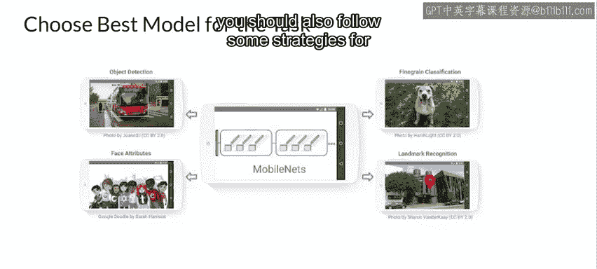

#  132：3_部署选项 🚀

在本节课中，我们将探讨机器学习模型部署的核心问题：**在哪里部署模型**。我们将分析两种主要的部署方式，并讨论在不同环境（如数据中心与移动设备）中部署时需要考虑的关键约束与权衡。

---

## 模型部署的两个主要选择

回到“我应该在哪里部署模型”这个问题，主要有两种选择。

**第一种选择**是拥有一个位于数据中心的**集中式模型**，通过远程调用来访问它。

**第二种选择**是将模型的实例**分发给用户**，以便他们在本地使用，例如在移动设备或嵌入式系统中。

---

## 数据中心部署的考量

在我们的数据中心中，无论规模大小，成本和效率都至关重要。即使是在拥有庞大资源的大型数据中心也是如此。

例如，像谷歌这样的大公司不断寻找方法来提高资源利用率并降低应用程序和数据中心的成本，它们使用的许多技术和策略与本课程讨论的内容相同。

---

## 移动设备部署的约束

接下来，让我们看看在移动设备上运行模型的情况，并了解这些设备可能带来的硬件限制。

在移动电话中，即使设备有GPU，其平均GPU内存大小也远小于数据中心中的GPU，通常小于约**4 GB**。

你通常只有一个GPU，并且它由多个应用程序共享，而不仅仅是你的应用。

在大多数情况下，你可以使用GPU进行加速处理，但这需要付出代价：可用的GPU资源有限，使用它可能导致电池电量快速耗尽。

如果你的机器学习模型操作复杂，导致电池快速耗尽或手机过热，你的应用将不会受到欢迎，并可能获得差评。

此外，还有存储限制，因为用户不喜欢占用手机存储空间的大型应用。

如果模型太大，你很少能将一个非常庞大、复杂的模型部署到像手机这样的设备上。由于内存限制，用户甚至可能选择不安装它。

因此，由于存在内存、处理能力、电池使用等方面的这些约束，有许多类别的模型我们根本无法部署到移动电话或嵌入式系统中。

---

## 服务器部署与API暴露

因此，我们可能会选择将模型部署到服务器，然后通过**REST API**将其暴露出来，以便在我们的应用程序中用于推理。

但这当然也可能不合适。在预测延迟至关重要或网络连接可能不总是可用的环境中，将模型部署到服务器可能不可行。

一个例子是部署到自动驾驶汽车中的物体检测模型。在这些应用中，系统能够基于近乎实时的预测采取行动，而无需等待服务器往返，这一点至关重要。

---

## 延迟、准确性与模型权衡

作为一般规则，你应该始终尽可能选择**最小化推理延迟**。这通过减少应用程序的响应时间来增强用户体验。

但也有例外。在模型准确性至关重要的场景中，延迟可能不那么重要，例如**疾病诊断**。

因此，你需要在模型复杂性、大小、准确性和预测延迟之间进行权衡，并为你正在开发的应用理解各自的成本和约束。这不是一项容易的任务。

所有这些因素都会影响你为任务选择最佳模型，这取决于你的限制和约束。

---

## 移动设备专用模型示例

一个例子是**MobileNets**，这些是专门为移动设备上的计算机视觉设计的模型。

它们可能没有最多的预测类别，也可能不是最先进的识别模型，但为获得最佳移动模型而进行的所有权衡工作已经为你完成，你可以在此基础上进行构建。

因此，如果你要部署到移动设备，还应遵循一些策略来优化你的模型，以适应受限的移动环境。

---

## 本节总结

在本节课中，我们一起学习了机器学习模型部署的两种主要路径：**集中式服务器部署**与**分布式边缘部署**。我们深入探讨了数据中心部署对效率与成本的关注，以及移动设备部署面临的**内存、算力、电池和存储**等多重硬性约束。同时，我们理解了在**延迟、准确性、模型复杂度与大小**之间进行权衡的必要性，并了解了像MobileNets这样的专用模型如何帮助我们在受限环境中找到平衡点。选择正确的部署策略，需要紧密结合应用场景的具体需求与约束条件。