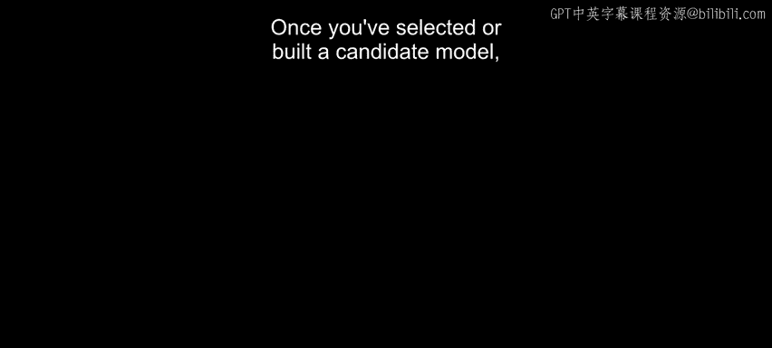
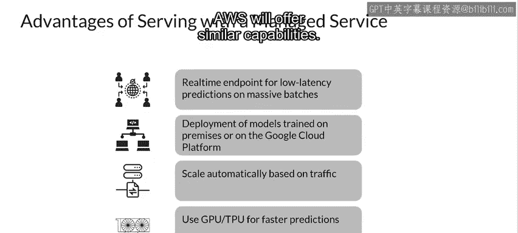

#  133：改善预测延迟与降低资源成本 🚀



在本节课中，我们将学习如何对候选模型进行性能剖析与基准测试，并探讨多种模型部署方案，包括移动端、服务器端以及云服务，旨在优化预测延迟并有效控制资源成本。

## 模型性能剖析与优化 🔍

上一节我们讨论了模型选择，一旦你为任务选定了候选模型，对其进行性能剖析和基准测试是良好的实践。

TensorFlow Lite 基准测试工具内置了性能剖析器，可以展示每个算子的性能统计信息。这有助于理解性能瓶颈，并识别出哪些算子占用了主要的计算时间。

如果某个特定算子频繁出现在模型中，并且通过剖析发现它消耗了大量时间和资源，你可以着手优化它或考虑使用不同的算子。

我们之前讨论了很多关于模型优化的内容，其目标是创建更小、通常更快且更节能的模型。这对于在移动设备上的部署尤为重要。

TensorFlow Lite 支持多种优化技术，例如**量化**。量化是一种通过降低模型权重和激活值的数值精度（例如，从32位浮点数到8位整数）来减小模型大小并提升推理速度的技术。

```python
# 示例：TensorFlow Lite 量化转换（概念性代码）
converter = tf.lite.TFLiteConverter.from_saved_model(saved_model_dir)
converter.optimizations = [tf.lite.Optimize.DEFAULT] # 启用默认优化（通常包括量化）
tflite_quant_model = converter.convert()
```

你也可以通过增加解释器线程数来加速算子的执行。然而，增加线程数也会使模型使用更多资源和功耗。

对于某些应用，**延迟**可能比能效更重要。但多线程执行也会导致性能波动性增加，这取决于同时运行的其他任务，在移动应用中尤其如此。

例如，一些隔离测试可能显示多线程版本比单线程版本快2倍，但如果另一个应用同时运行，其性能实际上可能比单线程版本更差。因此，你需要进行实际测试验证。

## 服务器端模型部署设计 🖥️

如果你选择另一条路径，将模型部署到服务器，在设计时也需要考虑一些因素。

你的模型用户需要一种发出请求的方式，这通常通过Web应用程序实现。在这种方法中，模型被包装成一个API服务。大多数服务基础设施和编程语言都有Web框架可以帮助你实现这一点。

以下是几种常见的Web框架选项：
*   **Flask**：一个非常流行的Python Web框架，可以非常轻松地推出API。
*   **Django**：同样是一个功能强大的Python Web框架。
*   **Java**：也有许多选择，如Apache Tomcat、Spring等。

如果你熟悉Flask，也许可以在10分钟内创建一个新的Web客户端端点。

## 使用模型服务器进行部署 ⚙️

模型服务器可以管理模型部署，例如创建服务器并管理它以服务来自客户端的预测请求。它们消除了将模型放入定制Web应用的需要，通常只需几行代码即可部署模型。

模型服务器还使得更新或回滚模型、按需或在需要资源时加载和卸载模型、以及管理模型的多个版本变得容易。

以下是两个流行的开源模型服务器：

**1. Clipper**
*   由UC Berkeley RISELab开发。
*   帮助你部署在Caffe、TensorFlow、Scikit-learn等框架中构建的各种模型，其总体目标是**模型无关**。
*   包含标准的REST接口，便于与生产应用程序集成。
*   支持将模型包装在Docker容器中，以便进行集群和资源管理。
*   帮助你为可靠的延迟设置服务级别目标。

**2. TensorFlow Serving**
*   一个开源模型服务器，为生产环境设计的机器学习模型提供灵活的高性能服务系统。
*   使得在保持相同服务器架构和API的同时，轻松部署新算法和实验。
*   提供与TensorFlow模型的**开箱即用集成**，但也可以扩展以服务其他类型的模型和数据。
*   同时提供REST和gRPC协议，**gRPC通常比REST更高效**。
*   已证明每个核心每秒可处理高达100,000个请求，是服务机器学习应用的强大工具。
*   具有版本管理器，可以轻松加载和回滚同一模型的不同版本，并允许客户端为每个请求选择要使用的版本。

## 使用托管云服务 ☁️

使用托管服务来部署模型也有其优势。让我们以**Google Cloud AI Platform Prediction Service**为例来看一下。

*   它允许你设置提供低延迟预测的**实时端点**，也可以用于对批量数据进行预测。
*   允许你部署在Google Cloud上或本地训练的模型。
*   可以根据流量**自动扩展**，这可以在提供高度可扩展性的同时节省大量成本。
*   当然，也提供加速器，包括GPU和TPU。

其他云平台，如Microsoft Azure和Amazon AWS，也提供类似的功能。

## 总结与预告 📚



本节课中，我们一起学习了如何剖析模型性能以识别瓶颈，并探索了从移动端优化到服务器端部署的多种方案。我们介绍了通过量化等技术优化模型，使用Flask等框架或Clipper、TensorFlow Serving等专用服务器进行部署，以及利用Google Cloud AI Platform等托管服务来平衡延迟、成本与可扩展性。

接下来，你将进行实际操作，探索如何部署到AI预测平台。之后，我们将学习如何安装TensorFlow Serving并使用它进行计算机视觉预测。