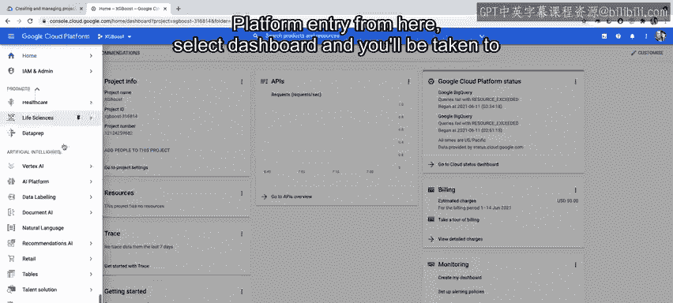
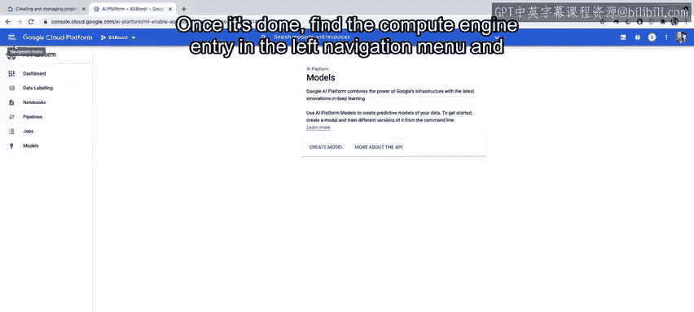
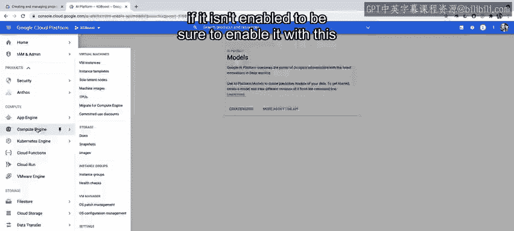
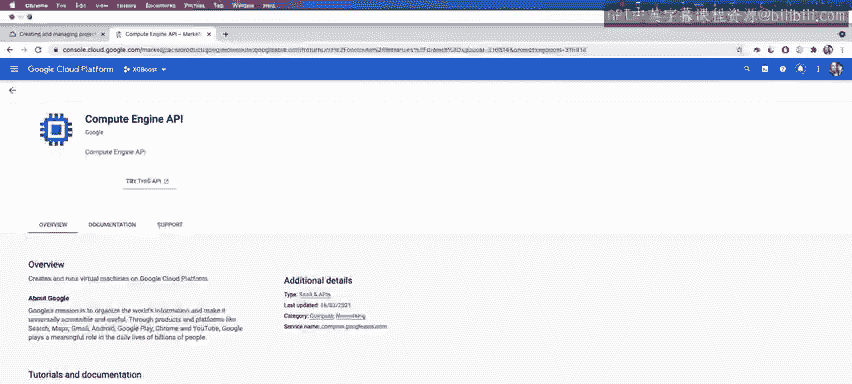
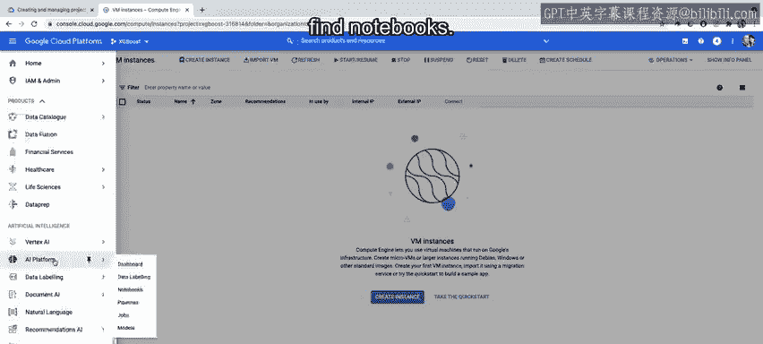
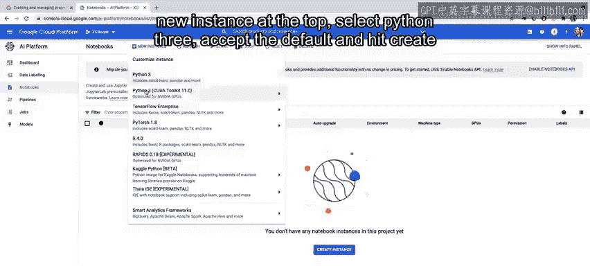
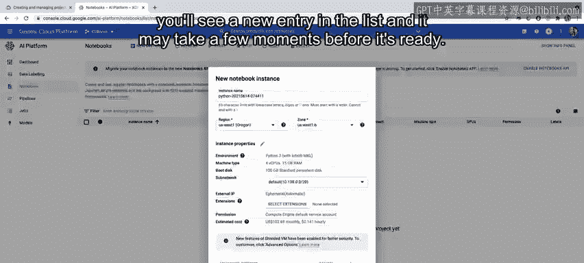
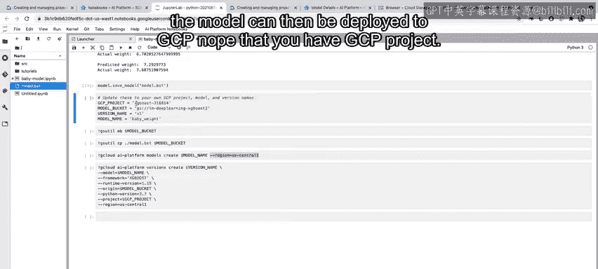
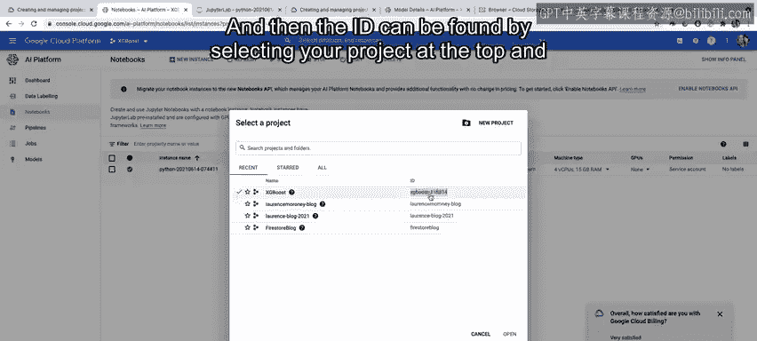
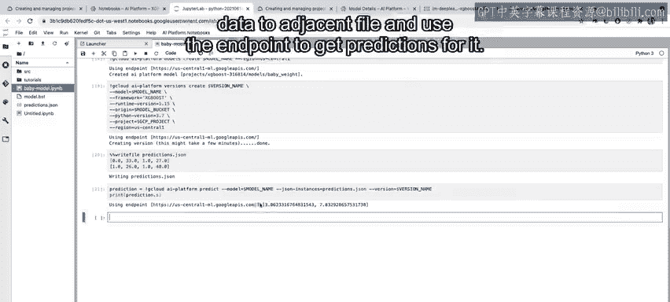

#  134：将模型部署到AI预测平台 🚀


在本节课中，我们将学习如何在Google Cloud AI Platform上构建并部署一个XGBoost模型。整个过程包括访问控制台、启用必要服务、在Notebook中训练模型，最终将模型部署为可提供预测的在线服务。

---

## 访问AI平台控制台

首先，您需要登录Google Cloud Platform控制台。向下滚动页面，直到找到“AI平台”的入口。

点击进入后，选择“仪表板”，您将被导航至AI Platform的主仪表板界面。




## 启用必要API与服务

在左侧列表中选择“模型”。您可能会看到需要启用相关API才能创建模型的提示，请点击启用并等待进度完成。

启用完成后，在左侧导航菜单中找到“Compute Engine”条目。




如果Compute Engine尚未启用，请务必点击相应按钮启用它。此过程可能需要一些时间。






## 创建Notebook实例


服务启用后，返回导航菜单中的“AI平台”条目，找到“Notebooks”。




页面打开后，您会看到一个Notebook列表（初始可能为空）。点击顶部的“新实例”按钮。

选择“Python 3”环境。




接受默认设置并点击“创建”。列表中会出现一个新条目，需要等待片刻使其准备就绪。




当实例状态变为就绪后，您会看到一个“打开JupyterLab”的链接。点击它，Jupyter环境将打开并提供多个选项。

## 安装依赖与准备环境

在JupyterLab中，选择“终端”选项。

在终端中，使用以下命令安装XGBoost库：
```bash
pip3 install xgboost
```
安装完成后，您可以新建一个Python 3笔记本。接下来的代码实验会提供所有必要代码，因此如果您现在看不到代码也无需担心。

## 构建与训练XGBoost模型

在笔记本中，您可以逐单元格运行代码。

前几个单元格用于查看和分析数据。随着代码运行，您将看到如何为此数据创建一个XGBoost回归器，该模型将预测婴儿体重并与实际体重进行比较。

核心训练步骤的伪代码如下：
```python
import xgboost as xgb
# 创建回归器
model = xgb.XGBRegressor()
# 训练模型
model.fit(X_train, y_train)
```

## 保存模型

模型训练完成后，您可以将其保存为TensorFlow SavedModel格式，以便后续部署。
```python
# 示例：使用TF兼容的方式保存模型
model.save_model('saved_model.pb')
```



## 部署模型到GCP


现在可以将模型部署到Google Cloud Platform。请注意，您需要一个GCP项目。项目ID可以通过点击控制台顶部的项目选择器，从您拥有的项目列表中找到。



模型存储桶是一个云存储桶，您可以用变量`model_bucket`为其命名。创建存储桶后，您可以将保存的模型复制到其中。


您可以在云存储中浏览以找到该存储桶，并在其中看到保存的模型文件。

## 创建AI平台模型与版本

运行以下命令将在AI Platform上创建模型：
```bash
gcloud ai-platform models create [MODEL_NAME]
```

接着，部署一个模型版本：
```bash
gcloud ai-platform versions create [VERSION_NAME] --model=[MODEL_NAME] --origin=gs://[BUCKET_NAME]/saved_model
```

完成后，刷新您的模型列表，您应该能看到名为“baby_model”的模型。该模型下会有一个名为“v1”的版本。

## 测试模型预测

现在，我们可以将一些模拟数据写入文件，并使用已部署的端点来获取预测结果。



预测调用的示例代码如下：
```python
from googleapiclient import discovery
# 创建预测服务
service = discovery.build('ml', 'v1')
# 构建请求并获取预测
response = service.projects().predict(name=name, body={'instances': instances}).execute()
```

---

## 总结


本节课中，我们一起学习了将XGBoost模型部署到Google Cloud AI Platform的完整流程。我们从访问控制台和启用服务开始，接着在Notebook环境中安装依赖、训练并保存模型，最后将模型部署为云端的在线预测服务并进行了测试。

现在轮到您了，请尝试完成代码实验，看是否能复现上述所有步骤。