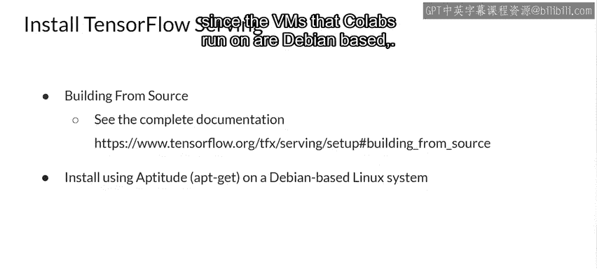
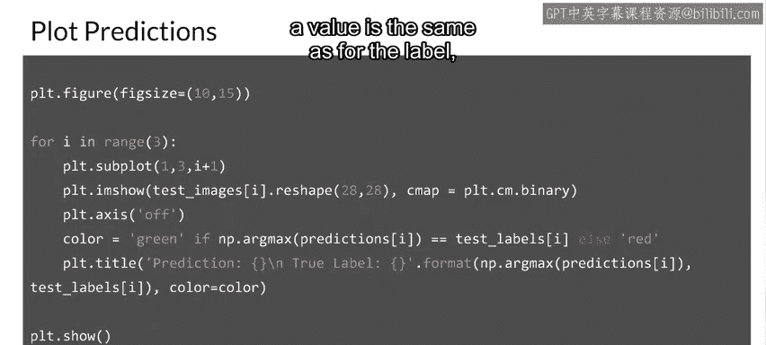

#  135：安装与使用 TensorFlow Serving 🚀


在本节课中，我们将学习如何在自己的基础设施上部署机器学习模型。我们将重点介绍开源解决方案 TensorFlow Serving，并完成从训练一个简单模型到部署并远程调用它的完整流程。我们将使用基于 Linux 的 Google Colab 环境，这些步骤同样适用于你自己的服务器。

---

## 概述：TensorFlow Serving 的安装方式

上一节我们介绍了云端部署，本节中我们来看看如何在自己的基础设施上进行部署。TensorFlow Serving 提供了多种安装方式，具体取决于你的需求和环境。

以下是几种主要的安装方法：

*   **Docker 镜像**：这是最简单直接的方式。除非你有容器化无法满足的特定需求，否则强烈推荐此方法。这也是让 TensorFlow Serving 支持 GPU 的最简单途径。
*   **预编译二进制文件**：你可以使用两种可用的二进制文件之一。
    *   **TensorFlow Model Server**：这是一个完全优化的服务器，使用了平台特定的编译器优化（如 SSE4 和 AVX 指令集）。对大多数用户来说，这是首选选项，但它可能无法在一些较旧的机器上运行。
    *   **TensorFlow Model Server Universal**：此版本使用基本优化编译，不包含平台特定的指令集，因此应该能在几乎所有机器上运行。如果 TensorFlow Model Server 无法工作，你可以使用此版本。
*   **从源码构建**：如果你想根据需求完全自定义 TensorFlow Serving，可以参考官方文档从源码进行构建。

在基于 Debian 的 Linux 系统上，你可以使用 `apt-get` 命令通过 aptitude 进行安装。由于本示例使用的 Colab 环境运行在基于 Debian 的虚拟机上，我们将采用这种方法。

---

## 准备安装环境

现在，让我们开始准备使用 aptitude 安装 TensorFlow Serving。首先，需要将 TensorFlow Model Server 软件包添加到 aptitude 的软件包源列表中。

请注意，在 Colab 环境中，你将需要以 root 权限运行命令。安装 TensorFlow Serving 只需一行命令：

```bash
apt-get install tensorflow-model-server
```

---



## 训练一个简单的模型

接下来，我们将使用 MNIST 数据集训练一个简单的计算机视觉模型，然后使用 TensorFlow Serving 来部署它进行推理。

MNIST 数据集包含 70,000 张 0 到 9 的手写数字灰度图像。这些图像以低分辨率（28x28 像素）显示单个数字。

尽管这些是图像，但我们将把它们作为 NumPy 数组加载，而不是二进制图像对象，因此我们不处理 JPEG、位图或 PNG 等格式。

对于模型训练，将像素强度重新缩放到 0 到 1 的范围非常重要，这个过程称为**归一化**。

接着，我们将训练集重塑为一个形状为 `(60000, 28, 28, 1)` 的数组。同样，将测试集重塑为形状 `(10000, 28, 28, 1)`。这里的 `1` 代表像素的颜色深度，因为是灰度图像，我们不需要红、绿、蓝三个通道。

在继续之前，检查数据总是很重要的。这里我们将可视化数据集中的一个样本，你可以自由更改 `idx` 的值来查看其他样本。

现在，让我们构建一个 `tf.keras.Sequential` 模型，用于对 MNIST 数据集的图像进行分类。我们将使用一个非常简单的卷积神经网络（CNN）。

确保你的模型具有正确的输入形状和正确数量的输出单元。我们将在输出层使用 **softmax** 作为激活函数。

然后，使用 Adam 优化器、稀疏分类交叉熵作为损失函数、准确率作为评估指标来配置模型以进行训练。接着，通过将训练图像拟合到训练标签来训练模型指定的周期数。

训练完成后，我们可以查看模型在测试集上的损失和准确率，对于一个如此简单的模型来说，结果还不错。

为了让 TensorFlow Serving 能够访问模型，你需要保存它。为此，你将使用 SavedModel 格式。以下代码将模型保存到 `MODEL_DIR` 变量指定的目录中。

为了让另一个进程（如 TensorFlow Serving）知道模型保存在哪里，你可以使用环境变量。这里，你可以为刚刚写入的模型路径创建一个环境变量。

---

## 部署模型并进行推理

安装好 TensorFlow Serving 后，你可以通过一个 bash 脚本启动它。然后使用以下参数来配置模型服务器：

*   **REST API 端口**：处理请求的端口，本例中为 `8501`。
*   **模型名称**：在 URL 中使用的模型名称，这里我们使用 `digits_model`。
*   **模型基础路径**：应使用环境变量 `MODEL_DIR` 作为已保存模型的基础路径。

要使用我们保存的模型发送预测请求，可以使用 JSON 格式。这里我们看到，我们使用测试集的前几个图像创建了一个 JSON 对象。

然后，我们将一个预测请求作为 POST 请求发送到服务器的 REST 端点，并传递这个包含请求数据的 JSON 对象。

默认情况下，服务器将使用模型的最新版本，但如果你需要（例如为了测试或进行 A/B 测试），也可以在此处指定特定版本。请注意 URL 中的 `digits_model`，这就是我们在上一步中使用的名称。

如果你想绘制结果，可以使用这样的代码。请注意，如果某个值的预测结果与标签相同，我们将其绘制为绿色，否则绘制为红色。

结果如下，效果不错。

---

## 总结




本节课中，我们一起学习了如何在自己的基础设施上部署机器学习模型。我们介绍了 TensorFlow Serving 的几种安装方式，并重点演示了在 Debian 环境下通过 `apt-get` 安装。随后，我们训练了一个简单的 MNIST 分类模型，将其保存为 SavedModel 格式，最后配置并启动了 TensorFlow Serving 服务器，成功通过 REST API 发送请求并获得了预测结果。这为你管理自己的模型服务提供了一个坚实的起点。