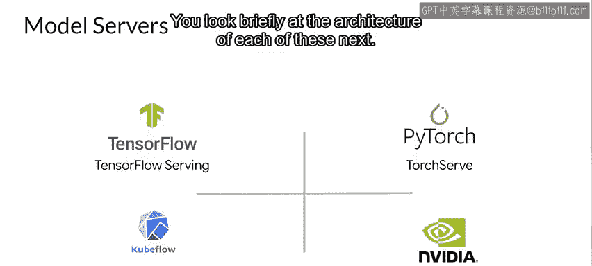

#  136：模型服务架构 🏗️

在本节课中，我们将学习模型服务的基础设施模式与扩展性。我们将从宏观层面探讨运行机器学习模型的基础设施选择，并深入了解几种流行的模型服务器架构。

---

## 基础设施部署地点概览

首先，我们从宏观层面审视构建和使用机器学习模型的两个主要基础设施部署地点。

这通常归结为两个主要选择：你可以在自己的场所拥有所有必需的硬件和软件，或者将它们外包给云服务提供商，由他们为你提供所有硬件管理以及软件服务（如管道管理）。

当你在自己的场所运行时，你对硬件基础设施拥有完全的控制权。显然，这非常灵活，你可以敏捷地快速适应需求变化，但这需要付出成本。你必须采购、安装、配置和维护你的硬件基础设施，这可能既复杂又昂贵。大公司倾向于采用这种方法，因为他们可以利用规模经济，例如拥有丰富的内部经验。

另一个选择，通常被小公司采用，是将他们的基础设施需求外包给在构建、管理、扩展和监控硬件、软件及应用程序方面的专家。这方面的优秀例子包括亚马逊、谷歌云平台和微软Azure等提供的服务。

---

## 模型服务的工作方式

在选择基础设施之后，你还必须根据你的选择考虑模型服务将如何工作。

当使用本地硬件时，你可以灵活选择你喜欢的模型服务器，并负责安装、配置和维护它。因此，像TensorFlow Serving、Kubeflow Serving和Viserver等选项将可供你使用，我们稍后会探讨其中一些的具体情况。

如果你在云端进行模型服务，那么你可以在他们的基础设施上创建虚拟机，这为你提供了与本地相同的灵活性，因此你可以安装和配置相同类型的预构建服务器，例如TensorFlow Serving和Kubeflow等。或者，你可以使用该云供应商提供的一套工具和服务。例如，如果你选择了谷歌云平台，你可以使用AutoML或任何谷歌云AI服务；如果你选择了亚马逊网络服务，那么SageMaker Autopilot将可供你使用。

---

## 模型服务器简介

现在你已经探索了关于如何进行模型服务的高层选项，无论是在本地还是使用云提供商，接下来让我们深入了解模型服务器，并探讨一些可供你选择的流行选项。

这些包括TensorFlow Serving、TorchServe、Kubeflow Serving和NVIDIA Triton推理服务器。但在了解它们之前，让我们快速回顾一下模型服务器实际上做什么。

模型服务器的高层架构可以用这样的图表来概括。你的模型通常保存到文件系统中。你也可以拥有同一模型的多个版本，以便尝试不同的模型，但最终它可供模型服务器读取。模型服务器的职责是实例化模型，并公开你希望向客户端提供的模型方法。

例如，如果模型是一个图像分类器，模型本身将接收特定大小和形状的张量。对于MobileNet，这将是224x224x3。模型服务器接收这些数据，将其格式化为所需的形状，传递给模型文件，并获取推理结果。它还可以管理多个模型版本，如果你希望进行A/B测试或为不同用户提供不同版本的模型。然后，模型服务器将该API暴露给客户端，正如我们之前提到的，例如，它有一个REST或gRPC接口，允许将图像传递给模型。模型服务器将处理该请求，并从模型获取推理结果（在本例中是图像分类），并将其返回给调用者。

以下是一些最流行的模型服务器：

*   TensorFlow Serving
*   TorchServe
*   Kubeflow Serving
*   NVIDIA Triton推理服务器

接下来，我们将简要了解每种服务器的架构。

---

## 总结

本节课中，我们一起学习了模型服务架构的基础知识。我们首先比较了本地部署与云部署两种基础设施选择及其优缺点。接着，我们探讨了在不同部署环境下模型服务的工作方式。最后，我们介绍了模型服务器的核心功能，并列举了几种主流的模型服务器选项，为后续深入学习具体技术细节奠定了基础。