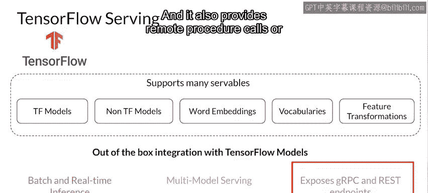
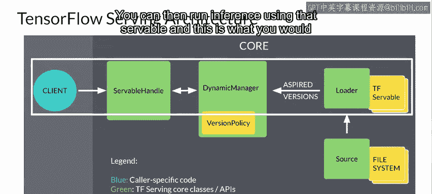
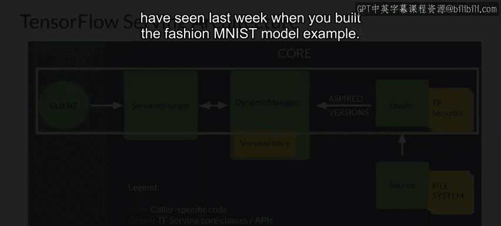

#  137：模型服务器 - TensorFlow Serving 🚀

在本节课中，我们将深入学习模型服务，并重点探讨 TensorFlow Serving 的架构与核心工作原理。我们将了解其如何高效地加载、管理和服务机器学习模型。

---

## 概述

上一节我们从宏观层面介绍了模型服务。本节中，我们将更深入地剖析一些具体的架构，首先从 TensorFlow Serving 开始。

TensorFlow Serving 是一个灵活、高性能的机器学习模型服务系统。它提供了与 TensorFlow 模型的开箱即用集成，同时也能扩展以服务其他类型的模型。

---

## TensorFlow Serving 的核心特性

以下是 TensorFlow Serving 的一些重要特性：

*   **批量与实时推理**：它支持同时获取大量推理结果（适用于推荐引擎等场景），也支持快速返回单个任务的答案（适用于图像分类等场景）。
*   **多模型服务**：允许为同一任务部署多个模型，服务器可在它们之间进行选择。这对于 A/B 测试、受众细分等场景非常有用。
*   **远程调用接口**：提供了远程过程调用（RPC）或传统的 REST 端点，供客户端调用服务器。

---

## TensorFlow Serving 的架构解析

TensorFlow Serving 的架构围绕一个核心概念构建：**Servable**。这是 TF Serving 中的核心抽象。

*   **Servable（可服务对象）**：这是客户端用于执行计算（例如推理或查找）的基础对象。它们可以是任何类型或接口，因此非常灵活。一个典型的 Servable 是一个 TensorFlow SavedModel，但也可能是一个嵌入查找表。
*   **Loader（加载器）**：管理 Servable 的生命周期。Loader API 实现了与特定学习算法、数据或产品用例无关的通用基础设施。具体来说，加载器标准化了加载和卸载 Servable 的 API。
*   **Aspired Versions（期望版本）**：代表一组应该被加载并准备就绪的 Servable 版本。
*   **Source（源）**：一次为单个 Servable 流通信这组期望版本。当源向管理器提供新的期望版本列表时，它会取代该 Servable 流之前的列表。
*   **Manager（管理器）**：处理 Servable 的完整生命周期，包括加载、服务和卸载 Servable。管理器监听源，并根据版本策略跟踪所有版本。它会卸载列表中不再出现的任何先前已加载的版本。
*   **Servable Handle（可服务对象句柄）**：为客户端提供外部接口。

架构中有许多组件，让我们通过一个例子来看看它们是如何协同工作的。

---

## 工作流程示例

假设一个源代表一个具有频繁更新权重的 TensorFlow 图，权重存储在磁盘上的文件中。

1.  源检测到模型权重的新版本。
2.  它创建一个包含指向磁盘上模型数据指针的加载器。
3.  源将“期望版本”通知动态管理器。
4.  动态管理器应用版本策略，并决定加载新版本。
5.  动态管理器告知加载器有足够的内存。
6.  加载器使用新权重将 TensorFlow 图实例化为一个 Servable。
7.  客户端请求最新版本模型的句柄。
8.  动态管理器返回新版本 Servable 的句柄。
9.  随后，您可以使用该 Servable 运行推理。这就是您上周构建 Fashion MNIST 模型示例时所看到的过程。

---

## 总结

本节课中，我们一起学习了 TensorFlow Serving 的核心架构与工作流程。我们了解了 **Servable**、**Loader**、**Manager** 等关键组件如何协作，以支持模型的灵活部署、版本管理和高效推理。掌握这些概念是构建可靠生产级模型服务系统的重要基础。