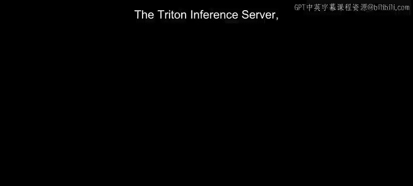
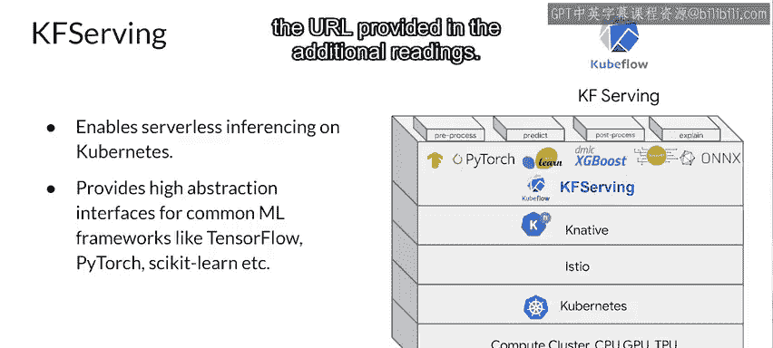

#  138：模型服务器 - 其他供应商 🚀

在本节课中，我们将学习除TensorFlow Serving之外的其他几种流行的模型服务器解决方案。我们将重点介绍NVIDIA的Triton推理服务器、PyTorch的TorchServe以及Kubeflow Serving，了解它们的特点、架构和适用场景。

---

## Triton推理服务器 🧠

上一节我们介绍了TensorFlow Serving，本节中我们来看看由NVIDIA提供的Triton推理服务器。它是一个开源推理服务软件，旨在简化生产环境中AI模型的大规模部署。

Triton推理服务器允许团队部署来自任何框架的训练好的AI模型，例如：
*   TensorFlow
*   TensorRT
*   PyTorch
*   ONNX Runtime
*   甚至是自定义框架

模型可以从本地存储或云平台（如Google Cloud Platform或AWS）部署，并可以运行在任何基于GPU或CPU的基础设施上，包括云端、数据中心或边缘设备。

Triton的核心优势在于其高效的资源利用。它使用CUDA流在单个GPU上并发运行来自相同或不同框架的多个模型。在多GPU服务器中，它会自动在每个GPU上创建每个模型的实例。所有这些都提高了GPU利用率，而无需用户编写额外的代码。

该推理服务器支持低延迟的实时推理和批处理推理，以最大化GPU和CPU的利用率。它还内置了对流式输入的支持，方便进行流式推理。

为了获得更高性能，用户可以使用共享内存支持。传递给Triton推理服务器的输入和输出可以存储在系统或CUDA共享内存中，这可以减少HTTP或gRPC的开销，从而提高整体性能。

Triton还支持模型集成。它与Kubernetes集成，用于编排、指标收集和自动扩缩容。同时，它也集成了KFServing和Kubeflow Pipelines，以构建端到端的AI工作流。

在监控方面，Triton推理服务器导出Prometheus指标，用于监控GPU利用率、延迟、内存使用率和推理吞吐量。它支持标准的HTTP/gRPC接口，便于与负载均衡器等应用程序连接，并且可以轻松扩展到任意数量的服务器，以处理任何模型不断增长的推理负载。

通过模型控制API，Triton推理服务器可以服务数十或数百个模型。可以根据模型控制配置中的更改，显式地将模型加载到推理服务器中或从中卸载，以适应GPU或CPU内存。它也可以用于在CPU上服务模型。它支持包含GPU和CPU的异构集群，有助于标准化跨这些平台的推理，因此在峰值负载期间，它可以动态扩展到任何CPU或GPU。

---

## TorchServe ⚡

除了TensorFlow Serving和Triton推理服务器，另一个流行的服务环境是围绕PyTorch设计的TorchServe。

TorchServe是AWS和Facebook共同发起的一个项目，旨在为PyTorch模型构建一个模型服务框架。在TorchServe发布之前，如果你想服务PyTorch模型，必须开发自己的模型服务解决方案，例如通过自定义处理程序、开发模型服务器、构建自己的Docker容器，并找到一种方法使模型可通过网络访问，并将其与集群编排系统集成。

使用TorchServe，你可以以即时执行模式或图形模式部署PyTorch模型。以下是其主要功能：
*   可以同时服务多个模型。
*   可以拥有版本化的生产模型，用于A/B测试。
*   可以动态加载和卸载模型。
*   可以监控详细的日志和可自定义的指标。
*   最重要的是，TorchServe是开源的，因此可以扩展以满足你的部署需求。

其服务器架构如下：前端负责处理请求和响应，管理来自客户端的请求、响应以及模型生命周期。后端使用模型工作器，这些工作器是从模型存储中加载的模型的运行实例，负责执行实际的推理。可以看到，在TorchServe上可以同时运行多个工作器，它们可以是同一模型的不同实例，也可以是不同模型的实例。实例化更多模型实例可以同时处理更多请求，从而提高吞吐量。

模型可以从云存储或本地主机加载。TorchServe支持服务PyTorch的即时执行模式模型和TorchScript保存的模型。服务器支持用于管理和推理的API，以及用于常见功能（如服务器日志、快照和报告）的插件。

---

## Kubeflow Serving 📦

除了TF Serving、Triton推理服务器和TorchServe，你可能还想了解一下Kubeflow Serving。这里内容较多，无法详细展开，但我们简要看一下。

Kubeflow也通过Kubeflow Serving提供了服务能力。这允许你使用带有Kubernetes的计算集群，通过抽象实现无服务器推理。它适用于TensorFlow、PyTorch等框架。我们在此不深入细节，但你可以在附加阅读材料提供的URL中了解更多信息。

---

## 总结与展望 🎯

本节课中我们一起学习了三种重要的模型服务器：NVIDIA的Triton推理服务器、PyTorch的TorchServe以及Kubeflow Serving。我们了解了它们如何支持多框架模型部署、提高资源利用率、提供监控和扩展能力。

现在你已经了解了机器学习模型服务是如何实现的，让我们退一步，探索如何扩展此类应用程序。接下来，你将理解水平扩展和垂直扩展的基本原理。从那里，你将看到如何使用虚拟化、容器和容器编排技术，通过开源服务来管理你的应用程序服务，并将其扩展到合适的规模。