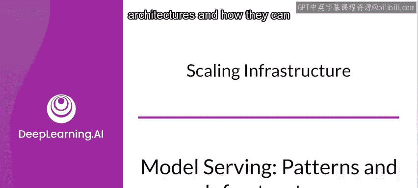
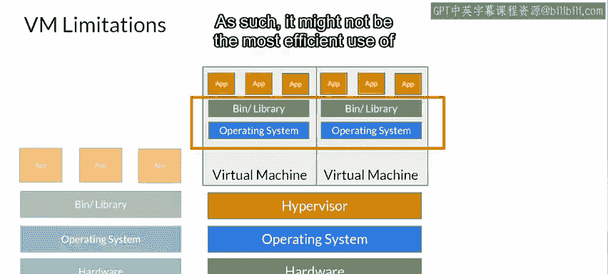
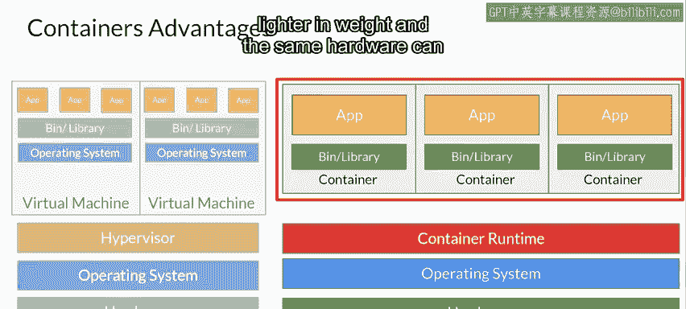
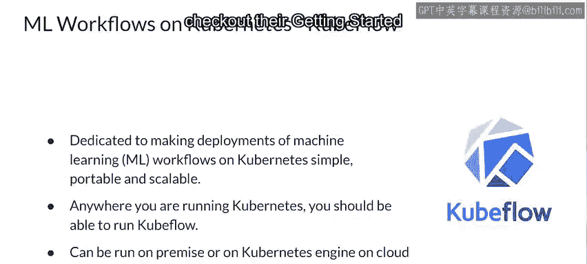

#  139：扩展基础设施 🚀

在本节课中，我们将要学习如何扩展机器学习系统的基础设施。我们将探讨扩展的重要性、两种主要的扩展方式（垂直与水平），并深入了解容器化技术及其编排工具，特别是Kubernetes和Kubeflow，它们如何帮助我们高效、弹性地管理机器学习工作负载。

---

## 扩展的重要性与方式

上一节我们介绍了模型服务架构。本节中我们来看看如何管理这些架构的规模。

当需要像这样部署模型时，管理规模和众多服务变得至关重要。接下来，你将了解什么是扩展、为什么它很重要，以及有哪些服务可以帮助你在应用程序和机器学习工作负载中实现扩展。

考虑一个模型，这里有一个非常简单的例子，但大多数模型会比这个模型大得多且复杂得多。

然后考虑在大型数据集上训练具有数十亿次操作的深度神经网络的成本。在标准CPU或单个GPU上完成训练可能需要数天时间。

因此，如果你能扩展运行训练的硬件，并将训练分布到不同的硬件设备上，甚至可能通过分片将数据分布到这些硬件上，你就可以使训练效率大大提高。

同样，你也可以考虑训练网络成本，这不仅仅是数据成本。网络越大、越复杂，需要调整和微调的参数就越多。像这样一个简单的神经元有两个浮点参数，因此可以想象拥有数百万个需要学习参数的大型网络。

不仅如此，还要考虑当你将模型部署到服务器时会发生什么。服务器收到的大量推理请求可能会使其不堪重负。因此，扩展运行时推理以及训练的能力至关重要。

扩展主要有两种方式：水平扩展和垂直扩展。让我们从垂直扩展开始。

---

### 垂直扩展 📈

垂直扩展非常直接，正如其名，它意味着使用更大、更强大的硬件。这可能是升级你的CPU、增加更多RAM、使用更新的GPU或其他类型的强大硬件。

如果你的车只能载5个人，而你需要运送100个人，你可以换一辆能载10个人的更大的车，这样你的运送速度就能快一倍。

---

### 水平扩展 ↔️

水平扩展则意味着向网络中添加更多设备。它会在负载增加时添加更多GPU或CPU。所以，与其买一辆更大的车，你可以找来20辆同样大小的车，一次性运送所有100个人。

沿用这个比喻，你可以在需要的时候借用其他19辆车，连同你自己的车一起使用。这基本上就是云计算的概念，你可以根据需要扩展，在不需要时再缩减回去，并且只为使用的部分付费。

---

## 为什么推荐水平扩展？

我通常推荐水平扩展，原因有很多。

首先是弹性。就像我那个100个人和5座车的例子，与其放弃你可靠的车去换一辆更大的车，并且只能逐步解决问题，你可以租用19辆和你自己车一样的车，用完后归还。

这样，你就不必持续维护和确保所有其他车辆的正常运行，在这种场景下道理完全相同。

不仅如此，如果你进行垂直扩展，通常必须让应用程序离线才能升级硬件资源。而在弹性扩展中，你不需要这样做，你只需启动新的实例。

一些框架，如Google的App Engine，也非常智能地使用机器学习来预测使用模式，以便在实际需要之前预热机器，从而降低整体延迟。

当然，也存在限制。但这些限制通常是预算上的，而不是硬件上的。所以，如果你需要更多节点并且负担得起，你就可以去获取它们。

---

## 选择云平台时的考量

许多供应商提供允许你水平扩展的云平台。在选择时，请关注他们为系统整体扩展提供的服务。我通常会关注以下三点：

以下是选择云平台时需要考虑的三个关键方面：

*   **手动扩展**：例如，我是否可以说我只想要N个虚拟机实例？
*   **自动扩展**：如果我希望我的应用程序能根据需求自动启动和关闭，会发生什么？延迟和成本是怎样的？
*   **扩展策略**：系统根据我的需求启动和关闭实例的策略有多积极？

---

## 容器化：实现高效水平扩展

当然，下一个问题随之而来：我如何管理我的额外虚拟机，以确保它们上面有我想要的内容？

对于机器学习来说，可能有很多依赖项、数据访问权限、权限以及许多其他可配置项。如果我打算进行水平扩展，我希望新机器能够快速启动并运行。

为此，就有了容器化。接下来让我们探讨一下容器化是什么。

---

### 从虚拟机到容器

让我们思考一个典型的系统，我可能运行着许多应用程序。

模式通常看起来是这样的：我的应用程序在操作系统内使用一些二进制文件或库运行，而操作系统则由硬件执行。

对此的扩展是虚拟机架构，应用程序仍然可以在操作系统内的二进制文件和库上运行，但该操作系统并不直接在硬件上运行，而是在一个没有硬件的虚拟机上运行。这个虚拟机由管理程序管理，管理程序充当虚拟机的管理者，每个虚拟机都有自己的操作系统、二进制文件和应用程序，如图所示。管理程序通常直接运行在硬件上。

你已经可以看到这如何用于水平扩展：我们的硬件可能支持多个操作系统和应用程序实例，如图所示。

这很酷，但它可能面临一个限制：即每个虚拟机上必须安装很多东西，至少是一个完整的操作系统。因此，这可能不是系统资源最有效的利用方式。

这就是容器可以提供帮助的地方。从架构上看，它们与虚拟机概念非常相似，只是每个分区不需要单独的操作系统，因此它们重量更轻，相同的硬件通常可以管理比虚拟机更多的容器。

---

### 容器的优势

考虑使用容器的优势：因为每个应用程序实例不需要一个操作系统，你通常可以在相同的硬件上运行更多实例，从而获得更好的水平可扩展性。

让它们在容器运行时中运行的抽象，也为你提供了在支持容器运行时的硬件上更大的灵活性。你无需担心操作系统，你的应用程序可以直接运行。

这带来了更轻松的部署和更多的部署选择。

---

### Docker：流行的容器运行时

你无疑听说过Docker，它是最流行的容器运行时。它最初是一项基于Linux的技术，但迅速扩展到Windows等其他操作系统，并广泛应用于数据中心、个人机器和公共云基础设施中。

你经常会看到开发人员教程以Docker实例的形式实现，因为这使得处理复杂的依赖关系或操作系统特性变得更加容易。

容器为你提供了一种非常方便的水平扩展方式，但并非没有其自身的挑战。

---

## 容器编排：管理容器集群

例如，你可能希望在多台机器上运行多个容器，并尝试让它们保持同步。像任何应用程序一样，即使是容器中的应用程序，也有宕机的风险，或者容器主机本身可能发生故障。因此，你还需要保持一组容器处于热备用状态，以便在某个容器宕机时切换流量。

因此，我们需要牢记容器编排的概念，接下来让我们深入探讨一下。

容器编排背后的想法很简单：它是一组工具，用于管理容器的生命周期，包括它们的扩展。

在你的容器管理器之上，容器编排通常提供多种服务，例如资源管理，以确保容器不会过度分配硬件资源；调度，以便容器满足运行和停机时间要求；当然还有常规的服务管理，以便你可以管理编排环境如何执行其工作。

例如，你可以使用服务管理来确保一定数量的容器处于热备用状态，以防某些容器发生故障。随着时间的推移，当你了解系统如何运行时，可以调整这个数量。

两个比较流行的容器编排工具是Kubernetes和Docker Swarm。接下来让我们看看Kubernetes，因为它支撑了Kubeflow，这项技术让你能够使用容器通过水平扩展来扩展你的ML应用程序和学习。

---

### Kubernetes简介

我在这里不会深入介绍Kubernetes的细节，你可以在Kubernetes.io上了解更多。总之，它是一个用于自动化容器化应用程序的部署、扩展和管理的开源系统。

它将组成应用程序的一组容器分组为逻辑单元，以便于管理和发现。

Kubernetes建立在Google多年来构建可扩展应用程序的经验之上，并结合了社区的经验，旨在为你带来两全其美的效果。

请查看课程末尾附加阅读材料中提供的网站和链接，你会看到一个视频，介绍伦敦《金融时报》如何将数百个微服务迁移到容器环境，使用Kubernetes进行水平扩展。本周晚些时候，你将做一个关于TensorFlow Serving的快速实验，使用Kubernetes进行自动扩展。

---

### Kubeflow：Kubernetes上的ML工作流

当涉及到在Kubernetes上部署ML工作流时，Kubeflow应运而生。它旨在使ML工作流的部署（包括数据摄取、特征提取、训练、模型管理等所有这类任务）能够使用Kubernetes实现可移植和可扩展。

Kubeflow的一个重要特性是，它的设计使得任何可以运行Kubernetes的地方，你都可以使用它。因此，无论你是选择云供应商、在自己的场所运行容器，还是某种两者结合的方式，你的机器学习工作流都能够与之一起运行。

请访问Kubeflow.org了解更多信息，特别是查看他们的入门指南，了解如何安装和使用它。

---

## 总结

本节课中我们一起学习了如何扩展机器学习系统的基础设施。我们探讨了水平扩展与垂直扩展的区别及其适用场景，深入了解了容器化技术（以Docker为例）如何实现轻量级、高效的应用部署。接着，我们介绍了容器编排的必要性，并重点学习了Kubernetes这一强大的编排工具，以及专为机器学习工作流设计的Kubeflow项目。它们共同构成了构建弹性、可扩展的现代机器学习生产系统的基石。

我建议你在继续深入学习之前，花一些时间尝试使用这些产品。