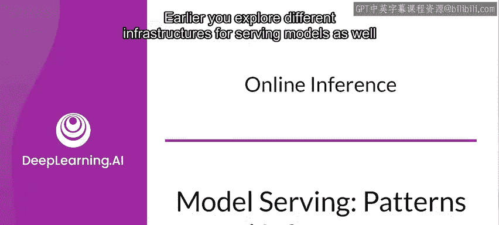
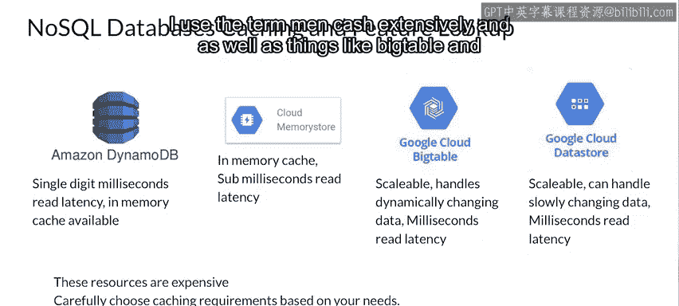

#  140：第11讲 在线推理 🚀

在本节课中，我们将要学习在线推理的基本流程，并探讨如何从多个维度优化模型服务系统，包括延迟、吞吐量和成本。我们还将了解一些可用于优化的技术和策略。

---

## 在线推理的典型流程

上一节我们介绍了模型服务的基础设施，本节中我们来看看在线推理的典型交互过程。一个模型与在线调用之间的典型交互流程如下所示。

外部世界与调用者之间的接口通常通过一个 REST API 实现。你通常会拥有一些关于用户的数据，通常称为**观测值**，你希望基于此获得预测。例如，这可能是关于客户的上下文信息，可用于预测适合他们的购买类型，从而生成推荐列表。或者，它也可能是像智能回复生成器这样的应用，在对话中，文本可用于自动生成用户可以选择回复。

观测值通过 REST API 发布到模型，返回的预测结果被呈现出来。

---

## 在线推理的优化指标

在第一周，我们讨论了在一般场景下进行推理时需要优化的指标。现在，让我们在在线推理的上下文中重新审视它们。

如果你想优化这样一个系统，你应该从三个不同的轴来考虑。

*   **延迟**：数据传递到服务器、推理执行以及响应处理总共需要多长时间。延迟有多种形式，但从用户的角度来看，是他们的操作与应用响应之间的延迟。这不仅仅是推理时间。即使模型性能优异，但如果数据传输或结果呈现引入了延迟，用户也会感受到延迟。因此，在应用程序设计的各个环节管理延迟至关重要。
*   **吞吐量**：系统在单位时间内处理的请求数量。虽然吞吐量对所有系统都很重要，但对于像密集型数据处理应用这样的非面向客户的系统，吞吐量通常更为关键。尽管如此，对所有系统而言，都需要牢记这一点。
*   **成本**：大多数预算并非无限。你为尽可能提高延迟和吞吐量效率所做的工作会产生成本。你需要始终考虑这一点。系统中的成本有多种，不仅仅是硬件，还包括工程和测试、时间和精力、软件许可、更新缓慢的机会成本以及应用中断的损失成本等。这些以及许多其他因素都必须考虑在内。

---

## 优化策略与技术

现在你已经了解了在机器学习服务系统中需要优化的方面，接下来让我们探讨一些优化策略，以及一些可用于优化延迟和吞吐量的技术。

如果你想优化推理，可以关注三个主要领域。

以下是三个主要的优化方向：

1.  **服务基础设施**：用于服务模型和处理用户输入输出的基础设施。这可以通过增加或使用更强大的硬件，以及使用本周早些时候介绍的容器化或虚拟化环境来进行扩展。
2.  **模型架构**：理解你的模型架构及其训练和测试时使用的指标。在推理速度和准确性之间通常存在权衡。如果一个准确率为99%的模型比准确率为98%的模型慢10倍，那么额外的成本真的值得吗？
3.  **模型编译**：如果你知道将要部署模型的硬件（例如特定类型的GPU），通常存在一个训练后步骤，包括创建模型工件和模型执行运行时，最终适配底层硬件。你可以优化模型图和推理运行时，以减少内存消耗和延迟。

此外，在应用层也可以执行一些优化。

例如，考虑进行购物预测的场景，为客户提供他们接下来可能想购买的产品列表。

应用程序将接收客户的详细信息，包括某种形式的标识符。这些数据被模型用来生成推理，模型将返回一系列可能适合该客户的产品ID。因此，应用程序必须在数据存储中查找这些ID，以获取有关它们的详细信息，然后将其作为预测结果返回给客户端。

这里涉及大量数据库查询，因此一个明显的优化是考虑将常见场景缓存到比典型数据存储更快的介质中。

例如，如果你有一些热门产品，可以将它们存储在更快的数据存储中。当然，存储速度越快，成本就越高，因此这里存在权衡，并且可能无法将所有数据都放在这样的存储中。如果你能找到放入其中的数据量的平衡点，就可以在最小化额外成本的同时最大化延迟效益。

快速数据缓存通常使用 NoSQL 数据库或内存缓存来实现。市场上有一些产品可以处理这个问题，例如亚马逊的 DynamoDB、谷歌云的内存存储（以前称为 Memcache）。在我之前使用的男孩乐队案例研究中，我广泛使用了 Memcache 这个术语。此外，像 Big Table 和 Cloud Datastore 这样的服务也可以快速处理大型数据集。

---

## 数据处理的优化

前面我们从高层次探讨了在线推理的工作原理，并讨论了一些可以优化机器学习推理的场景和技术，特别是管理应用程序内部的数据。还有另一个可以考虑优化的领域，那就是传入和传出模型的数据。接下来，我们将看看数据的预处理和后处理。

---

本节课中我们一起学习了在线推理的基本流程、关键的优化指标（延迟、吞吐量、成本），并探讨了从基础设施、模型架构、模型编译到应用层缓存等多个维度的优化策略。理解这些概念对于构建高效、可靠的机器学习服务系统至关重要。