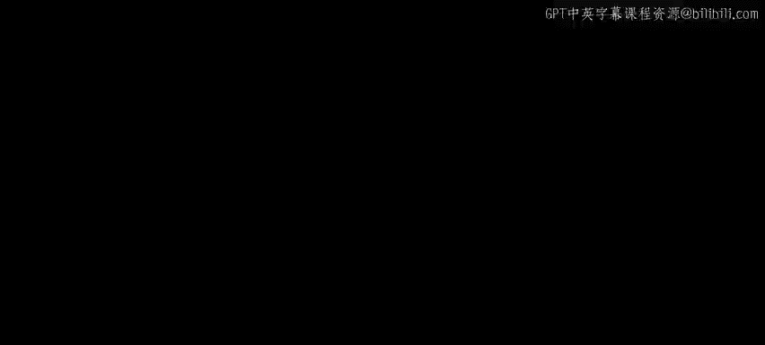
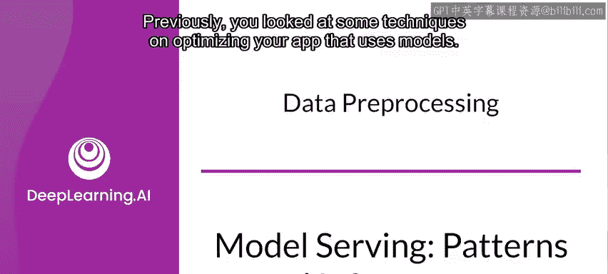
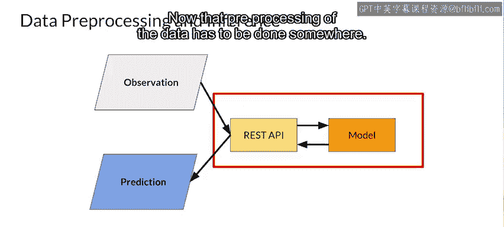
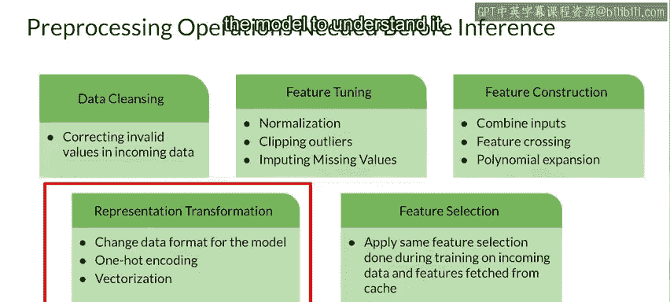
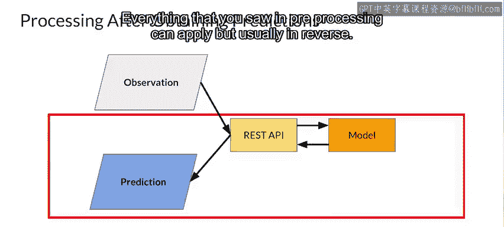

#  141：数据预处理 🛠️

在本节课中，我们将要学习机器学习应用中的数据预处理环节。我们将探讨为何需要对输入数据进行转换、常见的预处理任务类型，以及预处理在模型部署流程中的位置。

---

上一节我们介绍了通过优化硬件、容器、模型架构和应用缓存来提升应用性能。本节中我们来看看另一个关键的优化领域：**数据预处理**。

回顾一个简单的应用高层架构图，传入系统的观测数据可能是一种格式，但这不一定是模型设计时所接受的格式。数据必须以某种方式进行转换。

例如，考虑一个简单的语言模型，观测数据可能是用户输入的一个句子，并以字符串形式存储。模型被设计用于对该文本进行分类，以判断其是否含有不当内容。此类NLP模型在输入向量上进行训练，其中单词被转换为高维向量，句子则是这些向量的序列。

现在，数据的预处理必须在某个环节完成。这只是一个相对简单的例子，说明了需要将数据从一种格式转换为另一种格式。

---

除了格式转换，在预处理时还需考虑其他方面，例如**数据清洗**，即修正传入数据中的无效值。

以下是数据预处理中需要考虑的几个关键任务：

*   **数据清洗**：例如，你正在构建一个图像分类器，用户发送的图片因尺寸过大而无效。你当然可以拒绝它，或者也可以承担起调整其尺寸以获得有效图片大小的处理任务。
*   **特征调整**：对数据进行某种转换，使其适合模型。对于图像，这可能是**归一化**。例如，不是用32位值表示一个像素，而是将其转换为代表红、绿、蓝的三个8位值（忽略Alpha通道）。然后，不是让这些值在0到255之间，而是可以将它们转换为0到1之间的值，因为神经网络往往能更好地处理此类归一化后的值。
*   **特征构造**：模型通常要求数据预处理包含特征构造。例如，对于一个预测房价的模型，输入数据可能包含多个列，如房间数量和每个房间的大小，但模型是在房屋的总建筑面积上训练的。那么，可以使用**特征交叉**来将你拥有的值相乘，以得到模型使用的特征类型。这里的其他场景可能包括**多项式扩展**，即根据原始特征的公式计算新特征。也许数据包含摄氏温度，但模型期望的是华氏温度。
*   **表示转换**：特征调整和特征构造也可以是表示转换的一种形式，即输入数据需要被转换以便模型理解。一个经典应用是数据的**独热编码**。

此外，还有**特征智能缓存**，这可以在训练期间完成。例如，在我们的句子示例中，可能存在像“早上好”这样的常见句子。与其每次都经过清洗、调整、构造和表示转换，不如直接将输入数据格式预先转换并缓存起来，然后直接使用它。

---

但不要忘记**后处理**。一旦你的模型将预测结果返回给应用，你仍然需要对这些结果进行处理。

例如，在一个智能回复应用中，模型可能会给出几个关于最佳下一句可能是什么的预测。这些预测可能是代表句子中单词的向量序列，但并非句子本身。你的应用在将其返回给用户之前，需要将这些向量转换为字符串。这就是数据的后处理。你在预处理中看到的所有内容都可以应用，但通常是反向的。

---

现在你已经了解了后处理是什么样子，让我们探索一些现有的产品，它们可以为你完成这项任务提供捷径。

接下来，我将提供一份阅读笔记，向你介绍 **Apache Beam** 和 **TensorFlow Transform**，它们能极大地帮助完成预处理任务。

---

本节课中我们一起学习了数据预处理的核心概念。我们了解到，输入数据通常需要经过清洗、调整、构造和转换，才能匹配模型的期望格式。同时，预测输出也可能需要后处理才能返回给用户。高效地管理这些步骤对于构建健壮、高性能的机器学习应用至关重要。