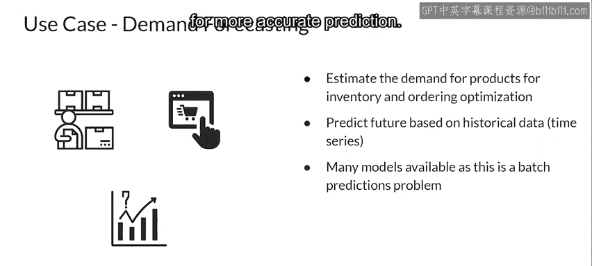

#  142：批量推理场景 🚀

在本节课中，我们将学习机器学习模型在生产环境中的一种关键部署方式：批量推理。我们将探讨其定义、优势、劣势、适用场景以及性能优化的核心考量。

---

## 概述

上一节我们讨论了模型扩展和推理架构。本节中，我们来看看批量推理场景下的模型性能与资源需求。

在训练、评估和调优一个机器学习模型之后，模型会被部署到生产环境中以生成预测。

机器学习模型可以提供批量预测，这些预测将在未来的某个时间点应用于实际用例。

## 什么是批量推理？📦

基于批量推理的预测，是指您的机器学习模型在一个批量评分作业中，为大量数据点生成预测。这些预测不需要实时生成，或者实时生成并不可行。

例如，在批量推荐中，您可能只使用客户与商品交互的历史信息来进行预测，而不需要任何实时信息。

批量推荐通常用于针对有高流失倾向的非活跃用户的留存活动，或用于促销活动等场景。

用于预测的批量作业通常按某种循环计划生成，例如每日夜间或每周。

预测结果通常存储在一个数据库中，随后可供开发人员和用户使用。

## 批量推理的优势与劣势 ⚖️

批量推理有一些重要的优势。您可以使用复杂的机器学习模型来提高预测的准确性，因为推理时间没有限制，并且通常也不需要缓存预测结果。

为预测所需的特征采用缓存策略会增加您机器学习系统的总体成本。

如果不采用缓存策略，数据检索可能会花费一些时间。

批量推理也可以等待数据检索完成后再进行预测，因为预测结果并非实时可用。

然而，批量推理也有一些缺点。

预测无法用于实时目的。

预测的更新延迟可能长达数小时，有时甚至是数天。

因此，预测通常是基于旧数据进行的，这在某些场景下会产生问题。

假设一个像电影流媒体这样的服务在夜间生成推荐，如果有新用户注册，他们可能无法立即看到个性化推荐。

为了解决这个问题，系统被设计为向新用户展示来自相似人群（如同一年龄段或相同地理位置）的其他用户的推荐。

## 批量推理的用例

以下是批量推理的一些典型用例。

在执行批量预测时，需要优化的最重要指标是**吞吐量**。

在批量预测中，您应始终致力于提高吞吐量，而不是降低延迟。

当数据以批次形式可用时，模型应能一次处理大量数据。

随着吞吐量的增加，生成每个预测的延迟也会增加。

但这在批量预测系统中不是一个大问题，因为预测不需要立即可用。预测通常被存储起来供后续使用，因此可以牺牲一些延迟。

通过使用硬件加速器（如GPU），可以提高处理批量数据的机器学习模型或生产系统的吞吐量。

您还可以增加部署模型的服务器或工作节点的数量。

您可以将模型的多个实例加载到多个工作节点上以提高吞吐量。

## 用例详解

让我们具体看一些批量预测的用例。

首先，电子商务网站上的新产品推荐可以在一个循环计划中生成，然后缓存这些预测结果以便于检索，而不是在每次用户登录时都生成。这使系统更简单，并且可以节省推理成本，因为您不需要保证像实时推理那样的低延迟。

您还可以使用更复杂的模型进行预测，因为您没有预测延迟的限制。

这有助于实现更高程度的个性化，但使用的是可能不包含用户新信息的延迟数据。

让我们看一个情感分析问题。根据用户的评论（通常是文本格式），您可能希望预测一条评论是正面、中性还是负面的。

基于客户评论来分析用户对您产品或服务情感的系统，可以利用循环计划的批量预测。

例如，有些系统可能每周生成一次产品情感分析。

在这种情况下不需要实时预测，因为客户和利益相关者并非在等待基于预测结果实时完成某个操作。

情感预测可以用于长期改进服务或产品，正如您所见，这并非一个实时的业务流程。

基于CNN、RNN或LSTM的方法可以用于情感分析，我倾向于喜欢LSTM。

这些模型更复杂，但它们通常能提供更高的准确性。

这使得在批量预测中使用它们更具成本效益。

让我们看一个不同的例子：预测产品或服务的需求。

您可以使用批量预测来估计产品需求的模型，例如每日一次，用于库存和订单优化。

这可以建模为一个时间序列问题，因为您是基于历史数据预测未来需求。

由于批量预测的延迟约束最小，可以使用像ARIMA、SARIMA或RNN这样的时间序列模型，而不是线性回归等方法，以获得更准确的预测。

---

## 总结

本节课中，我们一起学习了机器学习中的批量推理场景。我们明确了批量推理的定义，分析了其允许使用复杂模型、无需严格实时性等优势，以及预测延迟高、基于旧数据等劣势。我们探讨了其在推荐系统、情感分析和需求预测等领域的典型用例，并强调了在批量推理中优化吞吐量而非延迟的核心原则。理解批量推理是构建高效、经济生产级机器学习系统的重要一环。