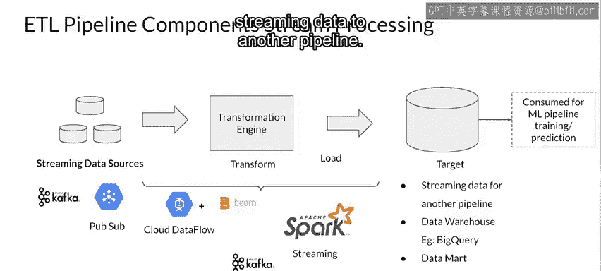

#  143：使用ETL进行批处理 📊

在本节课中，我们将学习如何为机器学习模型准备数据，特别是处理那些频繁更新的时间序列数据或流式数据。我们将重点介绍一个称为ETL（提取、转换、加载）的核心数据处理流程，并了解其工作原理及常用工具。

---

上一节我们介绍了静态数据的批处理。本节中，我们来看看如何处理时间序列数据或其他需要作为流读取的、频繁更新的数据类型。

根据来源不同，数据可以有多种类型。例如，数据湖中通常存储着来自CSV文件、日志文件等的大量批处理数据。另一方面，流式数据则是实时到达的，传感器数据就是其中一个例子。

在数据用于进行批量预测之前，必须从多个来源（如我们提到的日志文件和CSV文件）中提取数据。这些来源也可能包括API、其他应用程序、流式数据源等。

提取的数据需要进行转换，以便进行机器学习预测，然后将其加载到数据库中。之后，数据可以分批发送进行预测。

整个准备数据的流程被称为ETL管道。ETL代表提取、转换和加载。

ETL管道是一系列从数据源提取数据、转换数据，然后将数据加载到输出目标（如数据仓库）的过程。加载后的数据可用于多种目的，包括运行批量预测、执行其他分析、进行数据挖掘等。

从数据源提取数据和对数据进行转换可以分布式执行。数据被分割成块，然后可以由多个工作节点并行处理。

ETL工作流的结果存储在数据库中，其优势在于数据处理延迟更低、吞吐量更高。

在数据被发送进行推理之前，让我们看看ETL管道中可用于数据批处理的各种框架。

以下是数据可能来源的几种类型：
*   CSV文件
*   XML文件
*   JSON API
*   数据湖（如Google Cloud Storage）

对数据的ETL操作由Apache Spark或Google Cloud Dataflow等引擎执行，它们利用了Apache Beam编程范式。

转换后的数据被存储到BigQuery等数据仓库中，并且可以在发送进行批量预测之前，被送回Google Cloud Storage等数据湖。

持续更新的数据源（如传感器）可以连接到Apache Kafka、Google Cloud Pub/Sub等产品。使用Apache Beam的Cloud Dataflow也可以对流式数据执行ETL。Spark有一个专门用于处理流式数据的产品。Apache Kafka同样可以作为流式数据的ETL引擎。

这些数据随后可能被收集到BigQuery等数据仓库，或数据市场、数据湖中。它也可以作为另一个管道的流式数据源。

---

现在，让我们通过探索Google Cloud平台上的一个场景来实践上述内容。在该场景中，您将使用Beam和TensorFlow。

虽然您使用的关于碳、氢、氮和氧的分子数据是静态的而非流式的，但这个例子将让您了解基于Beam的系统中所有组件如何协同工作以实现学习目标。

---

本节课中，我们一起学习了ETL（提取、转换、加载）管道如何为机器学习准备数据，特别是处理流式或频繁更新的数据。我们了解了数据的不同来源、分布式处理的优势，以及Apache Spark、Apache Beam（通过Google Cloud Dataflow）和Apache Kafka等关键工具在构建高效数据处理流程中的作用。