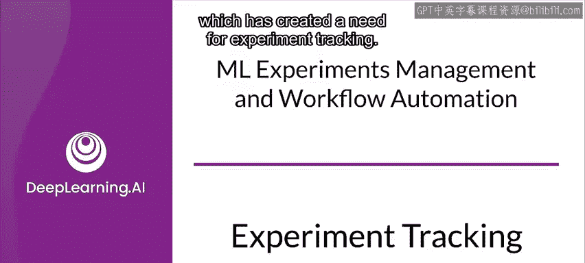
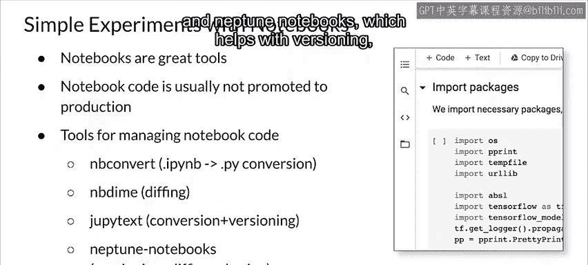
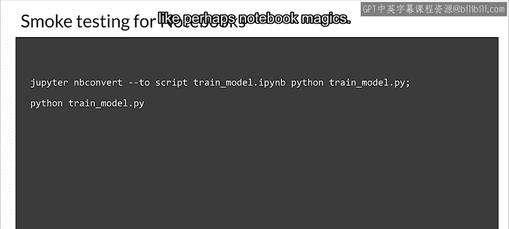
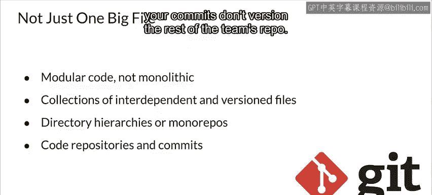
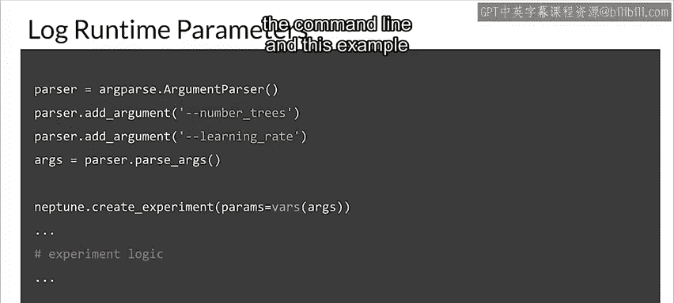
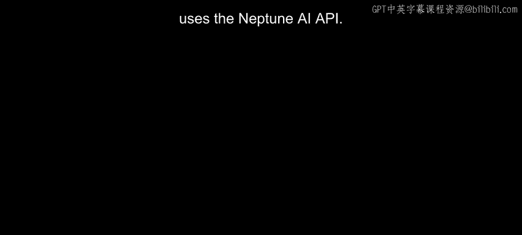

#  144：实验跟踪 📊


在本节课中，我们将学习机器学习开发中的一个核心实践——实验跟踪。我们将探讨为什么实验跟踪至关重要，以及如何有效地记录和管理实验的各个方面，包括代码、参数、环境和结果。

---

## 概述

机器学习在很大程度上是一门实验科学。开发过程的核心是不断实验和分析结果。为了获得可重现的结果并建立严谨的流程，我们需要系统地跟踪实验。本节将介绍实验跟踪的基本概念、重要性以及实施方法。



---

## 实验跟踪的重要性 🔍

上一节我们概述了实验跟踪的意义，本节中我们来看看为什么它在机器学习实践中如此关键。

机器学习实践更像实验科学而非理论科学。因此，在生产环境中跟踪实验结果对于实现目标至关重要。

机器学习中的调试通常与软件工程中的调试有根本不同。它通常涉及模型不收敛或泛化能力差的问题，而非像段错误这样的功能性问题。清晰记录模型和数据的随时间变化，有助于定位问题根源。

即使是微小的更改，例如改变层的宽度或学习率，也可能对模型性能和训练所需资源产生重大影响。因此，跟踪所有更改非常重要。

此外，运行实验（即反复训练模型）可能非常耗时且昂贵，对于大型模型和数据集尤其如此。因此，最大化利用每次实验至关重要。

---

## 实验跟踪的内容

现在，我们了解了实验跟踪的重要性，接下来具体看看需要跟踪哪些内容。

首先，需要记录所有为复现结果所必需的信息。许多人有过这样的糟糕经历：获得一个好结果后，进行了一些未妥善记录的更改，随后发现很难恢复到产生好结果的原始设置。

另一个重要目标是能够进行有意义的比较。这有助于指导你决定下一步实验的方向。但若没有良好的跟踪，很难对大量实验进行比较。

因此，重要的是跟踪和管理每次实验的所有投入，包括：
*   **代码**
*   **超参数**
*   **执行环境**（例如使用的库版本）
*   **评估的指标**

当然，以有意义的方式组织它们会很有帮助。许多人最初会做自由形式的笔记，这对于少量简单实验尚可，但很快就会变得混乱。最后，由于你很可能在团队中工作，良好的跟踪有助于与团队分享结果。这通常意味着团队需要共享通用工具并保持一致性。

---

## 从笔记本开始 📓

对于初学者或项目初期，大多数实验可能都在笔记本中进行。

笔记本是用于机器学习、数据和模型开发的强大且友好的工具，支持良好的迭代开发过程，包括内联可视化。然而，笔记本代码通常不会直接部署到生产环境，且结构往往不佳。原因之一是笔记本不完全是产品代码，它们通常包含仅适用于笔记本环境的特殊注解（magics）、检查值的代码以及生成可视化的代码，这些在生产工作流中很少需要。

在笔记本中进行实验时，需要确保跟踪这些实验。以下是一些辅助工具：
*   **N B convert**：可用于从笔记本中提取 Python 代码。
*   **En be dime**：支持 Jupyter 笔记本的差异比较和合并。
*   **Juoppy text**：在笔记本和匹配的 Python 文件之间进行转换和同步。
*   **Neptune notebooks**：帮助进行笔记本的版本控制、差异比较和共享。

例如，为确保从笔记本提取的 Python 代码能够运行，可以使用类似以下的命令提取代码并尝试运行。如果失败，则说明你的代码依赖于笔记本中的某些特定元素，例如 notebook magics。

```bash
jupyter nbconvert --to python your_notebook.ipynb
python your_notebook.py
```

---

## 迈向模块化代码

随着实验从简单、小型发展到生产级别，将所有内容放在笔记本中的模式很快就会显得不足。



你应该计划编写模块化代码，而非单体代码，并且这个过程开始得越早越好。因为你会反复执行许多核心工作，从而开发出可重用的模块，这些模块将成为高级工具，通常特定于你的环境、基础设施和团队。这些模块将节省大量时间，并且更加健壮和可维护，也使理解和复现实验变得更加容易。

最简单的形式是目录层次结构，特别是当整个团队在单一代码库中工作时。但在更高级和分布式的工作流中，代码仓库和基于提交的版本控制是管理大型项目（包括实验）的强大且广泛可用的工具。在这些情况下，如果你与团队使用共享的单一代码库，可能希望将实验分开，以免你的提交影响团队仓库的其他部分。



---

## 管理运行时参数

进行实验时，你经常需要更改运行时参数，包括模型的超参数。将这些参数的值纳入实验跟踪非常重要，而你设置它们的方式将决定如何实现跟踪。

一个简单而稳健的方法是使用配置文件，并通过编辑这些文件来更改值。这些文件可以与你的代码一起进行版本控制以进行跟踪。

另一种选择是在命令行上设置参数。但这需要额外的代码来保存这些参数值并将其与你的实验关联起来。这意味着需要在实验代码中加入逻辑，将这些值保存到某个数据存储中。这是一个额外的负担，但它也使这些值易于用于分析和可视化，而无需从特定版本的配置文件代码中解析它们。

当然，如果你使用配置文件，也可以在实验代码中加入逻辑，将这些值保存到数据存储中，从而兼得两者优点。

以下是一个示例代码，展示了当你在命令行设置运行时参数时，如何保存这些值（此示例使用 Neptune AI API）：



```python
import neptune

# 初始化 Neptune 运行
run = neptune.init_run(project='your-project')

# 记录超参数
run['parameters'] = {
    'learning_rate': 0.001,
    'batch_size': 32,
    'num_epochs': 10
}

# ... 你的训练代码 ...

# 记录指标
run['metrics/accuracy'].log(0.95)
run['metrics/loss'].log(0.05)

# 结束运行
run.stop()
```

---

## 总结





本节课中，我们一起学习了机器学习实验跟踪的核心概念。我们认识到，由于机器学习的实验性质，系统化地跟踪代码、超参数、环境和结果对于实现可重现性、有效比较实验结果以及团队协作至关重要。我们从简单的笔记本工具开始，探讨了如何逐步过渡到模块化代码和专业的版本控制工具，并介绍了管理运行时参数的几种方法。良好的实验跟踪实践是构建可靠、可维护的机器学习生产系统的基础。