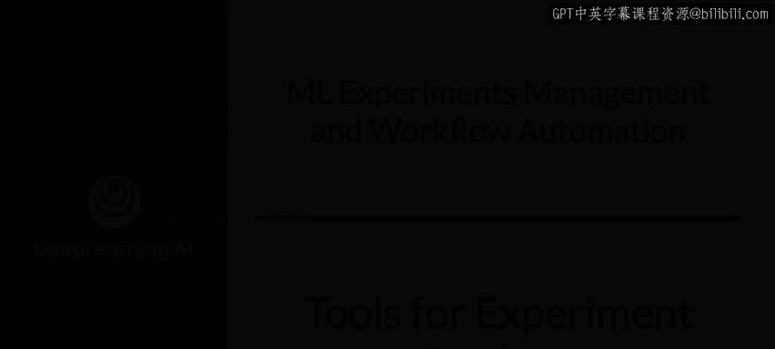
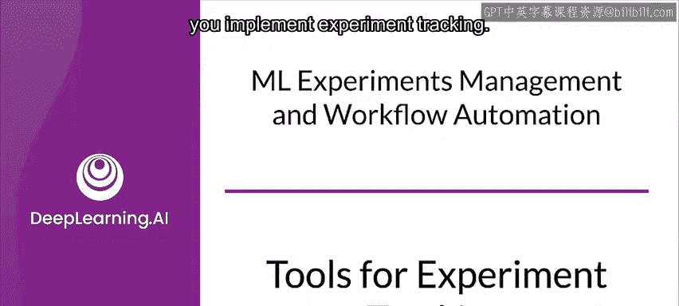
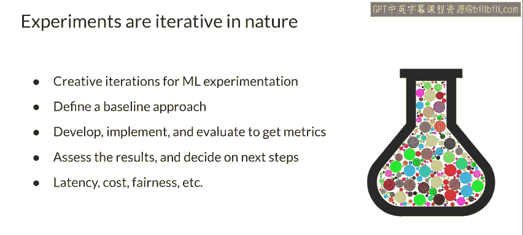

#  145：实验跟踪工具 🧪





在本节课中，我们将学习实验跟踪的重要性以及用于实现实验跟踪的各种工具。我们将了解如何系统地记录实验的各个方面，包括代码、数据和参数，以便于比较、复现和协作。

## 概述

实验跟踪是机器学习工作流中的关键环节。它确保你能系统地记录每次实验的配置、数据和结果，从而能够有效地比较不同实验、复现成功的结果，并与团队协作。

## 数据版本控制 📊

上一节我们介绍了实验跟踪的概念，本节中我们来看看一个核心组成部分：数据版本控制。

你的代码和运行时参数需要版本控制，你的数据同样需要。数据反映了其收集时世界的一个快照，而世界是不断变化的。添加新数据、清理旧数据或修改数据都会改变实验结果。因此，就像修改代码、模型或超参数一样，你需要跟踪数据的版本。在实验过程中，你可能还会更改特征向量，例如添加、删除或修改特征，这些变更也需要被版本化。

为了能够跟踪、理解、比较和复现你的实验结果，你必须对数据进行版本控制。

以下是可用于数据版本控制的一些工具：

*   **Neptune**：集成了数据版本控制、实验跟踪和模型注册表功能。
*   **Pyderm**：允许你在仓库的主分支中持续更新数据，同时在独立分支中基于特定的数据提交进行实验。
*   **Delta Lake**：运行在现有数据湖之上，提供数据版本控制功能，包括回滚和完整的历史审计追踪。
*   **Git LFS**：Git 的扩展，用 Git 内部的文本指针替换大型文件（如音频样本、视频、数据集和图形）。
*   **Dolt**：一个可以像 Git 仓库一样进行分叉、克隆、分支、合并、推送和拉取的 SQL 数据库。
*   **LakeFS**：一个开源平台，提供类似 Git 的分支和提交模型，可扩展到 PB 级数据。
*   **DVC**：一个面向机器学习项目的开源版本控制系统，构建于 Git 之上。
*   **ML Metadata**：一个用于记录和检索与 ML 开发者和数据科学家工作流（包括数据集）相关的元数据的库。MLMD 是 TFX 的组成部分，但也可独立使用。

## 实验管理与分析 🔍

典型的机器学习工作流涉及运行大量实验。开发者通常发现，在与其他结果的对比中查看单个结果，比孤立地查看更有意义。起初，同时查看大量实验可能会让人困惑，但随着对工具的熟悉，你会更得心应手，更容易聚焦于所需信息。

不同的实验风格会导致不同的工作流，但一个好的习惯是记录所有你可能关心的指标，用几个对你有意义的一致标签来标记实验，并添加注释。养成这些习惯能让后续工作更有条理。

TensorBoard 是分析训练过程的绝佳工具，有助于理解实验。例如，你可以使用 TensorBoard 回调来记录指标，并在每个训练周期（Epoch）结束时记录混淆矩阵。

```python
# 示例：在 Keras 中使用 TensorBoard 回调
tensorboard_callback = tf.keras.callbacks.TensorBoard(log_dir=log_dir, histogram_freq=1)
model.fit(x_train, y_train, epochs=5, callbacks=[tensorboard_callback])
```

当展示结果时，你能清晰地了解模型的表现。例如，通过检查混淆矩阵，默认仪表板会显示最后一步或最后一个周期的图像摘要。你可以使用滑块查看更早的混淆矩阵。注意矩阵如何随着训练进程发生显著变化：更深的色块沿对角线聚集，而矩阵其余部分趋向于0和白色。这意味着你的分类器随着训练在不断改进。

在模型训练过程中（而不仅仅是训练完成后）可视化结果的能力，也能为你提供对实验的深刻洞察。随着实验的进行，你会在每个结果可用时查看并开始进行比较。

## 协作与共享 🤝

从一开始就组织好你的实验和结果非常重要，这既能帮助你在日后回顾时理解自己的工作，也能帮助你的团队理解。你需要确保实验易于共享和访问，以便你和团队能够协作，尤其是在处理大型项目时。为每个实验添加标签和注释将对你和团队都有帮助，并有助于避免重复运行实验。

支持共享的工具能提供很大帮助。例如，使用 Neptune AI 提供的实验管理工具，你可以发送一个链接来共享实验比较视图。这使得你和团队可以轻松跟踪和审查进度、讨论问题并激发新想法。

像 Vertex AI TensorBoard 这类基于云的工具也能提供显著优势。首先，与许多基础设施决策一样，使用托管服务在安全、隐私和合规性方面具有重要优势。但最重要的功能之一是拥有一个持久、可共享的仪表板链接，你可以与团队分享，而无需担心其设置和维护。拥有项目中所有实验的可搜索列表也非常有用。

这类工具比电子表格和笔记是巨大的进步和帮助。

## 从实验到项目目标 🎯

然而，你可以通过创造性的迭代将机器学习项目提升到新的水平。在每个项目中，都有一个制定业务规范的阶段，通常包括时间表、预算和项目目标。目标通常是一组关键绩效指标（KPIs）、业务指标，或者如果你非常幸运的话，是实际的机器学习指标。

你和你的团队应该选择与项目一致的、你认为可能实现的业务目标，并首先定义一个基线方法。实现你的基线并评估它，以获得第一组指标。

你通常可以从这些最初的基线结果中学到很多。它们可能接近你的目标，这表明这可能是一个简单的问题。或者你的结果可能相差甚远，以至于你会开始怀疑数据中预测信号的强度，并开始考虑更复杂的建模方法。

不要忘记，尽管人们倾向于关注建模指标（不幸的是，许多工具也聚焦于此），但既然你从事的是生产级机器学习，你还需要满足业务在延迟、成本、公平性、隐私、GDPR 等方面的目标。

## 总结



本节课中，我们一起学习了实验跟踪在机器学习项目中的核心作用。我们了解到，为了有效管理实验，需要对代码、数据和超参数进行系统性的版本控制。我们介绍了一系列数据版本控制和实验跟踪工具（如 Neptune, DVC, TensorBoard），并探讨了如何利用它们记录指标、可视化结果（如混淆矩阵）以及促进团队协作。最后，我们强调实验的最终目的是服务于业务目标，因此在关注模型性能指标的同时，也必须考虑延迟、成本、公平性等生产环境约束。良好的实验跟踪实践是连接模型开发与成功部署的桥梁。